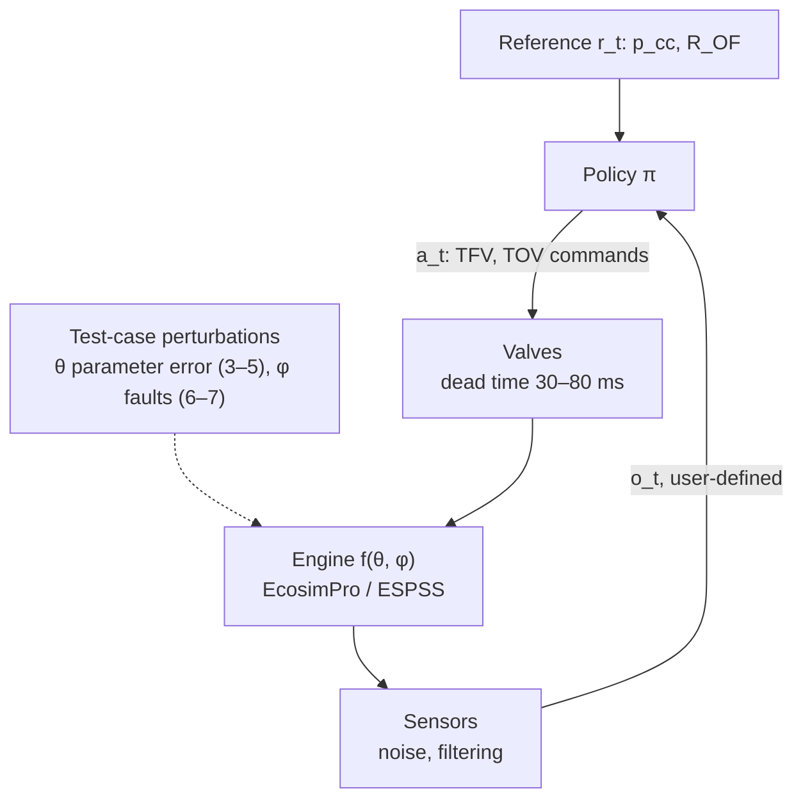
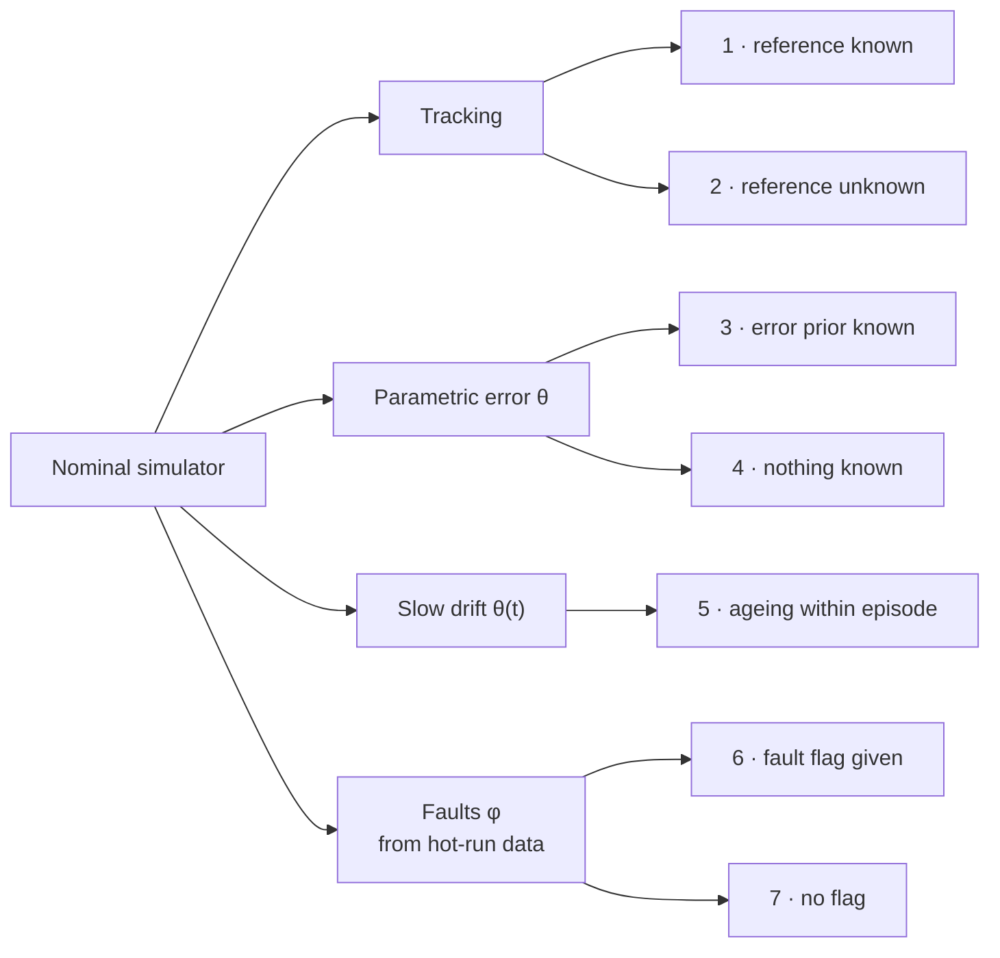

# 1. The control problem

!!! warning "What is and is not known"
    The LUMEN Control Challenge environment was not public on 2026-09-30 ([search log](07-references.md#71-search-log-where-the-lumen-control-challenge-simulator-is-not)). This page therefore states the problem from the published benchmark design and from DLR's own RL formulations of the same engine. Two sources carry the benchmark design: the [AI4Aerospace 2025 extended abstract](https://w3.onera.fr/ailab/sites/default/files/2025-06/abstractsAI4A5thworkshop_external.pdf#page=55) and the [RL4AA'25 abstract](https://indico.kit.edu/event/4216/contributions/19241/contribution.pdf). The formulations come from the [Dresia 2025 thesis](https://elib.dlr.de/219040/1/DLR-FB-2025-16.pdf). Anything the challenge fixes that these sources do not state is marked **unknown**. That includes the observation vector, reward, control rate, episode length and scoring.

## 1.1 The plant in one paragraph

LUMEN is a 25 kN liquid-oxygen / liquefied-natural-gas (LOX/LNG) engine with an expander-bleed cycle and two parallel turbopumps, run on test bench P8.3 at DLR Lampoldshausen. Its envelope is 35–80 bar chamber pressure and mixture ratio 3.0–3.8, i.e. 58–133 % of nominal thrust, with the nominal point at 60 bar and 3.4 ([thesis Table 4.1](https://elib.dlr.de/219040/1/DLR-FB-2025-16.pdf#page=75)). Fuel cools the chamber wall, and part of the heated fuel drives both turbines and is then dumped overboard. Two turbine valves therefore set how much power reaches each pump, and through the pumps set the propellant flows:

- **TFV** (turbine fuel valve) and **TOV** (turbine oxidiser valve).
- "Opening both valves symmetrically increases the combustion chamber pressure, while opening TFV and TOV asymmetrically adjusts the mixture ratio" ([thesis p. 56](https://elib.dlr.de/219040/1/DLR-FB-2025-16.pdf#page=73)).

```vegalite
{
  "$schema": "https://vega.github.io/schema/vega-lite/v6.json",
  "title": {"text": "Where LUMEN operates", "subtitle": "Envelope and nominal point: thesis Table 4.1. RL hot-fire range: thesis p. 99. Mixture-ratio constraint: thesis Table 5.1"},
  "width": "container", "height": 250,
  "encoding": {
    "x": {"type": "quantitative", "scale": {"domain": [30, 85], "nice": false}, "title": "Chamber pressure (bar)"},
    "y": {"type": "quantitative", "scale": {"domain": [2.4, 4.1], "nice": false}, "title": "Mixture ratio (–)"}
  },
  "layer": [
    {"data": {"values": [{"x": 30, "x2": 85, "y": 2.5, "y2": 4.0, "what": "Mixture-ratio constraint 2.5–4.0"}]},
     "mark": {"type": "rect", "color": "var(--viz-grid)", "opacity": 0.7, "cornerRadius": 0},
     "encoding": {"x": {"field": "x"}, "x2": {"field": "x2"}, "y": {"field": "y"}, "y2": {"field": "y2"}, "tooltip": [{"field": "what", "title": "region"}]}},
    {"data": {"values": [{"x": 35, "x2": 80, "y": 3.0, "y2": 3.8, "what": "Operating envelope: 35–80 bar, 3.0–3.8 (58–133 % thrust)"}]},
     "mark": {"type": "rect", "color": "var(--viz-s1)", "fillOpacity": 0.1, "stroke": "var(--viz-s1)", "strokeWidth": 2, "cornerRadius": 0},
     "encoding": {"x": {"field": "x"}, "x2": {"field": "x2"}, "y": {"field": "y"}, "y2": {"field": "y2"}, "tooltip": [{"field": "what", "title": "region"}]}},
    {"data": {"values": [{"x": 40, "x2": 60, "y": 3.0, "what": "RL hot-fire test range: 40–60 bar at mixture ratio 3.0"}]},
     "mark": {"type": "rule", "color": "var(--viz-s2)", "strokeWidth": 5, "strokeCap": "round"},
     "encoding": {"x": {"field": "x"}, "x2": {"field": "x2"}, "y": {"field": "y"}, "tooltip": [{"field": "what", "title": "range"}]}},
    {"data": {"values": [{"x": 60, "y": 3.4, "what": "Nominal point: 60 bar, 3.4"}]},
     "mark": {"type": "point", "filled": true, "size": 120, "color": "var(--viz-s1)", "stroke": "var(--md-default-bg-color)", "strokeWidth": 2},
     "encoding": {"x": {"field": "x"}, "y": {"field": "y"}, "tooltip": [{"field": "what", "title": "point"}]}},
    {"data": {"values": [
        {"x": 61.8, "y": 3.4, "t": "Nominal 60 bar, 3.4"},
        {"x": 36, "y": 3.72, "t": "Operating envelope"},
        {"x": 40, "y": 2.88, "t": "RL hot-fire test range"},
        {"x": 31, "y": 3.94, "t": "Mixture-ratio constraint"}]},
     "mark": {"type": "text", "align": "left", "baseline": "middle"},
     "encoding": {"x": {"field": "x"}, "y": {"field": "y"}, "text": {"field": "t"}}}
  ]
}
```

Section [2](02-primer.md) explains the physics.

## 1.2 Formal statement

The benchmark is best read as a **partially observed, parametrised MDP family**. One nominal simulator plus perturbations produces seven test cases.



The benchmark as a control loop. The dotted input is what the test cases perturb; the agent sees only $o_t$, and constraint violations enter through the reward or trip a redline.
{: .caption }

**Latent state.** $x_t \in \mathbb{R}^n$ is the full state of the EcosimPro/ESPSS differential-algebraic model. It includes:

- pressures and temperatures in lines, cooling channels and chamber;
- the two turbopump speeds;
- valve positions;
- wall and fluid thermal masses.

$n$ is in the hundreds, and $x_t$ is never observed directly.

**Action.** In the benchmark, $a_t = (u_{\mathrm{TFV}}, u_{\mathrm{TOV}}) \in \mathcal{A} \subset [0,1]^2$, the commanded openings of the two turbine valves. The design says "two control valves are used to regulate the oxidizer and fuel turbine mass flow" and "the resulting LUMEN control task is a 2×2 MIMO problem" ([AI4Aerospace abstract p. 55](https://w3.onera.fr/ailab/sites/default/files/2025-06/abstractsAI4A5thworkshop_external.pdf#page=55)). The RL Bootcamp 2026 pitch described the same two actions ([§7.2](07-references.md#72-lumen-control-challenge-and-benchmark)). The admissible sub-box is **unknown** for the challenge; DLR's hardware controller used $u_{\mathrm{TFV}} \in [0.2, 0.7]$ and $u_{\mathrm{TOV}} \in [0.1, 0.4]$ ([thesis eq. 6.1](https://elib.dlr.de/219040/1/DLR-FB-2025-16.pdf#page=118)).

**Controlled outputs.** $y_t = (p_{cc}, R_{OF})$:

- $p_{cc}$ is the combustion chamber pressure in bar, a proxy for thrust.
- $R_{OF} = \dot m_{\mathrm{LOX}} / \dot m_{\mathrm{LNG}}$ is the oxidiser-to-fuel mass-flow ratio.

**Observation.** $o_t = h(x_t, r_{t}, a_{t-1}) + \varepsilon_t$ is **user-definable** in the challenge, according to the pitch. The example there contains:

- $p_{cc}$ and $R_{OF}$;
- their references $r_t = (p_{cc}^{\mathrm{ref}}, R_{OF}^{\mathrm{ref}})$;
- the measured valve positions.

Measurement effects the sim-to-real work had to model:

- **Noise.** Measured steady-state noise on the real engine is $\sigma = 0.3\,\%$ on $p_{cc}$ and $3.0\,\%$ on $R_{OF}$ ([thesis Fig. 6.11](https://elib.dlr.de/219040/1/DLR-FB-2025-16.pdf#page=133)).
- **Sensor delays.** DLR randomised the $p_{cc}$ moving-average window over 0.05–0.15 s ([thesis Table A.3](https://elib.dlr.de/219040/1/DLR-FB-2025-16.pdf#page=165)).
- **Valve dead time** of 0.03–0.08 s (same table).

**Dynamics.** $x_{t+1} = f_{\theta, \phi}(x_t, a_t)$, where:

- $\theta$ are physical parameters: valve flow coefficients, pump and turbine efficiencies, heat-transfer coefficients, injector losses.
- $\phi$ is a fault mode.

The nominal model $f_{\theta_0, \varnothing}$ is calibrated on hot-fire data. For the chamber pressure it has a mean absolute percentage error of 2.4 %, and 3.5 % for the mixture ratio ([Kurudzija et al. 2025, Table 2](https://www.eucass.eu/doi/EUCASS2025-105.pdf#page=10)).

**Objective.** Track a reference trajectory $r_{0:T}$ with smooth valve motion and no constraint violations:

$$
\max_\pi \; \mathbb{E}_{\theta,\phi,r}\Big[\sum_{t=0}^{T} \gamma^t \Big( \sum_{y \in \{p_{cc}, R_{OF}\}} \big(e^{-\delta\,|y_t - y^{\mathrm{ref}}_t| / y^{\mathrm{ref}}_t} - 1\big) \;-\; \alpha_u \sum_{u} |u_t - u_{t-1}| \;-\; \sum_{c \in \mathcal{C}} \beta_c\,\mathbb{1}[c_t \notin [c_{\min}, c_{\max}]] \Big)\Big]
$$

This is DLR's reward shape, not the challenge's. The challenge leaves the reward to the user, and its scoring metric is **unknown**. DLR used:

- $\delta = 12$ and $\alpha_u = 5$;
- a constant penalty $\beta_c$ per violated constraint;
- $\gamma = 0.9$ ([thesis eqs. 5.6–5.8](https://elib.dlr.de/219040/1/DLR-FB-2025-16.pdf#page=98), [6.4–6.5](https://elib.dlr.de/219040/1/DLR-FB-2025-16.pdf#page=119), [Table A.1](https://elib.dlr.de/219040/1/DLR-FB-2025-16.pdf#page=164)).

The exponential tracking term is bounded in $[-1, 0]$ per output per step. The episode return therefore has known limits, which DLR used to monitor training.

**Constraints** $\mathcal{C}$ come from DLR's test case 1 ([thesis Table 5.1](https://elib.dlr.de/219040/1/DLR-FB-2025-16.pdf#page=96)) and §4.1.2 ([PDF pp. 75–77](https://elib.dlr.de/219040/1/DLR-FB-2025-16.pdf#page=75)):

| Constrained variable | Limit | Why |
|---|---|---|
| Mixture ratio $R_{OF}$ | 2.5 – 4.0 | Hot-gas temperature; the fastest constraint to violate |
| Injector momentum-flux ratio $J$ | $\ge 10$ | Flame anchoring at the injector face |
| Turbine inlet temperature | $\le 700$ K | Blade thermal stress |
| Oxidiser turbopump speed | $\le 28{,}000$ rpm | Rotordynamics, bearings |
| Fuel turbopump speed | $\le 50{,}000$ rpm | Rotordynamics, bearings |
| Cooling-channel mass flow $\dot m_{RC}$ | $\ge f(p_{cc})$ | Chamber-wall temperature |
| Cooling-channel pressure $p_{RC}$ | $\ge 46$ bar | Keeps methane supercritical (critical pressure 46 bar), avoiding boiling and heat-transfer deterioration |
| Fuel injection temperature | 210–300 K | Thermal stress on chamber and injector |
| Valve motion | no sustained oscillation | Fatigue; pressure waves; "chugging" |

With only TFV and TOV actuated, the other valves (FCV, BPV, OCV, XCV) are presumably held at fixed openings. Several of these constraints are then only indirectly controllable. How the challenge handles this is **unknown**.

**Horizon and rate.** These are **unknown** for the challenge. DLR's settings for comparison:

- Simulation study: $\Delta t = 0.1$ s, 50 s episodes of 500 steps ([thesis p. 79](https://elib.dlr.de/219040/1/DLR-FB-2025-16.pdf#page=96), [p. 83](https://elib.dlr.de/219040/1/DLR-FB-2025-16.pdf#page=100)).
- Hardware controller: 20 Hz ([thesis p. 99](https://elib.dlr.de/219040/1/DLR-FB-2025-16.pdf#page=116)).
- Real hot-fire closed-loop windows: tens of seconds, "over 16 s" in the successful run ([thesis p. 117](https://elib.dlr.de/219040/1/DLR-FB-2025-16.pdf#page=134)).
- Plant time scales: step-response settling times of 0.4–0.6 s for TOV steps, but 5.4–23.8 s for TFV steps on the fuel side ([thesis Table 4.7](https://elib.dlr.de/219040/1/DLR-FB-2025-16.pdf#page=91)). The fuel side is slow because heat must flow into the cooling channels before turbine power changes.

## 1.3 The seven test cases as RL problem classes

The benchmark design lists seven test cases, each a Gym environment ([AI4Aerospace abstract p. 56](https://w3.onera.fr/ailab/sites/default/files/2025-06/abstractsAI4A5thworkshop_external.pdf#page=56)). The right-hand column is my reading of each in standard RL terms.



| # | Benchmark description | What it is in RL terms |
|---|---|---|
| 1 | Tracking, nominal model, reference known a priori during training | Single-task MDP; open-loop trajectory optimisation is a valid baseline |
| 2 | Tracking, nominal model, randomised unknown reference | Goal/reference-conditioned policy; generalisation over reference signals |
| 3 | Multiplicative parametric uncertainty, distribution and affected parameters known at training time | Robust RL / domain randomisation with a known prior over $\theta$ |
| 4 | Parametric uncertainty, nothing known about it | Unsupervised domain adaptation, i.e. sim-to-real with an unknown gap; presumably where the "dataset for fine-tuning" ([RL4AA'25](https://indico.kit.edu/event/4216/contributions/19241/contribution.pdf)) enters |
| 5 | Slow continuous dynamics change within an episode (component ageing) | Non-stationary MDP; online adaptation / system identification in the loop |
| 6 | Fault, with a binary fault-detection signal given at training and evaluation | Fault-tolerant control with privileged context (a mode flag in the observation) |
| 7 | Fault, no detection signal | Fault-tolerant control with latent mode; implicit identification from history |

The two faults are "simulated based on hot run data gathered at the P8.3 test facility" ([p. 56](https://w3.onera.fr/ailab/sites/default/files/2025-06/abstractsAI4A5thworkshop_external.pdf#page=56)). Which faults they are is **unknown**. In DLR's related diagnosis benchmark (DX'25), faults included:

- a pump bearing failure (torque × $f > 1$);
- turbine nozzle blockage (area × $f < 1$);
- a pump leak;
- a stuck valve;
- multiplicative sensor faults with $f \in [0.8, 1.2]$ ([LiU benchmark page](https://vehsys.gitlab-pages.liu.se/dx25benchmarks/lumen/lumen_index)).

DX'25 also evaluated on a second, withheld simulator with slightly different parameters to mimic the real engine ([Pill et al. 2025, p. 9](https://elib.dlr.de/219953/1/DX2025benchmark.pdf#page=9)). The same device is a plausible design for test cases 3–4 and for the challenge's "automatic evaluation"; that is my inference.

## 1.4 What "solved" would mean

Here "solved" means the reference numbers below are matched or beaten on the challenge's own metric **and** on these criteria, measured in the challenge's evaluation environments. The challenge's scoring is unknown, so the criteria come from what DLR reports.

1. **Nominal tracking (test cases 1–2).** Mean absolute percentage tracking error of about 0.5 % or below on $p_{cc}$ and $R_{OF}$ over randomised references in 35–80 bar. For reference:
    - DLR's SAC controller reaches 0.5 % mean on $p_{cc}$ and 0.3 % on $R_{OF}$ in nominal simulation ([thesis Table 6.2](https://elib.dlr.de/219040/1/DLR-FB-2025-16.pdf#page=130)).
    - On a fixed trajectory it reaches 0.3 % / 0.1 %, against 1.4 % / 0.6 % for MPC ([thesis p. 93](https://elib.dlr.de/219040/1/DLR-FB-2025-16.pdf#page=110)).
    - Settling within a 2 % band should take under 1 s after a set-point change. SAC took 0.7 s and MPC 3.0 s for 50 → 80 bar (same page).
2. **Zero constraint violations** across all evaluation episodes, including during ramps. In simulation MPC dipped below the cooling-flow limit for 22 steps while SAC did not ([thesis p. 95](https://elib.dlr.de/219040/1/DLR-FB-2025-16.pdf#page=112)).
3. **Smooth actuation.** No sustained valve oscillation. The first real-engine test of an RL controller failed on exactly this ([Dauer et al. 2025, p. 7](https://www.eucass.eu/doi/EUCASS2025-533.pdf#page=7)), and the successful run still showed ±2 % oscillations at 0.5 Hz at the highest load point ([thesis p. 113](https://elib.dlr.de/219040/1/DLR-FB-2025-16.pdf#page=130)).
4. **Robustness (test cases 3–5).** Degradation from nominal that stays inside the 2 % tolerance band. For scale:
    - DLR's domain-randomised closed-loop controller degrades from 0.4 % to 0.5 % mean error.
    - Open loop degrades to 4.2 % ([thesis Table 6.2](https://elib.dlr.de/219040/1/DLR-FB-2025-16.pdf#page=130)).
5. **Fault tolerance (test cases 6–7).** Recovery to the tolerance band after fault onset, or a detected and flagged loss of capability. The safety line of work ([Dauer et al. 2025](https://www.eucass.eu/doi/EUCASS2025-533.pdf)) treats knowing when the policy is out of its competence as part of the task.
6. **Transfer.** The real test, only available to DLR, is zero-shot deployment on the engine. The published bar is 1.3 % mean tracking error over more than 16 s of closed-loop hot fire ([thesis p. 113](https://elib.dlr.de/219040/1/DLR-FB-2025-16.pdf#page=130)). That figure averages four regulated variables: $p_{cc}$ 0.7 %, $R_{OF}$ 2.7 %, cooling-channel flow 1.1 % and injection temperature 0.8 %. It came from a four-valve controller, not the 2×2 benchmark task.

None of these numbers has been reproduced in this repository: the environment is not available ([§7.1](07-references.md#71-search-log-where-the-lumen-control-challenge-simulator-is-not)).
