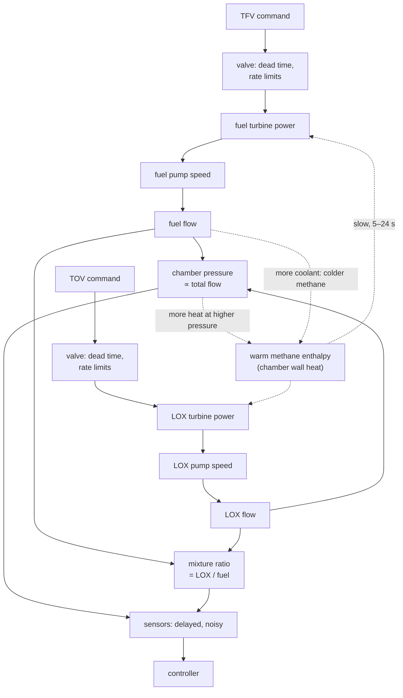

# :re-primer: 2. Domain primer: start here

!!! abstract "In short"

    - Nine short chapters take you from **the engine as a control system** to **the reward**, one physical idea each. They build up to the **Engine Lab**, an in-browser, LUMEN-like surrogate engine on which a PI controller and trained PPO and SAC agents run live, and close with how real hot-fire tests and DLR's simulator work.
    - Every chapter follows the same pattern: a question, a picture you can play with, the equations, **what it means for the agent**, and a short self-check.
    - All equations live on one [equation sheet](primer/equations.md). Each entry says what DLR's LUMEN model does and what the surrogate does instead.
    - The physics in four lines:
        - Chamber pressure is thrust, and mixture ratio is flame temperature.
        - Two turbine valves feed one heat budget to two pumps, so **both valves move both outputs**.
        - The oxidiser side answers in half a second; the fuel side answers through the **chamber wall's heat**, over 5–24 s.
        - Mixture ratio, the noisiest measurement, guards the fastest-acting limit.

This primer is the physics you need to read the LUMEN Control Challenge critically and to design for it. It covers what the controlled variables mean, why the two actions couple, where the slow and fast dynamics come from, what the constraints protect, and what a hot-fire test looks like. It assumes the RL; it does not assume combustion or turbomachinery. Equations are the ones the DLR group itself uses, each linked to where it appears. Everything else links to [References](07-references.md).

!!! warning "About the widgets and the Lab"
    DLR's simulator is not public ([§7.1](07-references.md#71-search-log-where-the-lumen-control-challenge-simulator-is-not)). The widgets run a **surrogate**: a reduced expander-bleed engine written for this site and calibrated to the static gains, settling times and overshoot DLR publishes for its LUMEN model ([model card](primer/8-lab.md#model-card)). It shows the right mechanisms at roughly the right sizes and speeds. Its numbers are not DLR's and say nothing quantitative about the challenge.

## How to use it

-   :re-engine:{ .lg .middle } **[The engine as a control system](primer/1-engine.md)**

    ---

    Thrust is chamber pressure, mixture ratio is temperature, and two valves set both. *Widget: the valve plane.*

-   :re-cycle:{ .lg .middle } **[The expander-bleed cycle](primer/2-cycle.md)**

    ---

    Where the turbine power comes from, and why both turbines share one heat budget. *Widget: the engine at steady state.*

-   :re-valve:{ .lg .middle } **[Valves are the actuators](primer/3-valves.md)**

    ---

    Flow coefficients, dead time and rate limits, and why valve models broke sim-to-real twice. *Widget: a valve step.*

-   :re-clock:{ .lg .middle } **[Fast chamber, slow heat](primer/4-time-scales.md)**

    ---

    Settling times from half a second to 24 s, and a pressure overshoot 75 % larger than the final change. *Widget: TFV and TOV steps.*

-   :re-map:{ .lg .middle } **[Constraints and the operating map](primer/5-constraints.md)**

    ---

    Cooling, injection and turbopump limits, and which set points two valves can hold. *Widget: the operating map.*

-   :re-sensor:{ .lg .middle } **[Sensors, delays and noise](primer/6-sensors.md)**

    ---

    What the controller actually reads, and why mixture ratio is the noisiest signal. *Widget: delay and noise.*

-   :re-reward:{ .lg .middle } **[From physics to reward](primer/7-reward.md)**

    ---

    DLR's reward and observation design, term by term, and what this repo's environment changes. *Widget: the tracking reward.*

-   :re-lab:{ .lg .middle } **[The Engine Lab](primer/8-lab.md)**

    ---

    Everything above in one simulator. Presets show a schedule, PI, PPO and SAC, or you, turning the knobs. You can perturb the engine and compare runs.

-   :re-hotfire:{ .lg .middle } **[Hot fire, simulators and glossary](primer/9-field.md)** and :re-sigma:{ .lg .middle } **[Equation sheet](primer/equations.md)**

    ---

    What a test looks like, how DLR's model is built and how good it is, the vocabulary, and every equation in one place.

Reading time is about ninety minutes with the widgets. If you only have twenty minutes:

1. Read [Fast chamber, slow heat](primer/4-time-scales.md).
2. Open the Lab on the [TFV step](primer/8-lab.md?preset=tfv_step).
3. Then open it on the [PI controller](primer/8-lab.md?preset=pi).

## The whole problem on one page

Two valve commands go in every 0.05 s (20 Hz in the challenge; the surrogate on this site uses 0.1 s), and chamber pressure and mixture ratio come out. The chain between them, as LUMEN implements it (each box is covered in one of the chapters):

The dotted arrows close the slow loop that makes the fuel side hard: more chamber pressure means more wall heat, but more coolant flow means colder methane for the turbines.
{: .caption }

## One valve step in five moments

The TFV step is the most instructive single experiment on this engine. Open each moment in the Lab (surrogate; the times match DLR's model to within about 25 %, see the [model card](primer/8-lab.md#model-card)).

| t after the step | What happens | Why it matters | |
|---|---|---|---|
| 0–0.05 s | nothing: valve dead time | a controller acting on its own latest command sees no effect yet | [open](primer/8-lab.md?preset=tfv_step){ .re-try } |
| 0.1–2 s | fuel turbine spins up; fuel flow, then pressure rise; mixture ratio falls | the fast response: both outputs move, in opposite directions | [open](primer/8-lab.md?preset=tfv_step){ .re-try } |
| about 2 s | pressure peaks about 6.5 bar above where it started | in DLR's model the peak is "75 % larger than the static gain" ([p. 73](https://elib.dlr.de/219040/1/DLR-FB-2025-16.pdf#page=90)) | [open](primer/8-lab.md?preset=tfv_step){ .re-try } |
| 2–20 s | more coolant through the same heat: colder methane, weaker turbines, pressure sags | the slow loop; a PI tuned on the peak is too weak for the sag | [open](primer/8-lab.md?preset=pi){ .re-try } |
| about 20 s | settled at about +3.4 bar, −0.55 in mixture ratio, 100 K colder methane | DLR's model: +3.7 bar, −0.6, −110 K ([Table 4.6](https://elib.dlr.de/219040/1/DLR-FB-2025-16.pdf#page=89)) | [open](primer/8-lab.md?preset=tfv_step){ .re-try } |
