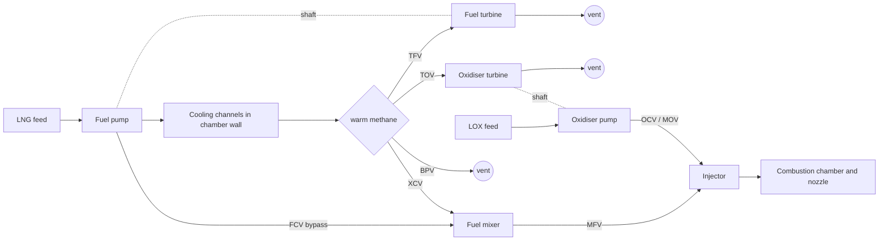

# 2. Domain primer: pump-fed liquid rocket engines for an RL researcher

This page covers what you need to reason about the LUMEN task: what the controlled variables mean physically, why the actions couple them, where the slow and fast dynamics come from, what the constraints protect, and what a hot-fire test looks like operationally. It assumes the RL; it does not assume combustion or turbomachinery. Equations are the ones the DLR group itself uses; each links to where it appears.

## 2.1 Thrust is chamber pressure

A rocket engine burns an oxidiser and a fuel in a chamber and expands the hot gas through a converging–diverging nozzle. Thrust is momentum flux plus a pressure term at the nozzle exit ([Dresia thesis eq. 2.3](https://elib.dlr.de/219040/1/DLR-FB-2025-16.pdf#page=27)):

$$
F = \dot m_T\,u_e + (p_e - p_{\mathrm{amb}})\,A_e ,
$$

with $\dot m_T = \dot m_{\mathrm{ox}} + \dot m_{\mathrm{fuel}}$ the total propellant flow, $u_e$, $p_e$, $A_e$ exit velocity, pressure and area. For an ideal isentropic nozzle this becomes ([eq. 2.4](https://elib.dlr.de/219040/1/DLR-FB-2025-16.pdf#page=28))

$$
F = A_t\,p_{cc}\,\sqrt{\frac{2\kappa^2}{\kappa-1}\Big(\frac{2}{\kappa+1}\Big)^{\frac{\kappa+1}{\kappa-1}}\Big[1-\Big(\frac{p_e}{p_{cc}}\Big)^{\frac{\kappa-1}{\kappa}}\Big]} + (p_e-p_{\mathrm{amb}})A_e ,
$$

where $A_t$ is the nozzle throat area, $p_{cc}$ the combustion chamber pressure and $\kappa$ the ratio of specific heats. With a fixed throat and a weak dependence of $\kappa$ on mixture ratio, **thrust is proportional to $p_{cc}$**, which is why "thrust control becomes equivalent to $p_{cc}$ control" ([p. 11](https://elib.dlr.de/219040/1/DLR-FB-2025-16.pdf#page=28)). That is also why the benchmark tracks $p_{cc}$ rather than thrust: the test bench measures pressure directly and precisely.

Chamber pressure in turn follows the propellant flow. The classical small-signal model from Lorenzo and Musgrave, quoted in [thesis eq. 2.2](https://elib.dlr.de/219040/1/DLR-FB-2025-16.pdf#page=25), is

$$
\frac{p_{cc}(s)}{\dot m_T(s)} = \frac{c^*}{A_t\,g}\;\frac{e^{-\sigma s}}{\tau s + 1},
$$

a first-order lag with dead time. $c^*$ (the *characteristic velocity*) is a property of the propellant pair and mixture ratio, $\sigma$ is the combustion delay and $\tau$ the chamber filling time. Both are short compared with everything else in a pump-fed engine, so for control purposes: **more total flow means more pressure, almost immediately.** The hard part is getting the flow, which in LUMEN comes from turbopumps (§2.3).

## 2.2 Mixture ratio is temperature

The second controlled variable is the oxidiser-to-fuel mass ratio ([eq. 2.1](https://elib.dlr.de/219040/1/DLR-FB-2025-16.pdf#page=25))

$$
R_{OF} = \frac{\dot m_{\mathrm{ox}}}{\dot m_{\mathrm{fuel}}} .
$$

For methane, complete combustion $\mathrm{CH_4 + 2\,O_2 \to CO_2 + 2\,H_2O}$ needs $2 \times 32 = 64$ g of oxygen per 16 g of methane, a stoichiometric $R_{OF}$ of 4.0. Near stoichiometric the flame is hottest; engines therefore run fuel-rich, because "operating conditions close to the stoichiometric mixture ratio needs to be avoided" to protect the chamber wall ([thesis p. 11](https://elib.dlr.de/219040/1/DLR-FB-2025-16.pdf#page=28)). LUMEN runs at $R_{OF}$ 3.0–3.8, nominally 3.4 ([Table 4.1](https://elib.dlr.de/219040/1/DLR-FB-2025-16.pdf#page=75)). An excursion upwards is the fastest way to damage hardware, which is why classical designs make the mixture-ratio loop the fast loop and the pressure loop the slow one ([Lorenzo & Musgrave 1992, p. 3](https://ntrs.nasa.gov/citations/19920004056); [thesis p. 9](https://elib.dlr.de/219040/1/DLR-FB-2025-16.pdf#page=26)).

The coupling is built in: $p_{cc}$ depends on the *sum* of the two flows and $R_{OF}$ on their *ratio*, so any single valve that changes one flow moves both outputs ([thesis p. 9](https://elib.dlr.de/219040/1/DLR-FB-2025-16.pdf#page=26)). That is the 2×2 MIMO structure of the benchmark.

## 2.3 How LUMEN moves propellant: the expander-bleed cycle

Pressure-fed engines push propellant out of pressurised tanks; that caps chamber pressure at tank pressure. Pump-fed engines use turbopumps, and the engine *cycle* is the answer to "where does the turbine power come from?". In a gas-generator cycle a small separate combustor makes hot gas for the turbines; in staged combustion that gas then goes into the main chamber; in an expander cycle the fuel is heated in the chamber's cooling channels and that heat drives the turbines.

LUMEN is an **expander-bleed** engine ([thesis p. 54](https://elib.dlr.de/219040/1/DLR-FB-2025-16.pdf#page=71)): liquid methane is pumped through channels in the chamber wall in counter-flow, picks up heat, and part of this warm methane drives both turbines and is then vented unburned (an "open" cycle); the rest is remixed and injected. The two turbopumps run in parallel and independently. Simplified from [thesis Fig. 4.1](https://elib.dlr.de/219040/1/DLR-FB-2025-16.pdf#page=71):

The control consequence is the one the benchmark is built on: **the two turbine valves TFV and TOV set how much warm methane reaches each turbine, hence each pump's speed, hence each propellant flow.** Opening both raises $p_{cc}$; opening them asymmetrically shifts $R_{OF}$ ([thesis p. 56](https://elib.dlr.de/219040/1/DLR-FB-2025-16.pdf#page=73)). The other four continuous valves (FCV fuel-bypass, BPV vent, XCV mixer, OCV oxidiser) shape cooling flow, injection temperature and oxidiser flow; they are actuated in DLR's own 4- and 5-valve controllers but, as far as the published benchmark design says, not in the 2×2 task.

### Turbopump power balance

Each turbopump is a shaft with a turbine on one end and a pump on the other. Its speed $\omega$ obeys the rotational form of Newton's second law, $I\,\dot\omega = T_{\mathrm{turbine}} - T_{\mathrm{pump}}$, and at steady state the two torques balance ([thesis p. 67](https://elib.dlr.de/219040/1/DLR-FB-2025-16.pdf#page=84)). DLR's ESPSS model describes the pump with dimensionless maps ([eq. 4.4](https://elib.dlr.de/219040/1/DLR-FB-2025-16.pdf#page=83)):

$$
\psi^+ = \frac{\Delta p}{\rho_{in}\,\omega^2},\qquad \varphi^+ = \frac{\dot m}{\rho_{in}\,\omega},\qquad C^+ = \frac{T_{\mathrm{pump}}}{\rho_{in}\,\omega^2},
$$

so pump pressure rise grows with $\omega^2$ and flow with $\omega$; and the turbine with a specific-torque map $T_s = T_{\mathrm{turbine}}/(\dot m\,r\,c) = f(\Pi, N)$ over pressure ratio $\Pi$ and blade-speed ratio $N = \omega r / c$ ([eq. 4.5](https://elib.dlr.de/219040/1/DLR-FB-2025-16.pdf#page=83)). Two things follow for an RL person:

- **Turbine power is heat-limited.** The warm methane's enthalpy comes from the chamber wall, which depends on chamber pressure and on how much methane goes through the channels. More thrust needs more turbine power, which needs more heat, which needs more thrust: a positive loop with thermal lag. This is why fuel-side actuation is slow (§2.5).
- **Efficiencies are uncertain.** Shaft torque is not measured on LUMEN; efficiencies were inferred from pressures and temperatures, and the turbines were characterised with ambient nitrogen but run on hot methane, whose speed of sound is about 500 vs 350 m/s ([thesis p. 67](https://elib.dlr.de/219040/1/DLR-FB-2025-16.pdf#page=84)). DLR therefore added turbine-torque scaling factors precisely so they could be randomised during training. Expect the benchmark's parametric-uncertainty test cases to perturb parameters of this kind.

## 2.4 Valves are the actuators

Every action in the benchmark is a valve command. A valve is characterised by its flow coefficient $k_v$ (water flow in m³/h at 1 bar pressure drop) and a characteristic curve $k_v(\text{position})$: linear, or equal-percentage (opens progressively). Guidelines put a control valve at 35–75 % of the system pressure drop when fully open ([thesis p. 21](https://elib.dlr.de/219040/1/DLR-FB-2025-16.pdf#page=38)); outside that range the loop gain varies sharply over the stroke, which an RL policy experiences as state-dependent action sensitivity. LUMEN's valves are DLR-built, servo-motor driven, with "opening speeds of less than 0.5 seconds" ([Traudt et al. 2022, p. 8](https://elib.dlr.de/191316/1/Traudt%20IAC-22,C4,1,3,x73654.pdf#page=8)), "high positioning accuracy, no overshoot … and no hysteresis" ([thesis p. 56](https://elib.dlr.de/219040/1/DLR-FB-2025-16.pdf#page=73)).

Valve dynamics are where sim-to-real has broken twice. The first hot-fire test of an RL controller oscillated, "likely attributable to an inaccurate model of the valve dynamics" ([Dauer et al. 2025, p. 7](https://www.eucass.eu/doi/EUCASS2025-533.pdf#page=7)); the thesis appendix calls the run "unstable due to a modeling error in the valve transfer function" ([PDF p. 166](https://elib.dlr.de/219040/1/DLR-FB-2025-16.pdf#page=166)). DLR then fitted a semi-empirical valve model and randomised valve $k_v$, maximum acceleration and velocity by ±5–8 % and dead time over 0.03–0.08 s during training ([Table A.3](https://elib.dlr.de/219040/1/DLR-FB-2025-16.pdf#page=165)).

## 2.5 Time scales: fast chamber, slow heat

Three layers of dynamics sit on top of each other:

| Process | Time scale | Source |
|---|---|---|
| Chamber filling and combustion delay | short compared with pump and thermal dynamics (first-order lag + dead time) | [thesis eq. 2.2](https://elib.dlr.de/219040/1/DLR-FB-2025-16.pdf#page=25) |
| Oxidiser-side valve steps (TOV, OCV) | "mostly … less than 1 s" (TOV 0.4–0.6 s on all outputs) | [thesis Table 4.7](https://elib.dlr.de/219040/1/DLR-FB-2025-16.pdf#page=91) |
| Fuel-side valve steps (TFV) | 5.4–23.8 s settling depending on output | same |
| Fuel injection temperature | mean 12.1 s settling | same |
| Expander-cycle start-up to equilibrium | up to 15 s | [thesis p. 10](https://elib.dlr.de/219040/1/DLR-FB-2025-16.pdf#page=27) |

The TFV–TOV asymmetry matters for the 2×2 task: one action channel acts within a second, the other through the thermal loop over tens of seconds. The thesis also notes that some engines are **non-minimum phase**: thrust can first drop when a valve opens because a fast process with small gain precedes a slow process with large gain ([p. 20](https://elib.dlr.de/219040/1/DLR-FB-2025-16.pdf#page=37)). For RL this means short horizons and myopic discounting ($\gamma$ = 0.9 at 10–20 Hz is an effective horizon of 0.5–1 s) lean heavily on the observation containing enough history, which DLR provides by stacking the last 3 observations ([thesis p. 81](https://elib.dlr.de/219040/1/DLR-FB-2025-16.pdf#page=98)).

## 2.6 What the constraints protect

The constraint table in [§1.2](01-problem.md#12-formal-statement) is physical, not cosmetic ([thesis §4.1.2](https://elib.dlr.de/219040/1/DLR-FB-2025-16.pdf#page=75)):

- **Cooling.** Minimum coolant flow $\dot m_{RC} \ge f(p_{cc})$ keeps the chamber wall below its temperature limit; the channel pressure must stay above methane's critical pressure of 46 bar to avoid boiling and "heat transfer deterioration". Yet "the highest efficiency in terms of specific impulse … is achieved with the lowest possible cooling channel mass flow" ([p. 74](https://elib.dlr.de/219040/1/DLR-FB-2025-16.pdf#page=91)); in this open cycle, maximising efficiency is equivalent to minimising the turbine flow that is vented unburned ([p. 82](https://elib.dlr.de/219040/1/DLR-FB-2025-16.pdf#page=99)). Optimal operation therefore sits on a constraint boundary.
- **Injection.** The fuel-to-oxidiser momentum-flux ratio $J = \rho_{\mathrm{CH_4}} v_{\mathrm{CH_4}}^2 / (\rho_{\mathrm{LOX}} v_{\mathrm{LOX}}^2)$ must exceed 10 for the flame to stay anchored at the injector face; injection temperature must stay within 210–300 K ([p. 59](https://elib.dlr.de/219040/1/DLR-FB-2025-16.pdf#page=76)).
- **Turbopumps.** Speed limits (28,000 rpm oxidiser, 50,000 rpm fuel), no dwelling at critical (resonant) speeds, turbine inlet below 700 K ([p. 60](https://elib.dlr.de/219040/1/DLR-FB-2025-16.pdf#page=77)).
- **Valves.** No oscillation: fatigue, pressure waves through the feed system, and "chugging" (low-frequency combustion–feed-system coupling) ([p. 60](https://elib.dlr.de/219040/1/DLR-FB-2025-16.pdf#page=77)).

On a test bench, critical variables also have **redlines**: "maximum and minimum thresholds … If those thresholds are exceeded, a safe shutdown of the engine is initiated" ([DX'25 LUMEN benchmark page](https://vehsys.gitlab-pages.liu.se/dx25benchmarks/lumen/lumen_index)). A redline trip ends the episode, costs the test, and can be triggered by a *sensor* fault as easily as by a real excursion, which is why DLR runs a parallel line of work on fault detection and virtual sensing.

## 2.7 Sensors and what the agent actually sees

LUMEN carries 40 thermocouples and 62 static and dynamic pressure sensors ([thesis p. 55](https://elib.dlr.de/219040/1/DLR-FB-2025-16.pdf#page=72)); mass flows come from Coriolis meters. Stated maximum uncertainties are ±1 % of span for pressure (0–250 bar), ±0.03 kg/s for mass flow, ±1.5–2.5 K for temperature, ±0.2 % for rotational speed ([Kurudzija et al. 2025, Table 1](https://www.eucass.eu/doi/EUCASS2025-105.pdf#page=5)). Two practical consequences:

- $R_{OF}$ is not measured; it is a ratio of two flow measurements, so its noise is much larger than that of $p_{cc}$: measured steady-state $\sigma$ of 3.0 % vs 0.3 % on the real engine, and the 3.0 % exceeded the 1.5 % maximum injected during training ([thesis p. 116](https://elib.dlr.de/219040/1/DLR-FB-2025-16.pdf#page=133)).
- Sensors have their own time constants and filtering; DLR modelled a moving-average window on $p_{cc}$ and randomised it over 0.05–0.15 s ([Table A.3](https://elib.dlr.de/219040/1/DLR-FB-2025-16.pdf#page=165)).

This is the "sparse, noisy, delayed" setting you know from beamline instrumentation, with the difference that here the noisiest channel ($R_{OF}$) is also the one tied to the fastest safety constraint.

## 2.8 What a hot-fire test looks like

A test is a scripted sequence ([thesis p. 9–10](https://elib.dlr.de/219040/1/DLR-FB-2025-16.pdf#page=26)): chill-down of lines and pumps, ignition, open-loop ramp-up to a stable point, optional closed-loop phase, scripted shutdown. Closed loop is only handed over once pressures and flows are established; in DLR's two RL hardware tests the first 15 s and 18 s were open-loop ([Dauer et al. 2025, Fig. 4](https://www.eucass.eu/doi/EUCASS2025-533.pdf#page=8)). Real data is scarce: across the 2024 and 2025 engine campaigns LUMEN had 17 ignitions and "an accumulated hot-fire test duration of over 20 minutes" ([Kurudzija et al. 2025, p. 4](https://www.eucass.eu/doi/EUCASS2025-105.pdf#page=4)). The successful RL hardware run was "over 16 s" of closed loop ([thesis p. 117](https://elib.dlr.de/219040/1/DLR-FB-2025-16.pdf#page=134)); the run shown at the RL Bootcamp 2026 tracked for about 15 s before a sensor failure ended it ([livestream, §7.2](07-references.md#72-lumen-control-challenge-and-benchmark)). In RL terms, the real environment offers on the order of minutes of interaction per year, with episode termination controlled by safety logic you do not own.

## 2.9 How the simulator is built and how good it is

The LUMEN model is written in EcosimPro (a commercial differential-algebraic modelling tool) with ESA's ESPSS propulsion libraries, version 6.4.0 / 3.6.0 in the thesis ([p. 60](https://elib.dlr.de/219040/1/DLR-FB-2025-16.pdf#page=77)). Components (pipes, pumps, turbines, valves, cooling channels, chamber) are calibrated individually on sub-system tests, then the whole engine is validated on hot-fire data. Against a single post-start-up test run the validated model reaches ([Kurudzija et al. 2025, Table 2](https://www.eucass.eu/doi/EUCASS2025-105.pdf#page=10)):

| Quantity | MAPE over test | Max steady-state error |
|---|---|---|
| Chamber pressure | 2.4 % | 3.3 % (2.4 bar) |
| Mixture ratio | 3.5 % | 5.2 % (0.2) |
| Fuel / oxidiser pump outlet pressure | 2.8 % / 4.1 % | 4.8 % / 7.4 % |
| Fuel injection temperature | 1.9 % | 4.8 % (15.1 K) |
| Turbopump speeds (FTP / OTP) | 1.5 % / 1.8 % | 3.1 % / 2.6 % |

On the specific run used for the RL hardware demonstration, model–experiment errors were larger: mean 4.1 % on $p_{cc}$, 4.9 % on coolant flow, maximum 10.6 % ([thesis Table 6.3](https://elib.dlr.de/219040/1/DLR-FB-2025-16.pdf#page=131)). A 2026 preprint describes a "representative upper-stage rocket engine based on the LUMEN" model with errors "below 5 % over the full operational envelope" ([Kurudzija et al. 2026](https://doi.org/10.2139/ssrn.6806858), abstract only) — plausibly the generalised simulator behind the challenge. ESPSS itself is ESA property: "Any entity interested in using ESPSS needs prior approval from ESA" ([EcosimPro brochure](https://www.ecosimpro.com/wp-content/uploads/2015/02/ecosimpro_brochure_library_espss.pdf)). My inference, not DLR's statement: this, and not just DLR's own IP, is the likeliest source of the "legal issues" mentioned at the bootcamp, and the reason the challenge promises a *generalised* model plus a remote evaluation service rather than the calibrated EcosimPro model itself.

## 2.10 Glossary

| Term | Meaning |
|---|---|
| $p_{cc}$ | Combustion chamber pressure (bar); thrust proxy |
| $R_{OF}$ | Oxidiser-to-fuel mass-flow ratio |
| LOX / LNG | Liquid oxygen / liquefied natural gas (methane) |
| Expander-bleed | Cycle where fuel heated in the cooling channels drives the turbines and is then vented |
| OTP / FTP | Oxidiser / fuel turbopump |
| TFV / TOV | Turbine fuel / oxidiser valve; the benchmark's two actions |
| FCV, BPV, XCV, OCV | Fuel control (bypass), bypass (vent), mixer, oxidiser control valves |
| MOV / MFV | Main oxidiser / fuel valves (on/off, for ignition and shutdown) |
| $\dot m_{RC}$ | Regenerative-cooling (cooling-channel) mass flow |
| $J$ | Injector momentum-flux ratio; flame-anchoring criterion |
| $c^*$ | Characteristic velocity; links chamber pressure to mass flow |
| $k_v$ | Valve flow coefficient |
| Redline | Threshold that triggers automatic shutdown on the test bench |
| P8.3 | Test cell at DLR Lampoldshausen where LUMEN is fired |
| EcosimPro / ESPSS | Commercial simulation tool / ESA propulsion library used for the LUMEN model |
| MAPE | Mean absolute percentage error |
