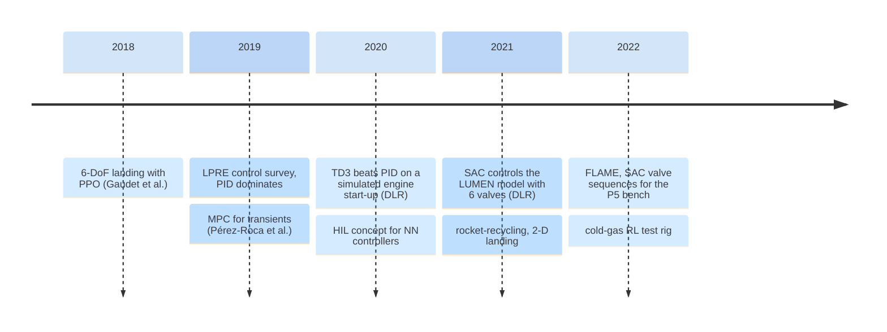
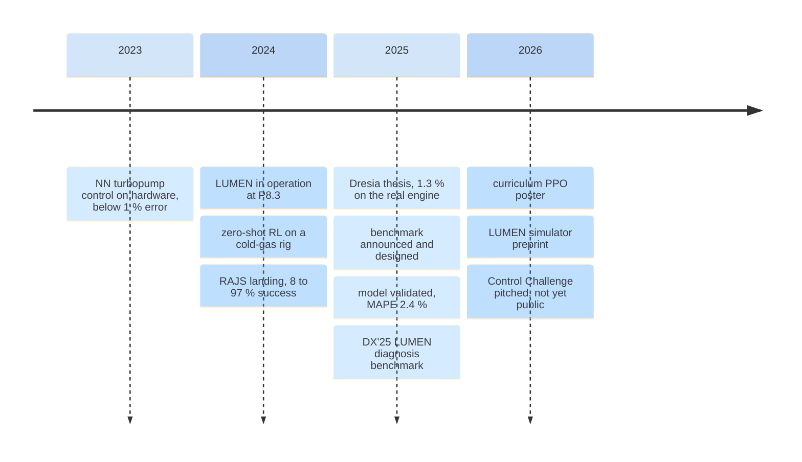

---
hide:
  - toc
icon: re/timeline
---

# :re-timeline: 3. Timeline 2018–2026

Results relevant to learning-based control of liquid rocket engines, in date order. **Engine** rows are the main line; **adjacent** rows (landing guidance, thrusters, test-bench automation) are included where they shaped methods or show the state of the art next door. Every number links to where it appears; rows marked *A* rest on an abstract only (see [§7](07-references.md)).

```vegalite
{
 "$schema": "https://vega.github.io/schema/vega-lite/v6.json",
 "title": {
  "text": "Every row of the table below, by date and kind of result",
  "subtitle": "Hover a point for the source row. Dates given only as a year are placed mid-year"
 },
 "width": "container",
 "height": 250,
 "encoding": {
  "x": {
   "field": "date",
   "type": "temporal",
   "title": null,
   "scale": {
    "domain": [
     "2018-06-01",
     "2026-12-31"
    ]
   },
   "axis": {
    "format": "%Y",
    "tickCount": {
     "interval": "year",
     "step": 1
    }
   }
  },
  "y": {
   "field": "lane",
   "type": "nominal",
   "sort": [
    "Engine control, simulation",
    "Hardware, engine or rig",
    "Benchmark and infrastructure",
    "Classical control",
    "Adjacent fields"
   ],
   "title": null,
   "axis": {
    "labelLimit": 220
   }
  }
 },
 "layer": [
  {
   "data": {
    "values": [
     {
      "date": "2018-10-20",
      "when": "2018-10",
      "lane": "Adjacent fields",
      "what": "Gaudet et al.: PPO, 6-DoF Mars landing",
      "result": "landing error < 5 m; 4 % more fuel than optimum"
     },
     {
      "date": "2019-06-01",
      "when": "2019",
      "lane": "Classical control",
      "what": "Pérez-Roca et al.: LPRE control survey",
      "result": "steady state mostly PID; transients open loop"
     },
     {
      "date": "2019-07-10",
      "when": "2019-07",
      "lane": "Classical control",
      "what": "Pérez-Roca et al.: MPC for transients",
      "result": "MPC keeps pump-speed bounds that PID and LQR exceed"
     },
     {
      "date": "2020-06-19",
      "when": "2020-06",
      "lane": "Engine control, simulation",
      "what": "Waxenegger-Wilfing et al.: TD3 vs PID, gas-generator model",
      "result": "IAE 519 (RL) vs 632 (PID)"
     },
     {
      "date": "2020-10-12",
      "when": "2020-10",
      "lane": "Hardware, engine or rig",
      "what": "Waxenegger-Wilfing et al.: hardware-in-the-loop concept",
      "result": "≈ 250,000 flops per policy inference"
     },
     {
      "date": "2021-03-17",
      "when": "2021-03",
      "lane": "Engine control, simulation",
      "what": "Dresia et al.: SAC on the LUMEN model",
      "result": "< 2 s load changes vs > 10 s open loop"
     },
     {
      "date": "2021-06-01",
      "when": "2021",
      "lane": "Engine control, simulation",
      "what": "Einicke: RL for pressure and mixture ratio (diploma)",
      "result": "abstract only"
     },
     {
      "date": "2021-08-01",
      "when": "2021",
      "lane": "Hardware, engine or rig",
      "what": "Hörger et al.: robust RL, 22 N thruster",
      "result": "basic functionality shown (abstract)"
     },
     {
      "date": "2021-11-07",
      "when": "2021-11",
      "lane": "Adjacent fields",
      "what": "Zou: rocket-recycling, open source",
      "result": "landing success 14.6 % → 91.7 % by reward redesign"
     },
     {
      "date": "2022-05-09",
      "when": "2022-05",
      "lane": "Adjacent fields",
      "what": "Dresia et al.: FLAME test-bench valve sequences",
      "result": "pump-inlet pressure within ±200 mbar"
     },
     {
      "date": "2022-05-10",
      "when": "2022-05",
      "lane": "Hardware, engine or rig",
      "what": "Hörger et al.: cold-gas RL test rig",
      "result": "4 bar set point settles in 0.44 s"
     },
     {
      "date": "2023-01-23",
      "when": "2023-01",
      "lane": "Hardware, engine or rig",
      "what": "Dresia et al.: NN control of the LUMEN turbopump",
      "result": "> 500 s of test, mean error < 1 %"
     },
     {
      "date": "2024-03-02",
      "when": "2024-03",
      "lane": "Hardware, engine or rig",
      "what": "Hörger et al.: zero-shot cold-gas controller",
      "result": "RMSE ≤ 0.2 bar over 142 tests"
     },
     {
      "date": "2024-03-15",
      "when": "2024-03",
      "lane": "Benchmark and infrastructure",
      "what": "LUMEN put into operation at P8.3",
      "result": "25 kN LOX/methane engine"
     },
     {
      "date": "2024-07-21",
      "when": "2024-07",
      "lane": "Adjacent fields",
      "what": "Jiang et al.: RAJS rocket landing",
      "result": "success 8 % → 97 %"
     },
     {
      "date": "2024-09-27",
      "when": "2024-09",
      "lane": "Adjacent fields",
      "what": "Carradori: meta-RL, 6-DoF landing",
      "result": "1000/1000 runs meet terminal constraints"
     },
     {
      "date": "2024-10-14",
      "when": "2024-10",
      "lane": "Hardware, engine or rig",
      "what": "Traudt et al.: first LUMEN hot-fire campaign",
      "result": "4-valve closed loop at 20 Hz; 8 tests"
     },
     {
      "date": "2024-11-01",
      "when": "2024",
      "lane": "Adjacent fields",
      "what": "Urgolo et al.: learned fault monitors",
      "result": "anomaly vs nominal F1 0.95"
     },
     {
      "date": "2025-01-06",
      "when": "2025-01",
      "lane": "Hardware, engine or rig",
      "what": "Hörger et al.: RL pressure and mixture ratio, 22 N thruster",
      "result": "RMSE below 0.5 bar (abstract)"
     },
     {
      "date": "2025-02-01",
      "when": "2025-02",
      "lane": "Adjacent fields",
      "what": "Iafrate et al.: DRL first-stage landing",
      "result": "metadata only"
     },
     {
      "date": "2025-04-04",
      "when": "2025-04",
      "lane": "Benchmark and infrastructure",
      "what": "Benchmark announced at RL4AA'25",
      "result": "'freely accessible to the RL community'"
     },
     {
      "date": "2025-04-09",
      "when": "2025-04",
      "lane": "Hardware, engine or rig",
      "what": "Dresia thesis: SAC on the real engine",
      "result": "1.3 % mean error over > 16 s"
     },
     {
      "date": "2025-05-19",
      "when": "2025-05",
      "lane": "Benchmark and infrastructure",
      "what": "Benchmark design: 2×2 task, 7 Gym test cases",
      "result": "faults based on hot-run data"
     },
     {
      "date": "2025-05-25",
      "when": "2025-05",
      "lane": "Engine control, simulation",
      "what": "Bareiß: hybrid RL + PI (MSc)",
      "result": "beats pure SAC and static PI (abstract)"
     },
     {
      "date": "2025-06-30",
      "when": "2025-07",
      "lane": "Benchmark and infrastructure",
      "what": "LUMEN model validated on hot fire",
      "result": "MAPE 2.4 % on chamber pressure"
     },
     {
      "date": "2025-07-02",
      "when": "2025-07",
      "lane": "Hardware, engine or rig",
      "what": "Dauer et al.: out-of-capability detection",
      "result": "retrained agent held pressure until test ended early"
     },
     {
      "date": "2025-09-22",
      "when": "2025-09",
      "lane": "Benchmark and infrastructure",
      "what": "DX'25 LUMEN diagnosis benchmark",
      "result": "simulator on request only"
     },
     {
      "date": "2026-03-31",
      "when": "2026-03",
      "lane": "Engine control, simulation",
      "what": "Matanza et al.: curriculum PPO (poster)",
      "result": "abstract only"
     },
     {
      "date": "2026-06-11",
      "when": "2026-06",
      "lane": "Adjacent fields",
      "what": "Chaudhary et al.: chance-constrained RL",
      "result": "28 kg propellant overhead"
     },
     {
      "date": "2026-07-29",
      "when": "2026-07",
      "lane": "Benchmark and infrastructure",
      "what": "LUMEN simulator preprint",
      "result": "errors below 5 % (abstract)"
     },
     {
      "date": "2026-09-11",
      "when": "2026-09-11",
      "lane": "Benchmark and infrastructure",
      "what": "DLR-RA GitHub organisation created",
      "result": "empty on 2026-09-30"
     },
     {
      "date": "2026-09-17",
      "when": "2026-09-17",
      "lane": "Benchmark and infrastructure",
      "what": "LUMEN Control Challenge pitched",
      "result": "not yet public"
     }
    ]
   },
   "mark": {
    "type": "point",
    "filled": true,
    "size": 90,
    "color": "var(--viz-s1)",
    "stroke": "var(--md-default-bg-color)",
    "strokeWidth": 2
   },
   "encoding": {
    "tooltip": [
     {
      "field": "when",
      "title": "date"
     },
     {
      "field": "what",
      "title": "result"
     },
     {
      "field": "result",
      "title": "headline"
     }
    ]
   }
  },
  {
   "data": {
    "values": [
     {
      "date": "2025-04-09",
      "lane": "Hardware, engine or rig",
      "t": "1.3 % on the real engine"
     },
     {
      "date": "2026-09-17",
      "lane": "Benchmark and infrastructure",
      "t": "Challenge pitched"
     },
     {
      "date": "2024-03-15",
      "lane": "Benchmark and infrastructure",
      "t": "LUMEN in operation"
     }
    ]
   },
   "mark": {
    "type": "text",
    "align": "right",
    "dx": -8,
    "dy": -11
   },
   "encoding": {
    "text": {
     "field": "t"
    }
   }
  }
 ]
}
```

| Date | Group | Method | Headline number | Link |
|---|---|---|---|---|
| 2018-10 | Univ. Arizona / MIT (Gaudet, Linares, Furfaro) — *adjacent* | PPO, 6-DoF Mars powered descent | Landing error < 5 m; 4 % more fuel than the 3-DoF optimal baseline | [arXiv:1810.08719](https://arxiv.org/abs/1810.08719) |
| 2019 | ONERA / CNES / ArianeGroup (Pérez-Roca et al.) | Survey of LPRE control | Steady-state controllers "in most cases are of PID type"; transients "usually in open loop" (*A*) | [doi:10.1016/j.paerosci.2019.03.002](https://doi.org/10.1016/j.paerosci.2019.03.002) |
| 2019-07 | ONERA / CNES / ArianeGroup (Pérez-Roca et al.) | Linear MPC + nonlinear pre-processor, Vulcain-like gas-generator engine, 5 valves | MPC respects turbopump speed bounds that PID and LQR exceed when throttling to 1.2× nominal $p_{cc}$ | [arXiv:1907.04273](https://arxiv.org/pdf/1907.04273#page=5) |
| 2020-06 | DLR Lampoldshausen (Waxenegger-Wilfing, Dresia et al.) | TD3 (Stable-Baselines) on EcosimPro gas-generator engine start-up, 3 valves, 25 Hz | Episode reward −4.2 (RL) vs −6.5 (PID) vs −7.9 (open-loop sequence); IAE on $p_{cc}$ 519 vs 632 vs 591 | [arXiv:2006.11108, Table I](https://arxiv.org/pdf/2006.11108#page=9); *IEEE TAES* 57(5), 2021 |
| 2020-10 | DLR (Waxenegger-Wilfing et al.) | Hardware-in-the-loop test concept for NN controllers | 400/300-neuron policy ≈ 250,000 flops per inference; a RAD750 (80 Mflop/s) runs it in real time | [IAC-2020-C4.1.15](https://elib.dlr.de/136877/) |
| 2021-03 | DLR (Dresia et al.) | SAC (RLlib) on LUMEN EcosimPro model, up to 6 valves, 10 Hz | Load changes 60→80 and 80→40 bar in < 2 s vs > 10 s open loop; constraint penalty 0 vs −162 | [SP2020_533, p. 6–7](https://elib.dlr.de/141739/1/533_Dresia.pdf#page=6) |
| 2021 | DLR / TU Dresden (Einicke) | RL for joint $p_{cc}$ and $R_{OF}$ control of an expander-bleed engine (*A*) | — | [elib 142247](https://elib.dlr.de/142247/) |
| 2021 (DOI year) | DLR (Hörger et al.) | Robust RL with domain randomisation, 22 N N₂O/C₂H₆ thruster | "preliminary experiments demonstrate the basic functionality" (*A*) | [doi:10.2514/6.2021-3223](https://elib.dlr.de/143555/) |
| 2021-11 | Zou — *adjacent* | PPO, 2-D rocket hover and landing (open source) | Landing success 14.6 % → 91.7 % from reward redesign alone, 2.1 M steps | [rocket-recycling](https://github.com/jiupinjia/rocket-recycling) |
| 2022-05 | DLR + ESA FLAME (Dresia et al.) — *adjacent* | SAC finds tank-pressurisation valve sequences on the P5 test bench | LOX pump-inlet pressure held within ±200 mbar over a 700 s profile; ~1 day on 8 cores | [SP2022_138](https://www.ecosimpro.com/wp-content/uploads/2022/11/SP2022_138_P_DLR_Flame.pdf) |
| 2022-05 | DLR (Hörger et al.) | SAC, cold-gas thrust chamber test infrastructure | 4 bar set point: settling 0.44 s, MSE 0.0055 bar² | [SP2022_50, p. 7](https://elib.dlr.de/186952/1/50_HOERGER.pdf#page=7) |
| 2023-01 | DLR (Dresia et al.) | NN controller on the LUMEN oxidiser turbopump, P8.3 | > 500 s total test, mean error < 1 % | [thesis p. 3](https://elib.dlr.de/219040/1/DLR-FB-2025-16.pdf#page=20); [SciTech 2023](https://arc.aiaa.org/doi/10.2514/6.2023-0137) (*A*) |
| 2024-03 | DLR (Hörger et al.) | SAC, cold-gas chamber pressure, zero-shot sim-to-real, M11.5 | 142 hardware tests, RMSE ≤ 0.2 bar; trajectory RMSE 1.15 bar (hardware) vs 0.36 bar (sim) | [Acta Astronautica 219, p. 9](https://elib.dlr.de/207225/1/Final_Acta_Astronautica.pdf#page=9) |
| 2024-03 | DLR | LUMEN put into operation at P8.3 | 25 kN LOX/methane; first German methane engine | [DLR LUMEN page](https://www.dlr.de/en/research-and-transfer/featured-topics/reusable-space-transportation/lumen) |
| 2024-07 | Tsinghua / LandSpace (Jiang et al.) — *adjacent* | Random Annealing Jump Start + PPO/SAC family, 6-DoF + mass Simulink model | Landing success 8 % (PID guide) → 97 % | [arXiv:2407.15083](https://arxiv.org/abs/2407.15083) |
| 2024-09 | TU Delft (Carradori) — *adjacent* | Meta-RL (LSTM, GTrXL) with PPO, 6-DoF atmospheric landing | 1000/1000 Monte-Carlo runs meet terminal constraints; 6 % more fuel than LQR-tracked optimum | [MSc thesis](https://repository.tudelft.nl/record/uuid:bf2a598c-9694-40cd-8dec-03b73d539b54) |
| 2024-10 | DLR (Traudt et al.) | LUMEN hot-fire campaign; 4-valve closed-loop control at 20 Hz | 8 tests; ramp 40→60 bar within tolerance band | [IAC 2024, p. 4–5](https://elib.dlr.de/213229/1/IAC-24,C4,1,5,x86850%20manuscript.pdf#page=4) |
| 2024 | SAL / TU Graz / DLR (Urgolo et al.) — *adjacent* | Learned signal-temporal-logic monitors on a LUMEN-like EcosimPro model | Anomaly vs nominal F1 0.95, false-alarm rate 0.10 | [DX 2024](https://drops.dagstuhl.de/entities/document/10.4230/OASIcs.DX.2024.15) |
| 2025-01 | DLR (Hörger et al.) | DRL $p_{cc}$ + $R_{OF}$ controller, 22 N N₂O/ethane thruster | RMSE "below 0.5 bar and 1"; "simulation is better than at the real system" (*A*) | [SciTech 2025](https://elib.dlr.de/220009/) |
| 2025-02 | Politecnico di Milano (Iafrate et al.) — *adjacent* | DRL first-stage propulsive landing (content not verified) | — (*A*, metadata only) | [doi:10.1016/j.actaastro.2024.11.028](https://doi.org/10.1016/j.actaastro.2024.11.028) |
| 2025-04 | DLR / PLUS Salzburg (Dresia et al.) | **Benchmark announced** at RL4AA'25 | "will be made freely accessible to the RL community" | [RL4AA'25 abstract](https://indico.kit.edu/event/4216/contributions/19241/contribution.pdf) |
| 2025-04 | DLR (Dresia, PhD RWTH) | SAC, 5 valves in sim vs MPC; 4 valves on hardware, 20 Hz, domain randomisation, no fine-tuning | Sim: 0.3 % / 0.1 % ($p_{cc}$/$R_{OF}$) vs MPC 1.4 % / 0.6 %. Hardware: **1.3 % mean** over > 16 s | [thesis p. 93](https://elib.dlr.de/219040/1/DLR-FB-2025-16.pdf#page=110), [p. 113](https://elib.dlr.de/219040/1/DLR-FB-2025-16.pdf#page=130) |
| 2025-05 | DLR (Bareiß et al.) | **Benchmark design**: 2×2 MIMO, 7 Gym test cases | Seven test cases incl. domain adaptation and faults from hot-run data | [AI4Aerospace abstract p. 55](https://w3.onera.fr/ailab/sites/default/files/2025-06/abstractsAI4A5thworkshop_external.pdf#page=55) |
| 2025-05 | DLR / RWTH (Bareiß, MSc) | Hybrid RL + PI on an electric-pump LOX/LNG engine model | Hybrid "learns a form of automatic gain scheduling", beats pure SAC and static PI (*A*) | [elib 214433](https://elib.dlr.de/214433/) |
| 2025-07 | DLR (Kurudzija et al.) | Validated LUMEN EcosimPro model on hot-fire data | MAPE 2.4 % ($p_{cc}$), 3.5 % ($R_{OF}$); 17 ignitions, > 20 min hot fire | [EUCASS 2025-105](https://www.eucass.eu/doi/EUCASS2025-105.pdf#page=10) |
| 2025-07 | DLR (Dauer et al.) | Out-of-capability detection for the SAC engine controller | First hardware test oscillated (valve model); retrained agent held $p_{cc}$ until the test was terminated early | [EUCASS 2025-533](https://www.eucass.eu/doi/EUCASS2025-533.pdf#page=7) |
| 2025-09 | DX'25 (Pill et al.) | LUMEN fault-diagnosis benchmark (sibling to the control benchmark) | 15 sensor + 3 actuator + 3 component faults; simulator on request | [DX'25 paper](https://elib.dlr.de/219953/1/DX2025benchmark.pdf#page=9) |
| 2026-03 | PLUS Salzburg / DLR (Matanza et al.) | Curriculum-guided PPO on the LUMEN environment (poster) | — (abstract only) | [RL4AA'26](https://indico.ph.liv.ac.uk/event/2025/contributions/10623/) |
| 2026-06 | Univ. Auckland / ESA ACT / Univ. Bologna (Chaudhary et al.) — *adjacent* | Chance-constrained RL correction on an SCP trajectory, 2-D landing | 28.08 kg propellant overhead over the deterministic optimum, 100,000 samples | [arXiv:2606.13605](https://arxiv.org/abs/2606.13605) |
| 2026-07 | DLR (Kurudzija et al.) | Transient system-level LUMEN-based simulator (preprint) | Errors "below 5 %" over the envelope (*A*) | [doi:10.2139/ssrn.6806858](https://doi.org/10.2139/ssrn.6806858) |
| 2026-09-11 | DLR Institute of Space Propulsion | GitHub organisation `DLR-RA` created | 1 repository (profile README) on 2026-09-30 | [github.com/DLR-RA](https://github.com/DLR-RA) |
| 2026-09-17 | DLR at RL Bootcamp 2026 | **LUMEN Control Challenge** pitched: Gymnasium env, TFV/TOV actions, PPO and SAC demos | ~15 s hardware tracking before a sensor failure; public release pending "legal issues" | [livestream 7:18:00](https://www.youtube.com/watch?v=CX8I88Pta_I&t=26280s) |

Affiliations are taken from the title pages of the papers I opened. The Kaiser 2021 Würzburg thesis on RL throttling for landing is omitted because no primary copy could be opened ([§7.4](07-references.md#74-deep-rl-control-at-dlr-lampoldshausen)).

**2018–2022: methods in simulation**



**2023–2026: hardware and the benchmark**



## Reading the timeline

- **Four years from simulation to hardware.** DLR's first LUMEN RL controller ran in simulation in early 2021; the first closed-loop RL hot fire of the full engine is reported in the 2025 thesis. The intermediate steps were component-level hardware (turbopump 2023, cold-gas chamber 2024), which is where the valve-model and sensor-noise lessons were learned.
- **Every hardware result is from one group.** All engine-level RL hardware numbers come from DLR Lampoldshausen. The benchmark is the first attempt to let anyone else work on the same plant.
- **The numbers are not on a common scale.** Error metrics differ: mean absolute percentage error, IAE, RMSE in bar, summed reward. So do plants (gas-generator model, LUMEN model, LUMEN hardware, cold-gas rig). A shared evaluation service is exactly what the field lacks; [§5](05-limitations.md) returns to this.
