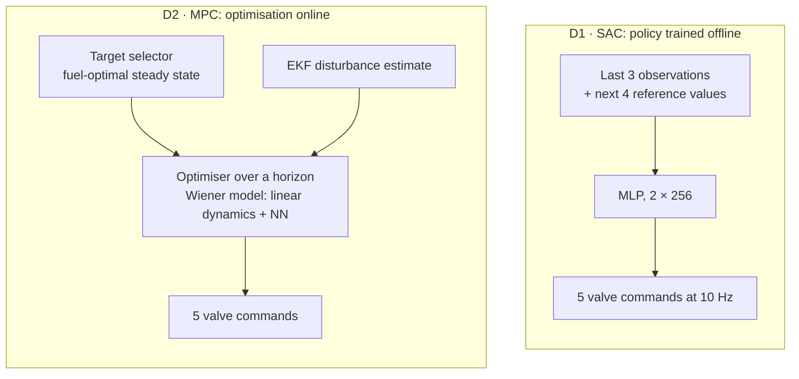
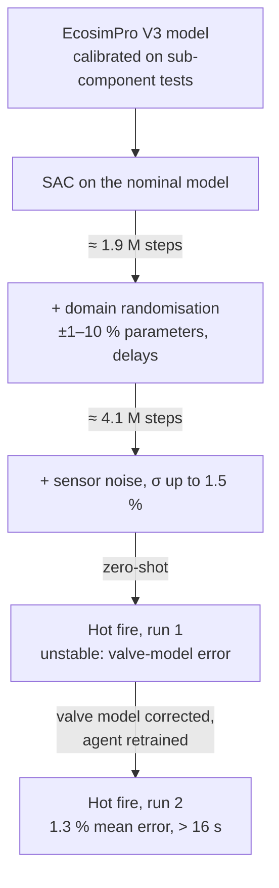

# 4. Solution designs side by side

This page lines up every published controller for this problem class that I could read, in the same terms: architecture, observation and action, reward, training data, compute, results. Designs are grouped by how close they are to the LUMEN Control Challenge task, the 2×2 TFV/TOV tracking problem ([§1](01-problem.md)). None has been run in this repository. The challenge environment is not public ([§7.1](07-references.md#71-search-log-where-the-lumen-control-challenge-simulator-is-not)).

## 4.1 Summary table

| Design | Plant | Actions | Obs. | Reward | Training | Result (best reported) |
|---|---|---|---|---|---|---|
| **D1** DLR SAC, fuel-efficient tracking | LUMEN EcosimPro V2, sim only | 5 valves (TOV, TFV, FCV, XCV, OCV), 10 Hz | 84-dim: outputs, 5 constrained vars, turbine flow, valve positions and commands, 4-step reference preview, 3-step stacking | exp. tracking + constant constraint penalties + fuel term | ~1.5 M steps nominal, 2.9 M with domain randomisation; ~1 M steps/day on 10 sims | 0.3 % / 0.1 % ($p_{cc}$ / $R_{OF}$); 0.7 s settling; no constraint violations |
| **D2** DLR MPC (same task as D1) | LUMEN EcosimPro V2 | same 5 valves | model state + EKF disturbance estimate | tracking + fuel-optimal target selector, soft constraints | Wiener model fitted on simulation data | 1.4 % / 0.6 %; 3.0 s settling; 22 steps below coolant limit; 0.38 % less propellant |
| **D3** DLR SAC, hardware controller | LUMEN EcosimPro V3 → real engine at P8.3 | 4 valves (TOV, TFV, FCV, BPV), 20 Hz | 57-dim: 4 outputs, 4 references (no preview), 3 extra pressures/temperature, 4 valve positions, 4 commands, 3-step stacking | exp. tracking on 4 outputs − 5 × valve-command change | curriculum: nominal → domain randomisation (1.9 M) → sensor noise (4.1 M); ~5 M steps, ~5 days | sim 0.4 % mean; **hardware 1.3 % mean** over > 16 s (run 2); run 1 unstable |
| **D4** Bootcamp 2026 demos | LUMEN benchmark env | 2 valves (TFV, TOV) | $p_{cc}$, $R_{OF}$, references, valve positions | user-defined | not stated | PPO tracks 60→70→57 bar with ramp lag; SAC tracks an Apollo-15-derived 40–80 bar profile (qualitative) |
| **D5** Curriculum PPO (RL4AA'26) | LUMEN benchmark env ("2x2 configuration") | 2 valves | not stated | reward components analysed | PPO, curriculum over envelope size | not in abstract |
| **D6** DLR SAC, early LUMEN study | LUMEN EcosimPro (2021) | up to 6 valves, 10 Hz | 11 variables | tracking + constraint penalties | 200 k steps | 40–80 bar changes in < 2 s; zero constraint penalty |
| **D7** DLR TD3, gas-generator start-up | Generic Vulcain-like GG engine (EcosimPro) | 3 valves, 25 Hz | 9 variables | set-point + GG constraint + valve terms | 100 k steps (~1.5 h) | IAE 519 vs PID 632 |
| **D8** Hybrid RL + PI (Bareiß MSc) | Electric-pump LOX/LNG engine model | PI outputs modulated by SAC | not stated | tracking | SAC | beats pure SAC and static PI (abstract) |
| **C1** SSME baseline | Staged-combustion LOX/LH2, flight | 2 closed-loop valves (FPOV, OPOV), 50 Hz | $p_{cc}$, $R_{OF}$ | — | — | PI, no gain scheduling needed over 65–109 % |
| **C2** Pérez-Roca MPC | Vulcain-like GG model | 5 valves, 100 Hz | 12 states | tracking; constraints on mixture ratios, pump speeds, valve rates | linearised models | respects pump-speed bounds that PID/LQR exceed |

Sources and details for each row follow.

The training column on one scale: every published agent used between 10⁵ and 5 × 10⁶ environment steps. The orange line marks what one laptop-CPU hour would buy at the thesis simulator's speed. That rate is my extrapolation from "about one million training steps per day" on 10 instances ([thesis p. 83](https://elib.dlr.de/219040/1/DLR-FB-2025-16.pdf#page=100)); the challenge simulator's speed is unknown.

```vegalite
{
  "$schema": "https://vega.github.io/schema/vega-lite/v6.json",
  "title": {"text": "Environment steps used to train each agent", "subtitle": "Log scale. Sources: arXiv:2006.11108 Table III; SP2020_533 Table 3; thesis Table 5.3 and p. 104"},
  "width": "container", "height": 190,
  "layer": [
    {"data": {"values": [
        {"agent": "D7 · TD3, gas-generator model", "steps": 100000, "label": "100 k"},
        {"agent": "D6 · SAC, early LUMEN model", "steps": 200000, "label": "200 k"},
        {"agent": "D1 · SAC, nominal model", "steps": 1500000, "label": "1.5 M"},
        {"agent": "D1 · SAC, domain-randomised", "steps": 2900000, "label": "2.9 M"},
        {"agent": "D3 · SAC, hardware controller", "steps": 5000000, "label": "≈ 5 M"}]},
     "layer": [
       {"mark": {"type": "point", "filled": true, "size": 100, "color": "var(--viz-s1)", "stroke": "var(--md-default-bg-color)", "strokeWidth": 2},
        "encoding": {"y": {"field": "agent", "type": "nominal", "sort": null, "title": null, "axis": {"labelLimit": 260}},
          "x": {"field": "steps", "type": "quantitative", "scale": {"type": "log", "domain": [20000, 10000000]}, "title": "Environment steps (log scale)", "axis": {"format": "~s"}},
          "tooltip": [{"field": "agent"}, {"field": "label", "title": "steps"}]}},
       {"mark": {"type": "text", "align": "left", "dx": 9},
        "encoding": {"y": {"field": "agent", "type": "nominal", "sort": null}, "x": {"field": "steps", "type": "quantitative"}, "text": {"field": "label"}}}
     ]},
    {"data": {"values": [{"x": 42000}]},
     "layer": [
       {"mark": {"type": "rule", "strokeWidth": 2, "color": "var(--viz-s2)"}, "encoding": {"x": {"field": "x", "type": "quantitative"}}},
       {"mark": {"type": "text", "align": "left", "dx": 5, "y": -6, "text": "≈ 4 × 10⁴: one CPU hour (extrapolated)"}, "encoding": {"x": {"field": "x", "type": "quantitative"}}}
     ]}
  ]
}
```

## 4.2 D1 vs D2: SAC against MPC on the same simulated task

Both come from the Dresia thesis, Chapter 5 ([PDF pp. 94–115](https://elib.dlr.de/219040/1/DLR-FB-2025-16.pdf#page=94)). The task tracks a fixed 60 s trajectory of $p_{cc}$ and $R_{OF}$ across the envelope while minimising the turbine flow vented overboard.

**D1, SAC.**

- *Implementation:* Ray RLlib (TensorFlow), a 2 × 256 MLP policy, and $\gamma = 0.9$, a 500 k replay buffer and target entropy −8 ([Table A.1](https://elib.dlr.de/219040/1/DLR-FB-2025-16.pdf#page=164)).
- *Observation:* outputs, constrained variables, turbine flow, valve positions and last commands, and the reference for the current and next $N_f = 4$ steps, stacked over the last $N_p = 3$ steps. The thesis gives the resulting length as 84 ([p. 81](https://elib.dlr.de/219040/1/DLR-FB-2025-16.pdf#page=98)).
- *Reward:*
    - an exponential tracking term per output, with $\delta = 12$;
    - a constant penalty per violated constraint ($\beta$ = 0.5, or 0.2 for coolant flow);
    - an economic term $-0.3\,(\dot m_{\mathrm{OTP,turb}} + \dot m_{\mathrm{FTP,turb}})$.

    See eqs. 5.6–5.9 and [Table A.2](https://elib.dlr.de/219040/1/DLR-FB-2025-16.pdf#page=164).

- *Compute:* a Xeon W-2265 workstation with an RTX 3090, 10 parallel EcosimPro instances, "about one million training steps per day"; convergence after about 1.5 M steps or 3000 episodes of 500 steps ([p. 83–84](https://elib.dlr.de/219040/1/DLR-FB-2025-16.pdf#page=100)). My derived figure: that is roughly 1.2 control steps per second per simulator instance, so the simulator, not the network, is the bottleneck.

**D2, MPC.**

- Built with RWTH's Institute of Automatic Control in Matlab with CasADi and IPOPT.
- A target selector computes the fuel-optimal steady state.
- A dynamic optimiser runs on a "data-based Wiener model with linear dynamics and a nonlinear steady-state output function in the form of a neural network", fitted to simulation data.
- Offset-free tracking uses disturbance estimation with an extended Kalman filter, and constraints are soft ([p. 92–93](https://elib.dlr.de/219040/1/DLR-FB-2025-16.pdf#page=109)).



The two controllers compared in the thesis. SAC does all its computation during training; MPC solves an optimisation at every step on a learned surrogate model.
{: .caption }

**Head to head** ([Table 5.4](https://elib.dlr.de/219040/1/DLR-FB-2025-16.pdf#page=114)):

| | IAE $p_{cc}$ | IAE $R_{OF}$ | Max settling | Mean settling | Control effort $\Delta u$ | Vented turbine propellant |
|---|---|---|---|---|---|---|
| MPC | 54.3 | 1.1 | 3.0 s | 1.5 s | 2.4 | 53.5 kg |
| SAC | 12.2 | 0.3 | 0.7 s | 0.3 s | 3.9 | 54.4 kg |

```vegalite
{
  "$schema": "https://vega.github.io/schema/vega-lite/v6.json",
  "title": {"text": "SAC vs MPC, one panel per metric", "subtitle": "Dresia 2025, Table 5.4. Lower is better in every panel; each panel has its own scale"},
  "data": {"values": [
    {"metric": "IAE, chamber pressure", "controller": "MPC", "value": 54.3},
    {"metric": "IAE, chamber pressure", "controller": "SAC", "value": 12.2},
    {"metric": "IAE, mixture ratio", "controller": "MPC", "value": 1.1},
    {"metric": "IAE, mixture ratio", "controller": "SAC", "value": 0.3},
    {"metric": "Max settling time (s)", "controller": "MPC", "value": 3.0},
    {"metric": "Max settling time (s)", "controller": "SAC", "value": 0.7},
    {"metric": "Mean settling time (s)", "controller": "MPC", "value": 1.5},
    {"metric": "Mean settling time (s)", "controller": "SAC", "value": 0.3},
    {"metric": "Control effort (valve travel)", "controller": "MPC", "value": 2.4},
    {"metric": "Control effort (valve travel)", "controller": "SAC", "value": 3.9},
    {"metric": "Vented turbine propellant (kg)", "controller": "MPC", "value": 53.5},
    {"metric": "Vented turbine propellant (kg)", "controller": "SAC", "value": 54.4}
  ]},
  "facet": {"row": {"field": "metric", "type": "nominal", "title": null,
    "sort": ["IAE, chamber pressure", "IAE, mixture ratio", "Max settling time (s)", "Mean settling time (s)", "Control effort (valve travel)", "Vented turbine propellant (kg)"],
    "header": {"labelAngle": 0, "labelAlign": "left", "labelAnchor": "start", "labelOrient": "top", "labelPadding": 2}}},
  "spec": {
    "width": 520, "height": 44,
    "mark": {"type": "bar", "cornerRadiusEnd": 4, "height": 16},
    "encoding": {
      "y": {"field": "controller", "type": "nominal", "title": null, "sort": ["SAC", "MPC"]},
      "x": {"field": "value", "type": "quantitative", "title": null, "axis": {"tickCount": 4}},
      "color": {"field": "controller", "type": "nominal", "scale": {"domain": ["SAC", "MPC"]}, "legend": {"title": null}},
      "tooltip": [{"field": "metric"}, {"field": "controller"}, {"field": "value", "format": ".1f"}]
    }
  },
  "resolve": {"scale": {"x": "independent"}}
}
```

What the numbers say:

- **SAC is faster.** It works by *overdriving* the valves: for the 50 → 80 bar step it "opens the turbine valves TOV and TFV for approximately 1.1 s beyond the final steady state positions" ([p. 86](https://elib.dlr.de/219040/1/DLR-FB-2025-16.pdf#page=103)). That is a bang-bang-like transient that this MPC, planning on a smooth data-based model with manually tuned penalties, does not produce. The price is about 60 % more valve motion (3.9 vs 2.4).
- **MPC is slightly more fuel-efficient** (0.38 % of total propellant).
- **MPC violates a soft constraint** for 22 steps, by up to 1.2 % of coolant flow ([p. 95](https://elib.dlr.de/219040/1/DLR-FB-2025-16.pdf#page=112)).
- **Robustness.** Under a 5 % error in fuel-turbine efficiency, the nominally trained SAC agent degrades to 1.7 % / 1.6 % error. The domain-randomised agent holds 0.3 % / 0.2 %, at the cost of training twice as long (2.9 M vs 1.5 M steps); open loop degrades to 4.7 % / 4.9 % ([Table 5.3](https://elib.dlr.de/219040/1/DLR-FB-2025-16.pdf#page=108)).

```vegalite
{
  "$schema": "https://vega.github.io/schema/vega-lite/v6.json",
  "title": {"text": "Tracking error with a 5 % fuel-turbine efficiency error", "subtitle": "Mean absolute % error on nominal vs perturbed model (Dresia 2025, Table 5.3)"},
  "data": {"values": [
    {"output": "Chamber pressure", "controller": "Open-loop sequence", "model": "Nominal model", "mape": 0.3},
    {"output": "Chamber pressure", "controller": "Open-loop sequence", "model": "5 % efficiency error", "mape": 4.7},
    {"output": "Chamber pressure", "controller": "SAC, nominal training", "model": "Nominal model", "mape": 0.3},
    {"output": "Chamber pressure", "controller": "SAC, nominal training", "model": "5 % efficiency error", "mape": 1.7},
    {"output": "Chamber pressure", "controller": "SAC, domain-randomised", "model": "Nominal model", "mape": 0.4},
    {"output": "Chamber pressure", "controller": "SAC, domain-randomised", "model": "5 % efficiency error", "mape": 0.3},
    {"output": "Mixture ratio", "controller": "Open-loop sequence", "model": "Nominal model", "mape": 0.1},
    {"output": "Mixture ratio", "controller": "Open-loop sequence", "model": "5 % efficiency error", "mape": 4.9},
    {"output": "Mixture ratio", "controller": "SAC, nominal training", "model": "Nominal model", "mape": 0.1},
    {"output": "Mixture ratio", "controller": "SAC, nominal training", "model": "5 % efficiency error", "mape": 1.6},
    {"output": "Mixture ratio", "controller": "SAC, domain-randomised", "model": "Nominal model", "mape": 0.3},
    {"output": "Mixture ratio", "controller": "SAC, domain-randomised", "model": "5 % efficiency error", "mape": 0.2}
  ]},
  "facet": {"column": {"field": "output", "type": "nominal", "title": null, "header": {"labelFontWeight": 600}}},
  "spec": {
    "width": 250, "height": 150,
    "mark": {"type": "bar", "cornerRadiusEnd": 4, "height": 12},
    "encoding": {
      "y": {"field": "controller", "type": "nominal", "title": null, "sort": null},
      "yOffset": {"field": "model", "sort": ["Nominal model", "5 % efficiency error"]},
      "x": {"field": "mape", "type": "quantitative", "title": "Mean abs. error (%)", "scale": {"domain": [0, 5]}},
      "color": {"field": "model", "type": "nominal", "scale": {"domain": ["Nominal model", "5 % efficiency error"]}, "legend": {"title": null}},
      "tooltip": [{"field": "output"}, {"field": "controller"}, {"field": "model"}, {"field": "mape", "title": "error (%)"}]
    }
  }
}
```

??? info "Table view: Dresia 2025, Table 5.3 (mean absolute % error; training steps)"
    | Controller | $p_{cc}$, nominal | $R_{OF}$, nominal | $p_{cc}$, 5 % error | $R_{OF}$, 5 % error | Training steps |
    |---|---|---|---|---|---|
    | Open-loop sequence | 0.3 | 0.1 | 4.7 | 4.9 | – |
    | SAC, nominal training | 0.3 | 0.1 | 1.7 | 1.6 | 1.5 M |
    | SAC, domain-randomised | 0.4 | 0.3 | 0.3 | 0.2 | 2.9 M |

## 4.3 D3: the hardware controller

This is the only RL controller reported to have closed the loop on the full LUMEN engine (thesis Chapter 6, [PDF pp. 116–135](https://elib.dlr.de/219040/1/DLR-FB-2025-16.pdf#page=116)).

**Task.** Arbitrary $p_{cc}$ changes over 40–60 bar, with three further regulated outputs: $R_{OF} = 3.0$, fuel injection temperature 270 K, and coolant flow scheduled on $p_{cc}$. It uses four valves at $T = 0.05$ s.

**Observation and reward.** The 19-element observation carries no reference preview, "as the reference trajectory is not known in advance", and is stacked 3 times. The reward is the exponential tracking term on all four outputs minus $5\sum_u |u_t - u_{t-1}|$ ([eqs. 6.2–6.5](https://elib.dlr.de/219040/1/DLR-FB-2025-16.pdf#page=119)).

**Training curriculum.**

1. Nominal model.
2. Domain randomisation switched on after about 1.9 M steps. Parameters are perturbed by ±1–10 %: valve flow coefficients and speeds, chamber heat transfer and efficiency, turbopump efficiencies, interface pressures and temperatures, sensor filter windows, and valve dead time ([Table A.3](https://elib.dlr.de/219040/1/DLR-FB-2025-16.pdf#page=165)).
3. Gaussian sensor noise up to $\sigma = 1.5\,\%$ after about 4.1 M steps ([p. 104](https://elib.dlr.de/219040/1/DLR-FB-2025-16.pdf#page=121)).



Retraining after a model change takes about 5 days ([p. 118](https://elib.dlr.de/219040/1/DLR-FB-2025-16.pdf#page=135)).

**Results** ([Table 6.2](https://elib.dlr.de/219040/1/DLR-FB-2025-16.pdf#page=130)), mean absolute percentage error over the four outputs:

| Condition | $p_{cc}$ | $R_{OF}$ | $T_{LNG}$ | $\dot m_{RC}$ | Mean | Max |
|---|---|---|---|---|---|---|
| Simulation, nominal | 0.5 | 0.3 | 0.2 | 0.4 | 0.4 | 2.0 |
| Simulation, randomised, closed loop | 0.6 | 0.5 | 0.3 | 0.5 | 0.5 | 2.0 |
| Simulation, randomised, open loop | 3.1 | 5.2 | 4.7 | 4.0 | 4.2 | 9.3 |
| Hot fire, run 1 | 6.8 | 16.7 | 1.4 | 6.4 | 7.8 | 64.7 |
| Hot fire, run 2 | 0.7 | 2.7 | 0.8 | 1.1 | **1.3** | 8.5 |

```vegalite
{
  "$schema": "https://vega.github.io/schema/vega-lite/v6.json",
  "title": {"text": "Mean tracking error of the hardware controller, by condition", "subtitle": "Mean over four regulated outputs, % (Dresia 2025, Table 6.2). Highlighted: the successful hot fire"},
  "width": "container", "height": 170,
  "data": {"values": [
    {"condition": "Simulation, nominal", "e": 0.4, "hl": "other"},
    {"condition": "Simulation, randomised, closed loop", "e": 0.5, "hl": "other"},
    {"condition": "Simulation, randomised, open loop", "e": 4.2, "hl": "other"},
    {"condition": "Hot fire, run 1", "e": 7.8, "hl": "other"},
    {"condition": "Hot fire, run 2", "e": 1.3, "hl": "run 2"}
  ]},
  "layer": [
    {"mark": {"type": "bar", "cornerRadiusEnd": 4, "height": 16},
     "encoding": {"y": {"field": "condition", "type": "nominal", "sort": null, "title": null, "axis": {"labelLimit": 260}},
       "x": {"field": "e", "type": "quantitative", "title": "Mean absolute error (%)", "scale": {"domain": [0, 8.5]}},
       "color": {"field": "hl", "type": "nominal", "scale": {"domain": ["other", "run 2"], "range": ["var(--viz-muted)", "var(--viz-s1)"]}, "legend": null},
       "tooltip": [{"field": "condition"}, {"field": "e", "title": "mean error (%)"}]}},
    {"mark": {"type": "text", "align": "left", "dx": 5},
     "encoding": {"y": {"field": "condition", "type": "nominal", "sort": null}, "x": {"field": "e", "type": "quantitative"}, "text": {"field": "e", "format": ".1f"}}}
  ]
}
```

Run 1 was "unstable due to a modeling error in the valve transfer function" ([p. 149](https://elib.dlr.de/219040/1/DLR-FB-2025-16.pdf#page=166)). Run 2 followed after the valve model was corrected and the agent retrained. Its closed loop started at $t$ = 18 s and lasted "over 16 s" ([p. 117](https://elib.dlr.de/219040/1/DLR-FB-2025-16.pdf#page=134)). It still showed ±2 % oscillation at 0.5 Hz at the highest load point. The 2.7 % mixture-ratio error largely reflects measurement noise: the thesis attributes the 8.5 % maximum to "large sensor noise", and the real $\sigma$ = 3.0 % exceeded the training noise ([p. 116](https://elib.dlr.de/219040/1/DLR-FB-2025-16.pdf#page=133)).

## 4.4 D4–D5: what has been run on the benchmark environment itself

The only public information about controllers on the actual challenge environment is the bootcamp pitch ([livestream at 7:10–7:22](https://www.youtube.com/watch?v=CX8I88Pta_I&t=25820s), auto-captions) and one poster abstract:

- **D4 PPO**, trained by a bachelor student:
    - Observation: $p_{cc}$, $R_{OF}$, their references and the valve positions.
    - Tracks a 60 → 70 → 57 bar profile. There is visible lag on ramps "because … we are not considering future reference values inside our MDP setup and because the valves have some delay".
- **D4 SAC** on "the landing profile of the Apollo 15 mission … mapped into our combustion chamber pressure regime which goes from 40 to 80 bar". No numbers were shown in the captions.
- **D5 curriculum PPO** ([RL4AA'26](https://indico.ph.liv.ac.uk/event/2025/contributions/10623/)). The operating envelope is expanded progressively during training. The authors say even the "2x2 configuration" suffers from sample inefficiency and instability "due to nonlinear, coupled dynamics and constraint-critical transients". No numbers in the abstract.

**Implication.** The D4 lag is exactly what D1's 4-step reference preview addresses. D3 dropped the preview because a landing vehicle's thrust demand is not known in advance. For the challenge, whether the observation may include future references is a design choice worth asking DLR about ([§6](06-open-questions.md)).

## 4.5 D6–D8: earlier and side designs

- **D6** ([Dresia et al. 2021](https://elib.dlr.de/141739/1/533_Dresia.pdf)): SAC in RLlib, up to six valves, 10 Hz, 11 observations, 200 k steps. Pressure steps of 60 → 80 and 80 → 40 bar in under 2 s, against more than 10 s open loop. Constraint penalty 0 against −162 for open loop ([Table 2, p. 7](https://elib.dlr.de/141739/1/533_Dresia.pdf#page=7)).
- **D7** ([Waxenegger-Wilfing et al. 2021](https://arxiv.org/abs/2006.11108)):
    - The only DLR study with a PID baseline. It is on a generic gas-generator engine, not LUMEN.
    - Setup: TD3 from Stable-Baselines, a [400, 300] network, 100 k steps (about 1.5 h), 25 Hz.
    - At a 100 bar target: reward −4.2 (RL) vs −6.5 (PID) vs −7.9 (open-loop sequence) ([Table I](https://arxiv.org/pdf/2006.11108#page=9)).
- **D8** ([Bareiß MSc 2025](https://elib.dlr.de/214433/), abstract only):
    - Plant: an electric-pump engine model from The Exploration Company.
    - Hybrid: SAC modulates a PI controller, and "learns a form of automatic gain scheduling". The abstract says it beats both pure SAC and static PI, and that "the control actions remain interpretable".
    - The first author also leads the benchmark design ([AI4Aerospace 2025](https://w3.onera.fr/ailab/sites/default/files/2025-06/abstractsAI4A5thworkshop_external.pdf#page=55)), so expect residual/hybrid ideas to be welcome there.

## 4.6 C1–C2: classical references

- **C1, SSME.**
    - "Closed loop control of the SSME is done via Proportional-Integral (PI) control." Only the two preburner oxidiser valves are closed-loop ([Lorenzo & Musgrave 1992, pp. 5–6](https://ntrs.nasa.gov/citations/19920004056)), at 50 Hz ([Davidson & Stephens 2004, p. 2](https://ntrs.nasa.gov/citations/20040085998)).
    - "The linear models of the SSME change very little from the 65% to the 109% power (thrust) level, therefore gain-scheduling was not required" (Lorenzo & Musgrave, p. 6).
    - LUMEN's 58–133 % range and expander-cycle thermal coupling are where that argument stops holding.
- **C2, MPC for transients** ([Pérez-Roca et al. 2019](https://arxiv.org/abs/1907.04273)):
    - Plant: a Vulcain-1-like gas-generator model with 12 states and 5 valves.
    - Controller: linear MPC around a nonlinear reference generator, at 10 ms with a 10-step horizon.
    - When throttling to 1.2 × nominal $p_{cc}$, PID and LQR "surpass rotational speeds bounds … whereas MPC respects them" ([p. 5](https://arxiv.org/pdf/1907.04273#page=5)).
- **Expander cycles specifically.**
    - Vinci-like engine: two decoupled PID loops with feed-forward and anti-windup, including a transition to 70 % thrust ([Raposo 2016](https://fenix.tecnico.ulisboa.pt/downloadFile/1407770020544802/ExtendedAbstract.pdf)).
    - The RL10-derived CECE demonstrator throttled to 5.9 % power, a 17.6:1 ratio, with turbine-bypass and oxidiser control valves ([Giuliano et al. 2010](https://ntrs.nasa.gov/citations/20100032918)).

## 4.7 Adjacent: sim-to-real on DLR's smaller rigs and safety layers

- **Cold-gas thrust chamber** ([Hörger et al. 2024](https://elib.dlr.de/207225/1/Final_Acta_Astronautica.pdf)):
    - SAC with 6 observations; the action is the valve *rate*, capped at 5 % per step, at 10 Hz.
    - Domain randomisation over pipe length (×0.6–1.4) and valve speed, plus sensor noise.
    - Zero-shot transfer across 142 hardware tests with RMSE ≤ 0.2 bar. On a trajectory: 1.15 bar on hardware vs 0.36 bar in simulation ([p. 9](https://elib.dlr.de/207225/1/Final_Acta_Astronautica.pdf#page=9)).
    - The action-as-rate parametrisation is a cheap way to enforce smoothness.
- **Out-of-capability monitor** ([Dauer et al. 2025](https://www.eucass.eu/doi/EUCASS2025-533.pdf)): a score that flags when the SAC engine controller is outside its training distribution. It is tested against PEDM in simulation under multiplicative sensor noise and compared with real LUMEN data. This is a detection layer, not a controller. It matters for test cases 6–7 and for any hardware deployment.

## 4.8 What this means for the challenge

- The published state of the art for the full engine (D1, D3) uses **more actuators than the challenge gives you**. With only TFV and TOV, coolant flow and injection temperature become passive, and constraint satisfaction depends on the fixed openings of the other valves.
- No 2×2 numbers are public (D4, D5). The first honest baseline set is therefore still to be produced: PI with decoupling, gain-scheduled PI, SAC/PPO with and without reference preview, and a model-based agent. [§6](06-open-questions.md) turns this into a plan. [Baselines on the surrogate](04a-surrogate-baselines.md) is a dry run of that set on this repo's stand-in engine; its numbers are not LUMEN's.
- Compute is dominated by the simulator: about 1 M steps per day on 10 EcosimPro instances in the thesis. If the challenge simulator runs at a similar speed, a one-hour CPU budget buys on the order of 10⁴–10⁵ environment steps, well below the 1.5–5 M steps the DLR agents used. Sample efficiency is then not a nicety. This is my extrapolation; the challenge simulator's speed is unknown.
