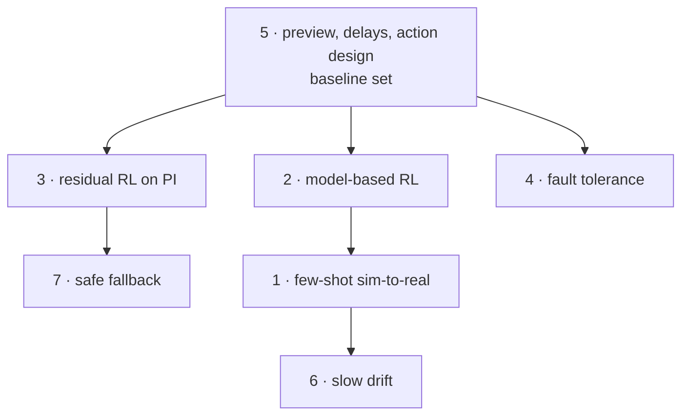
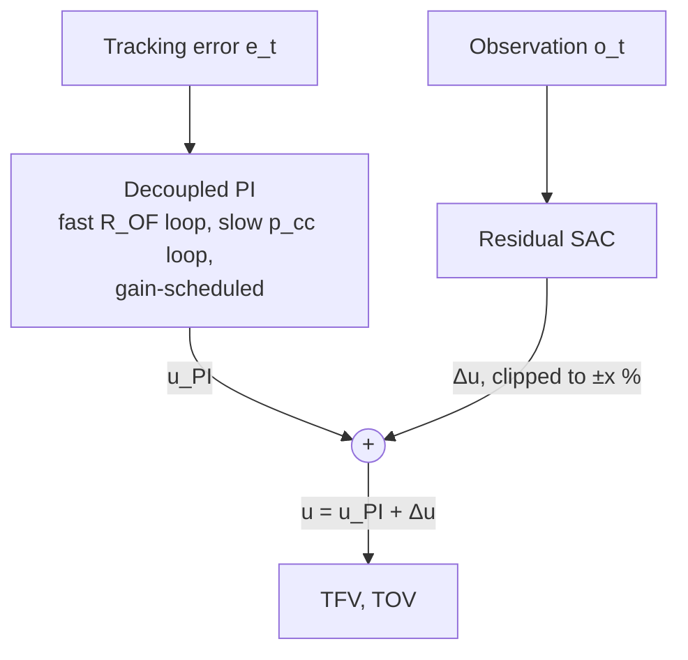
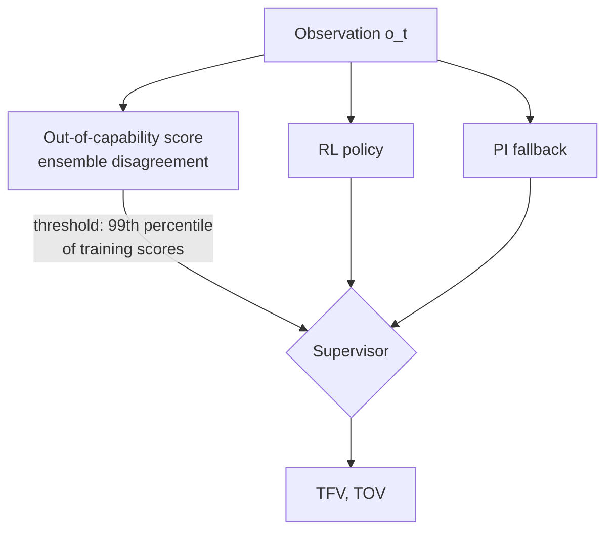

# 6. Open questions I could attack

The questions are ranked by expected value to the field, times how well they fit my background (sparse noisy sensors, expensive real steps, SB3/Gymnasium tooling, RL4AA), times how soon they could produce a result. Everything here needs the LUMEN Control Challenge environment. None of it needs the real engine. Effort estimates count from the day access is granted, assuming about 50 % of my research time; they are my guesses.

How the questions build on each other. Question 5 produces the wrappers, metrics and baselines the others reuse, so it comes first even though it ranks fifth on value.



```vegalite
{
  "$schema": "https://vega.github.io/schema/vega-lite/v6.json",
  "title": {"text": "Estimated effort per question, in rank order", "subtitle": "Months from access, at about half my research time (my estimates; see each section)"},
  "width": "container", "height": 220,
  "data": {"values": [
    {"q": "1 · few-shot sim-to-real", "lo": 3, "hi": 4, "start": "later", "note": "workshop paper; journal version about 6 months"},
    {"q": "2 · model-based RL", "lo": 2, "hi": 3, "start": "later", "note": "most of it on the ensemble model"},
    {"q": "3 · residual RL on PI", "lo": 2, "hi": 2, "start": "later", "note": "about 2 months"},
    {"q": "4 · fault tolerance", "lo": 3, "hi": 5, "start": "later", "note": "risk: two faults may be too easy or too hard"},
    {"q": "5 · preview, delays, actions", "lo": 1, "hi": 1.5, "start": "start here", "note": "4-6 weeks; builds the shared tooling"},
    {"q": "6 · slow drift", "lo": 3, "hi": 3, "start": "later", "note": "better done as an extension of question 1"},
    {"q": "7 · safe fallback", "lo": 2, "hi": 3, "start": "later", "note": "after question 3"}
  ]},
  "encoding": {"y": {"field": "q", "type": "nominal", "sort": null, "title": null, "axis": {"labelLimit": 240}}},
  "layer": [
    {"mark": {"type": "rule", "strokeWidth": 4, "strokeCap": "round"},
     "encoding": {"x": {"field": "lo", "type": "quantitative", "title": "Effort (months)", "scale": {"domain": [0, 6]}}, "x2": {"field": "hi"},
       "color": {"field": "start", "type": "nominal", "scale": {"domain": ["start here", "later"], "range": ["var(--viz-s2)", "var(--viz-s1)"]}, "legend": {"title": null}}}},
    {"transform": [{"fold": ["lo", "hi"], "as": ["end", "m"]}],
     "mark": {"type": "point", "filled": true, "size": 80, "stroke": "var(--md-default-bg-color)", "strokeWidth": 2},
     "encoding": {"x": {"field": "m", "type": "quantitative"}, "color": {"field": "start", "type": "nominal"},
       "tooltip": [{"field": "q", "title": "question"}, {"field": "lo", "title": "from (months)"}, {"field": "hi", "title": "to (months)"}, {"field": "note"}]}}
  ]
}
```

## 1. Using the fine-tuning data: few-shot sim-to-real adaptation (test cases 3–4)

**Why it is open.**

- DLR's only hardware result is zero-shot: the policy was trained with domain randomisation and deployed without fine-tuning. It lost a factor of about 3 in tracking error, from 0.4–0.5 % in simulation to 1.3 % on the engine ([thesis Table 6.2](https://elib.dlr.de/219040/1/DLR-FB-2025-16.pdf#page=130)).
- The model–plant mismatch on that run reached 10.6 % ([Table 6.3](https://elib.dlr.de/219040/1/DLR-FB-2025-16.pdf#page=131)), larger than the ±1–10 % randomisation ranges.
- The benchmark explicitly ships "a dataset for fine-tuning" ([RL4AA'25](https://indico.kit.edu/event/4216/contributions/19241/contribution.pdf)) and a test case where the target domain is unknown ([AI4Aerospace 2025, p. 56](https://w3.onera.fr/ailab/sites/default/files/2025-06/abstractsAI4A5thworkshop_external.pdf#page=56)). No published method on this plant uses target-domain data at all.

**What a first paper would show.** On test case 4, compare four ways of spending a fixed, small budget of target-domain data:

1. domain randomisation only;
2. system identification of the randomised parameters from the data, then retraining;
3. a learned residual dynamics correction on top of the simulator, then policy fine-tuning in the corrected model;
4. an in-context/latent-adaptation policy that infers the domain from history.

Report tracking error and constraint violations against the amount of target data, in seconds of engine time. Headline target: close most of the zero-shot gap with under a minute of data, the scale of one hot-fire test.

**Fit.** This is the crystal-alignment problem in different clothes: an expensive real system, a calibrated but imperfect simulator, few real steps allowed.

**Effort.** 3–4 months to a workshop paper (RL4AA'27), 6 months to a journal version.

## 2. Model-based RL for a slow simulator (MBPO-style, test cases 1–2)

**Why it is open.**

- DLR's agents needed 1.5 M steps nominally, 2.9 M with domain randomisation ([Table 5.3](https://elib.dlr.de/219040/1/DLR-FB-2025-16.pdf#page=108)) and about 5 M for the hardware controller.
- They trained at about 1 M steps per day on 10 EcosimPro instances ([p. 83](https://elib.dlr.de/219040/1/DLR-FB-2025-16.pdf#page=100)).
- The only model-based controller on LUMEN is the MPC with a Wiener model. It lost to SAC on tracking and constraints ([Table 5.4](https://elib.dlr.de/219040/1/DLR-FB-2025-16.pdf#page=114)).
- No Dyna/MBPO/Dreamer-class result exists for liquid-rocket-engine control.
- The plant is multi-time-scale: oxidiser-side responses under 1 s, fuel-side thermal responses up to 23.8 s ([Table 4.7](https://elib.dlr.de/219040/1/DLR-FB-2025-16.pdf#page=91)). That is a hard test for short-rollout model-based methods.

**What a first paper would show.**

- Environment steps to reach 1 % mean tracking error on the 2×2 task, for three agents:
    - PPO;
    - SAC;
    - a small MBPO: a probabilistic ensemble dynamics model, branched rollouts of k = 1–5 steps, SAC on model data.
- Evidence of where the model fails. My hypothesis is the slow thermal channel; test it with per-output one-step and k-step model errors.
- A one-hour CPU budget is a natural and honest axis here.

**Fit.** I have MBPO on the brief for this repo already. The RL4AA community already teaches GP-MPC and meta-RL ([RL4AA'24 tutorial](https://github.com/RL4AA/rl4aa24-tutorial)), so the audience knows the tools. The reference method is MBPO ([Janner et al. 2019, arXiv:1906.08253](https://arxiv.org/abs/1906.08253)).

**Effort.** 2–3 months, most of it making the ensemble model behave on stiff dynamics.

## 3. Residual RL on a decoupled PI baseline, with a bounded envelope

**Why it is open.**

- Every flown throttleable engine cited here uses PI-type loops. Examples: the SSME, "Closed loop control of the SSME is done via Proportional-Integral (PI) control" ([Lorenzo & Musgrave 1992, p. 5](https://ntrs.nasa.gov/citations/19920004056)), and a Vinci-like two-loop PID ([Raposo 2016](https://fenix.tecnico.ulisboa.pt/downloadFile/1407770020544802/ExtendedAbstract.pdf)).
- The DLR thesis proposes "parallel integration" $a = a_{\mathrm{PID}} + a_{\mathrm{NN}}$ as future work ([outlook, pp. 123–126](https://elib.dlr.de/219040/1/DLR-FB-2025-16.pdf#page=140)).
- A DLR MSc on a different engine reports that a hybrid RL + PI controller "learns a form of automatic gain scheduling" and beats both pure SAC and static PI ([Bareiß 2025](https://elib.dlr.de/214433/), abstract only).
- No published LUMEN result uses a residual policy, and none quantifies what is lost when the learned part is switched off.

**What a first paper would show.**

- A decoupled PI baseline on the 2×2 task: the $R_{OF}$ loop fast, the $p_{cc}$ loop slow, as in [The engine as a control system](primer/1-engine.md#mixture-ratio-is-temperature), with gain scheduling over the envelope.
- A residual SAC whose output is clipped to ±x % valve travel around the PI command.
- Results on tracking, valve travel (Δu) and constraint violations across test cases 1–5, plus the degradation when the residual is disabled mid-episode.



Claim to test: residual RL recovers most of pure RL's tracking advantage with a hard bound on how far it can take the valves from a certifiable baseline.

**Effort.** About 2 months. This is also the most useful baseline set for the challenge's leaderboard. A dry run of the PI baseline exists on the surrogate. There, a 5 % weaker LOX turbine leaves the integral-free PPO and SAC policies with a steady 3 % mixture-ratio offset that the PI removes, which is the case for a residual design in miniature ([Baselines on the surrogate](04a-surrogate-baselines.md)); the residual agent does not yet.

## 4. Fault-tolerant control with latent mode inference (test cases 6–7)

**Why it is open.**

- A domain-randomised SAC agent on LUMEN failed when the oxidiser-turbopump efficiency dropped to 80 %. It was "unable to maintain the desired pressure level" ([Dauer et al. 2025, p. 10](https://www.eucass.eu/doi/EUCASS2025-533.pdf#page=10)).
- DLR's work so far detects that the policy is out of its competence. It does not recover.
- The benchmark separates the two regimes cleanly: test case 6 gives a fault flag, test case 7 does not ([AI4Aerospace 2025](https://w3.onera.fr/ailab/sites/default/files/2025-06/abstractsAI4A5thworkshop_external.pdf#page=56)).

**What a first paper would show.**

- A history-conditioned policy (recurrent, or a small transformer over the last few seconds) trained over a distribution of fault magnitudes.
- Comparisons against the same policy given the fault flag, and against a flag-less feed-forward SAC.
- Metrics: time to re-enter the 2 % band after fault onset, residual error, and whether the policy's own uncertainty could replace the external detector.
- A related result to cite: meta-RL with LSTM and GTrXL policies met all terminal constraints in 1000/1000 6-DoF landing runs ([Carradori 2024](https://repository.tudelft.nl/record/uuid:bf2a598c-9694-40cd-8dec-03b73d539b54)).

**Effort.** 3–5 months. There is risk if the two benchmark faults are too easy or too hard to recover from with two valves.

## 5. Reference preview, delays and action parametrisation for the 2×2 task

**Why it is open.**

- The bootcamp PPO agent lagged on ramps. The speaker attributed this to missing future references and valve delay ([livestream](https://www.youtube.com/watch?v=CX8I88Pta_I&t=26100s)).
- DLR's simulated agent with a 4-step preview reached 0.3 % / 0.1 % ([thesis p. 93](https://elib.dlr.de/219040/1/DLR-FB-2025-16.pdf#page=110)). The hardware controller had no preview.
- DLR's cold-gas controller used valve *rate* as the action, capped at 5 % per step ([Hörger et al. 2024, p. 4](https://elib.dlr.de/207225/1/Final_Acta_Astronautica.pdf#page=4)).
- Nobody has published a controlled ablation of these choices on one plant.

**What a first paper would show.** A grid over three choices, with tracking error, lag on ramps, Δu and constraint violations for each:

- preview horizon: 0, 2, 4, 8 steps;
- action type: absolute position vs rate;
- delay handling: stacking vs explicit delay states vs a recurrent policy.

**Fit.** This is the short, careful baseline paper that the challenge needs first. It also produces the infrastructure for questions 1–4.

**Effort.** 4–6 weeks. **This is where I would start** (see [For Leander](for-leander.md)).

## 6. Slow drift: ageing within and across episodes (test case 5)

**Why it is open.** Reusability is the motivation of the whole programme. The thesis abstract notes that "component aging with each flight can lead to changes in engine system dynamics" ([RWTH record](https://publications.rwth-aachen.de/record/1012640)). The benchmark includes a slow continuous dynamics change. No LUMEN result addresses non-stationary dynamics.

**What a first paper would show.** Online adaptation without forgetting under drift:

- continual fine-tuning with a replay buffer;
- a context estimator;
- a PI outer loop.

Evaluate on how long tracking stays in tolerance as drift accumulates.

**Effort.** 3 months. It overlaps heavily with question 1, so it is better done as its extension.

## 7. Safe fallback: out-of-capability detection triggering a classical controller

**Why it is open.** DLR has a detector ([Dauer et al. 2025](https://www.eucass.eu/doi/EUCASS2025-533.pdf)) and PI heritage, but no published closed loop that switches between them. Hardware tests end early for safety reasons ([§5.2](05-limitations.md#52-safety-short-tests-no-guarantees)).

**What a first paper would show.** A supervisor that hands control from the RL policy to a PI fallback when an ensemble-disagreement score crosses a threshold. The payoff is measured against false switches in nominal operation.



The threshold rule is the one DLR used for its detector ([Dauer et al. 2025, p. 10](https://www.eucass.eu/doi/EUCASS2025-533.pdf#page=10)); the switching loop is the proposal.
{: .caption }

**Effort.** 2–3 months after question 3, which provides the fallback.

## What I cannot do from outside DLR

- **Hardware validation.** Anything above needs DLR as a partner to reach the engine. The benchmark's likely withheld-simulator evaluation, as in the [DX'25 design](https://elib.dlr.de/219953/1/DX2025benchmark.pdf#page=9), is the best available proxy.
- **Actuator-model errors.** These broke the first two hardware deployments and cannot be studied without real valve data. The question to put to DLR: does the fine-tuning dataset include valve command/position pairs?
