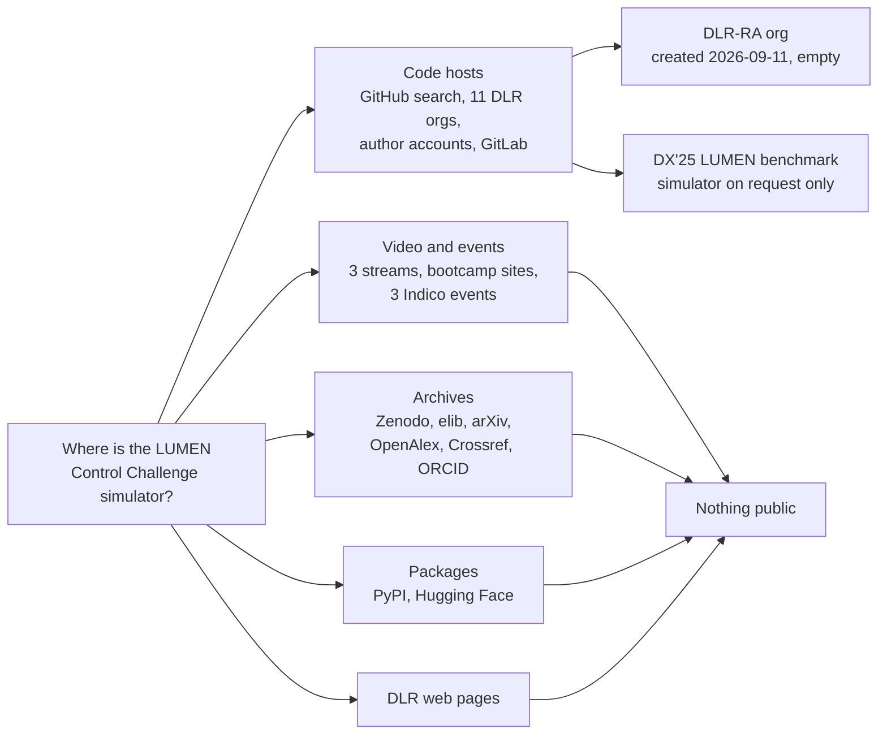

# :re-books: 7. References

Every source used anywhere on this site is listed here, with how far it was verified.

| Tag | Meaning |
|---|---|
| **V** | Full text opened and read (PDF downloaded and converted with `pdftotext`, or HTML page read). Numbers quoted on this site come from these. |
| **A** | Abstract, bibliographic record or metadata only. The full text is paywalled, DLR-internal or behind a bot wall. Only what the abstract says is used. |
| **U** | Unverified. The source exists according to secondary material, but I could not open a primary copy. Nothing from it is used as fact. |
| **P** | Personal communication from the challenge organisers. Used for facts about the challenge that are not yet published; to be replaced by the released documentation. |

```vegalite
{
  "$schema": "https://vega.github.io/schema/vega-lite/v6.json",
  "title": {"text": "How much of each section rests on full text", "subtitle": "Count of V / A / U tags per section below (a few entries tag two sources)"},
  "width": "container", "height": 200,
  "data": {"values": [
    {"section": "7.2 Challenge and benchmark", "tag": "V · full text", "n": 6}, {"section": "7.2 Challenge and benchmark", "tag": "A · abstract only", "n": 1}, {"section": "7.2 Challenge and benchmark", "tag": "U · unverified", "n": 0},
    {"section": "7.3 Engine and simulator", "tag": "V · full text", "n": 7}, {"section": "7.3 Engine and simulator", "tag": "A · abstract only", "n": 3}, {"section": "7.3 Engine and simulator", "tag": "U · unverified", "n": 0},
    {"section": "7.4 DLR deep-RL control", "tag": "V · full text", "n": 11}, {"section": "7.4 DLR deep-RL control", "tag": "A · abstract only", "n": 6}, {"section": "7.4 DLR deep-RL control", "tag": "U · unverified", "n": 1},
    {"section": "7.5 Safety and diagnosis", "tag": "V · full text", "n": 2}, {"section": "7.5 Safety and diagnosis", "tag": "A · abstract only", "n": 1}, {"section": "7.5 Safety and diagnosis", "tag": "U · unverified", "n": 1},
    {"section": "7.6 Classical control", "tag": "V · full text", "n": 7}, {"section": "7.6 Classical control", "tag": "A · abstract only", "n": 2}, {"section": "7.6 Classical control", "tag": "U · unverified", "n": 1},
    {"section": "7.7 Landing RL (adjacent)", "tag": "V · full text", "n": 5}, {"section": "7.7 Landing RL (adjacent)", "tag": "A · abstract only", "n": 1}, {"section": "7.7 Landing RL (adjacent)", "tag": "U · unverified", "n": 0},
    {"section": "7.8 On-ramp context", "tag": "V · full text", "n": 1}, {"section": "7.8 On-ramp context", "tag": "A · abstract only", "n": 1}, {"section": "7.8 On-ramp context", "tag": "U · unverified", "n": 0}
  ]},
  "transform": [{"calculate": "indexof(['V · full text', 'A · abstract only', 'U · unverified'], datum.tag)", "as": "o"}],
  "mark": {"type": "bar", "height": 16, "stroke": "var(--md-default-bg-color)", "strokeWidth": 2},
  "encoding": {
    "y": {"field": "section", "type": "nominal", "sort": null, "title": null, "axis": {"labelLimit": 240}},
    "x": {"field": "n", "type": "quantitative", "stack": "zero", "title": "Sources", "axis": {"tickMinStep": 1}},
    "color": {"field": "tag", "type": "ordinal", "scale": {"domain": ["V · full text", "A · abstract only", "U · unverified"], "range": ["var(--viz-ord-1)", "var(--viz-ord-2)", "var(--viz-ord-3)"]}, "legend": {"title": null}},
    "order": {"field": "o", "sort": "ascending"},
    "tooltip": [{"field": "section"}, {"field": "tag"}, {"field": "n", "title": "sources"}]
  }
}
```

PDF links carry a `#page=N` anchor where a specific page is cited. N is the PDF page index, which for the Dresia thesis is the printed page + 17.

## 7.1 Search log: where the LUMEN Control Challenge simulator is not

The search ran on 2026-09-30 from 16:08 to 16:38 UTC (30 min of direct searching). Six subagents opened and summarised literature sources in parallel. The goal was the public simulator and evaluation service announced on the "LUMEN Control Challenge" slide.



| # | Place | What was checked | Result |
|---|---|---|---|
| 1 | [RL Bootcamp 2026 day-2 livestream](https://www.youtube.com/watch?v=CX8I88Pta_I&t=26280s), YouTube id `CX8I88Pta_I`, channel "Reinforcement Learning", streamed 2026-09-17 | Video description; English auto-captions (fetched with yt-dlp 2026.08.19); the slide at 7:18:00 | Description empty. The slide reads "Public access to generalized LUMEN simulator model" and "Automatic evaluation of your control performance". It names Kai Dresia plus two further DLR contacts, partly hidden by the webcam overlay, and gives no URL. Captions at about 7:21:50: the DLR speaker says the team is "currently planning to make this benchmark more or less publicly available" and invites interested people to get in touch. |
| 2 | Day-1 ([`Ll6P0E_uH58`](https://www.youtube.com/watch?v=Ll6P0E_uH58)) and day-3 ([`ajA_z1kem5w`](https://www.youtube.com/watch?v=ajA_z1kem5w)) streams | Auto-captions searched for LUMEN, rocket, DLR, propulsion | No mention. |
| 3 | Bootcamp websites: [SARL-PLUS/RL-Bootcamp2026](https://github.com/SARL-PLUS/RL-Bootcamp2026) (site source), [SARL-PLUS/RL_Bootcamp_2026_tutorial](https://github.com/SARL-PLUS/RL_Bootcamp_2026_tutorial) (public slides), Indico [event 1701863](https://indico.cern.ch/event/1701863/) | Repository trees and pages searched for LUMEN, DLR, slides | No DLR slides or links. The Indico event requires a CERN login (not attempted). |
| 4 | GitHub repository search | `LUMEN rocket`, `LUMEN engine`, `LUMEN simulator`, `lumen control challenge`, `rocket engine reinforcement learning`, `ecosimpro gymnasium`, `ESPSS`, repos created after 2026-08-15 | Only unrelated name clashes. |
| 5 | GitHub code search | `LUMEN TFV TOV`, `EcosimPro gymnasium`, `LumenEnv`, `"Liquid Upper Stage Demonstrator Engine"`, `"LUMEN" "Lampoldshausen"` | Hits are a DX'25 benchmark link page (see row 13) and an explicitly synthetic data-management demo ([noheton/shepard `examples/lumen-showcase`](https://github.com/noheton/shepard), "synthetic and fake", no DLR measurements). No simulator. |
| 6 | GitHub organisations DLR-RM, DLR-SP, DLR-RY, DLR-SC, DLR-SR, DLR-KI, DLR-AE, DLR-VE, DLR-FT, DLR-RB | Full repository lists | Nothing related. |
| 7 | GitHub organisation [DLR-RA](https://github.com/DLR-RA) ("DLR Institute of Space Propulsion") | Creation date, repositories, commits | Created 2026-09-11 by user [Kai-AI](https://github.com/Kai-AI) ("Kai D."). Its only repository is `.github`, holding a one-line welcome README. This is the most likely future home of the challenge; re-checked at 16:31 UTC, still empty. |
| 8 | Authors' GitHub accounts: Kai-AI (0 public repos), [MathPhysSim](https://github.com/MathPhysSim) (Simon Hirlaender, 18 repos), [vincent-bareiss](https://github.com/vincent-bareiss) (1 repo); no accounts found for Jonas Dauer or Fabio Matanza | Repository lists | Nothing related. |
| 9 | GitHub organisations [RL4AA](https://github.com/RL4AA) and [SARL-PLUS](https://github.com/SARL-PLUS) | Repository lists and site sources | No LUMEN repository. The RL4AA'26 hands-on challenge is about CLARA, not LUMEN. |
| 10 | [Zenodo](https://zenodo.org) API | Free text, exact phrases, `creators.name:Dresia`, `Waxenegger-Wilfing` | Only an unrelated 2024 record (22 N thruster wall-temperature transfer learning). |
| 11 | [elib.dlr.de](https://elib.dlr.de) | The search endpoint returned HTTP 429 on every attempt, so I read the year listings [`/view/year/2018.html`](https://elib.dlr.de/view/year/2018.html) … [`2026.html`](https://elib.dlr.de/view/year/2026.html) and grepped them | Found the benchmark item [elib 220065](https://elib.dlr.de/220065/) (no full text) and the 2023–2025 papers listed below. No simulator, dataset or software record. |
| 12 | Indico [RL4AA'25](https://indico.kit.edu/event/4216/contributions/19241) and [RL4AA'26](https://indico.ph.liv.ac.uk/event/2025/contributions/10623/) | Export API over all contributions | One LUMEN talk per year, no attached material. |
| 13 | DX'25 diagnosis competition: [LiU benchmark page](https://vehsys.gitlab-pages.liu.se/dx25benchmarks/lumen/lumen_index), [LiU GitLab `vehsys/dx25benchmarks`](https://gitlab.liu.se/vehsys/dx25benchmarks), [DX-2025 site](https://conf.researchr.org/home/dx-2025) | Page text and repository tree | A LUMEN fault-diagnosis benchmark (not control). Simulator and data are available only on request to the model's author, Eldin Kurudzija. The `lumen/` folder holds just the description page and 3 images, while the other two DX'25 benchmarks ship training data. This is the precedent for how DLR shares LUMEN models. |
| 14 | arXiv API | `au:Dresia`, `au:Waxenegger`, `"rocket engine" AND "reinforcement learning"`, `LUMEN AND rocket` | Four Dresia papers 2019–2021; no benchmark paper. |
| 15 | OpenAlex, Crossref, ORCID (Dresia 0000-0003-3229-5184, Waxenegger-Wilfing 0000-0001-5381-6431, Kurudzija 0000-0001-5409-3845, Dauer 0009-0005-7577-8209) | 2024–2026 works | Adds the SSRN preprint [Kurudzija et al. 2026](#kurudzija2026). No code or data record. |
| 16 | PyPI (`lumen-env`, `lumen-gym`, `lumen-rl`, `lumen-control`, `lumen-challenge`, `lumen-benchmark`, `dlr-lumen`, `rocket-engine-gym`) and Hugging Face (models, datasets, spaces) | Package and hub search | All 404 / empty. |
| 17 | GitLab.com and gitlab.liu.se project search | `LUMEN rocket`, `lumen`, `dx25` | Only row 13. |
| 18 | DLR LUMEN pages: [featured topic](https://www.dlr.de/en/research-and-transfer/featured-topics/reusable-space-transportation/lumen), [project archive](https://www.dlr.de/en/ra/research-transfer/projects/project-archive/liquid-upper-stage-demonstrator-engine-lumen), [research infrastructure](https://www.dlr.de/en/research-and-transfer/research-infrastructure/large-scale-research-facilities/lumen-en) | Page text and links | No simulator, challenge or software link. |
| 19 | [Hirlaender publication list](https://mathphyssim.github.io/publications.html), [RWTH DSME colloquium 2023](https://www.dsme.rwth-aachen.de/cms/dsme/das-institut/aktuelle-veranstaltungen/~bajuon/dsme-colloquium-kai-dresia-on-fuel-effi/?mobile=1&lidx=1), [AI4Aerospace 2025 site](https://ai4aerospace25.sciencesconf.org/), [ESA ESPSS workshop 2025](https://indico.esa.int/event/580/contributions/11362/) | Entries and attachments | No links to code or data. |
| 20 | Web search (several phrasings of "LUMEN Control Challenge", "LUMEN benchmark", "DLR rocket engine control benchmark") | Results pages | Nothing beyond the above. |

**Conclusion (2026-09-30):** the LUMEN Control Challenge simulator and evaluation service are not publicly available. Two things point that way. The slide promises public access, while the speaker said on 2026-09-17 that the release was still being planned. And the only comparable LUMEN release, DX'25, was shared only on request. No repository, package or dataset existed on that date.

**Update (2026-10-08):** the organisers expect to share the challenge repository around the end of October 2026 ([personal communication](#organisers2026)). `python scripts/check_challenge.py` watches for it.

## 7.2 LUMEN Control Challenge and benchmark

<a id="bootcamp2026"></a>**RL Bootcamp 2026, day-2 livestream** (Salzburg, 16–18 Sep 2026). "Reinforcement Learning Live Stream", YouTube `CX8I88Pta_I`, streamed 2026-09-17, 33,041 s. The DLR pitch runs from about 7:10:20 to 7:22:40; the "LUMEN Control Challenge" slide appears at [7:18:00](https://www.youtube.com/watch?v=CX8I88Pta_I&t=26280s). **V** (auto-captions and slide read). The chair introduces the speaker as "Yonas" in the auto-captions. The brief I was given names Kai Dresia as presenter; Kai Dresia is the first contact on the slide, and Jonas Dauer is a co-author of the benchmark papers. The speaker's name is therefore not certain from public material. What the captions say, in paraphrase:

- The benchmark wraps the simulator in a Gymnasium environment.
- The actions are the commands to the TFV and TOV turbine valves.
- The observation is user-definable. The example uses chamber pressure, mixture ratio, their references and the current valve positions, "to make the state as Markovian as possible".
- The reward is user-defined.
- A PPO agent tracks 60 → 70 → 57 bar, lagging on ramps because future references are not in the observation and the valves have delay.
- A SAC agent tracks an Apollo 15 landing thrust profile mapped to 40–80 bar.
- A hardware video shows about 15 s of closed-loop tracking before a sensor failure ended the run.

<a id="organisers2026"></a>**LUMEN Control Challenge organisers** (DLR Institute of Space Propulsion, Lampoldshausen). Personal communication to the author, 7 October 2026. **P**. Until the challenge documentation is released, this is the source for:

- **Release.** A repository is planned for around the end of October 2026.
- **Control rate and episodes.** 20 Hz, a rate an earlier study of control rates found sufficient (the [Dresia thesis](#dresia2025)). Episodes last 10–100 s, depending on the control problem.
- **No preview.** Future reference values are not part of the observation, because on the real engine the targets are generated in real time.
- **Data.** No real hot-fire data is published. The sim-to-real test cases instead change model parameters.
- **Compute.** No local EcosimPro licence is needed. The simulator runs at about real time (10 s of engine time takes about 10 s), and several instances can run in parallel.

<a id="dresia2025rl4aa"></a>**Dresia, K., Waxenegger-Wilfing, G., Dauer, J., Hirlaender, S., Bareiß, V.** "A Benchmark for Deep Reinforcement Learning-Based Control of Liquid-Propellant Rocket Engines". RL4AA'25, DESY Hamburg, 4 Apr 2025, poster + talk. [Indico contribution](https://indico.kit.edu/event/4216/contributions/19241), [PDF](https://indico.kit.edu/event/4216/contributions/19241/contribution.pdf). **V**. The benchmark "includes simulation software calibrated with experimental data, a dataset for fine-tuning, and the ability to simulate representative errors in both sensors and the system itself" and "will be made freely accessible to the RL community".

<a id="bareiss2025"></a>**Bareiß, V., Dresia, K., Waxenegger-Wilfing, G.** "Development of a Benchmark for Deep Reinforcement Learning Based Control of Liquid Propellant Rocket Engines". 5th AI4Aerospace workshop (DLR–ONERA), Toulouse, 19–21 May 2025, collaboration proposal. Extended abstract on pp. 55–56 of the [workshop abstract booklet](https://w3.onera.fr/ailab/sites/default/files/2025-06/abstractsAI4A5thworkshop_external.pdf#page=55). **V**. The [elib record 220065](https://elib.dlr.de/220065/) lists six authors (adds Kurudzija, Dauer, Deeken) and has no full text. Key content:

- The task is "a 2×2 MIMO problem": two turbine valves regulate chamber pressure and mixture ratio, which are "highly coupled".
- There are seven test cases, "each … represented as an OpenAI Gym environment": nominal tracking with a known and with an unknown reference; domain adaptation with and without prior knowledge; slow continuous dynamics change; a fault with and without an external fault-detection signal.
- Faults are "simulated based on hot run data gathered at the P8.3 test facility".
- "The benchmark will be shared".

<a id="matanza2026"></a>**Matanza, F., Bareiss, V., Dauer, J., Dresia, K., Waxenegger-Wilfing, G., Hirlaender, S.** "Towards a Training-Efficient Reinforcement Learning Based Control Approach for the LUMEN Engine Using Curriculum-Guided PPO". RL4AA'26, Liverpool, poster, 31 Mar 2026. [Indico contribution 10623](https://indico.ph.liv.ac.uk/event/2025/contributions/10623/). **V** (abstract; no poster file attached). "2x2 configuration"; PPO with a curriculum that expands the operating envelope; evaluation on "training efficiency, transient-response quality, and tracking of constraint violations". The first author's affiliation is "University of Salzburg, B.Sc. AI Thesis (DLR, Institute of Space Propulsion & IDA Lab Salzburg)".

<a id="kurudzija2026"></a>**Kurudzija, E., Dresia, K., Bareiss, V., Waxenegger-Wilfing, G., Deeken, J.** "Transient System-Level Simulation of the LOX/LNG Expander-Bleed Rocket Engine LUMEN". SSRN preprint, posted 2026-07-29, [doi:10.2139/ssrn.6806858](https://doi.org/10.2139/ssrn.6806858). **A**: Crossref metadata and abstract; the SSRN page is behind a bot-verification wall. The abstract describes "a transient simulation model of a representative upper-stage rocket engine based on the LUMEN" engine. It says errors are "below 5 % over the full operational envelope" and that the model supports "the development of intelligent control and health monitoring systems". This is probably the "generalized LUMEN simulator model" of the challenge slide, though that is my inference.

<a id="pill2025"></a>**Pill, I., Jung, D., Kurudzija, E., Sztyber-Betley, A., Syfert, M., Dresia, K., Waxenegger-Wilfing, G., de Kleer, J.** "The DX Competition 2025 and its Benchmarks". DX'25, Nashville, 2025. [PDF](https://elib.dlr.de/219953/1/DX2025benchmark.pdf). **V**, paper under CC BY 4.0. LUMEN is one of three diagnosis benchmarks. The paper covers:

- a Python interface to an EcosimPro/ESPSS simulator with "errors below 10%";
- 15 sensor faults, 3 actuator faults and 3 component faults;
- a second, withheld simulator with different parameters, used for evaluation to mimic sim-to-real;
- Docker-based scoring.

Companion page: [LiU LUMEN benchmark](https://vehsys.gitlab-pages.liu.se/dx25benchmarks/lumen/lumen_index) (**V**), last updated 24 Jan 2025: "To get access to the simulation model and the datasets you will need to contact Eldin Kurudzija".

## 7.3 LUMEN engine, test campaigns and simulation model

<a id="deeken2021"></a>**Deeken, J., Waxenegger-Wilfing, G., Oschwald, M., Schlechtriem, S.** "LUMEN Demonstrator – Project Overview". Space Propulsion 2020+1, SP2020_375, 17–19 Mar 2021. [PDF](https://elib.dlr.de/142128/1/Paper.pdf). **V**. Envelope table on [p. 4](https://elib.dlr.de/142128/1/Paper.pdf#page=4); nominal mass flows and chamber data on [p. 5](https://elib.dlr.de/142128/1/Paper.pdf#page=5); the nozzle-extension requirement of no flow separation at 60 bar and the laser plasma igniter on [p. 6](https://elib.dlr.de/142128/1/Paper.pdf#page=6); turbopumps and project start in 2017 on [p. 6](https://elib.dlr.de/142128/1/Paper.pdf#page=6).

<a id="traudt2022"></a>**Traudt, T. et al.** "Liquid Upper Stage Demonstrator Engine (LUMEN): Component Test Results and Project Progress". IAC-22-C4.1.3.x73654, Paris 2022. [PDF](https://elib.dlr.de/191316/1/Traudt%20IAC-22,C4,1,3,x73654.pdf). **V**. Turbopump limits in Table 2 on [p. 5](https://elib.dlr.de/191316/1/Traudt%20IAC-22,C4,1,3,x73654.pdf#page=5); valves "opening speeds of less than 0.5 seconds" and instrumentation on [pp. 8–9](https://elib.dlr.de/191316/1/Traudt%20IAC-22,C4,1,3,x73654.pdf#page=8).

<a id="traudt2024"></a>**Traudt, T. et al.** "LUMEN: Liquid Upper Stage Demonstrator Engine – A Versatile Test Bed for Rocket Engine Components: Hot-Fire Test Results". IAC-24-C4.1.5.x86850, Milan 2024. [PDF](https://elib.dlr.de/213229/1/IAC-24,C4,1,5,x86850%20manuscript.pdf). **V**. Nominal 60 bar / ROF 3.4, throttling 58–133 % on [p. 1](https://elib.dlr.de/213229/1/IAC-24,C4,1,5,x86850%20manuscript.pdf#page=1); four-valve closed loop at 20 Hz on [p. 4](https://elib.dlr.de/213229/1/IAC-24,C4,1,5,x86850%20manuscript.pdf#page=4); 8 tests on [p. 5](https://elib.dlr.de/213229/1/IAC-24,C4,1,5,x86850%20manuscript.pdf#page=5). The Lab's test-stand graphic follows its photos of LUMEN on P8.3 (Figs. 3–4, [p. 3](https://elib.dlr.de/213229/1/IAC-24,C4,1,5,x86850%20manuscript.pdf#page=3): horizontal firing, turbopumps on the frame, a spray ring around the plume) and the start-up and shutdown shapes of its hot-fire traces (Fig. 5, [p. 4](https://elib.dlr.de/213229/1/IAC-24,C4,1,5,x86850%20manuscript.pdf#page=4)); the paper also names the LN2 purge valves (p. 1) and the GN2 turbine starter (p. 2).

<a id="borner2024"></a>**Börner, M. et al.** "Component Test Results and Project Progress of the DLR Liquid Upper Stage Demonstrator Engine (LUMEN)". AIAA SciTech 2024, [doi:10.2514/6.2024-1398](https://arc.aiaa.org/doi/10.2514/6.2024-1398). **A** (metadata only; closed access).

<a id="kurudzija2025"></a>**Kurudzija, E., Dresia, K., Bareiß, V. et al.** "Validation of the LUMEN EcosimPro Model with Hot-Fire Test Data". 11th EUCASS, Rome, 30 Jun–4 Jul 2025, [doi:10.13009/EUCASS2025-105](https://www.eucass.eu/doi/EUCASS2025-105.pdf). **V**. Campaign summary (17 ignitions, over 20 min hot fire, 38–78 bar) in §2.3; the Table 2 prediction errors (chamber pressure MAPE 2.4 %, mixture ratio 3.5 %) are on [p. 10](https://www.eucass.eu/doi/EUCASS2025-105.pdf#page=10). The elib copy ([218754](https://elib.dlr.de/218754/)) is DLR-internal.

<a id="dresia2025far"></a>**Dresia, K. et al.** "Hot-Fire Testing and System Analysis of the LUMEN Liquid Upper Stage Demonstrator Engine". FAR 2025, Arcachon. [elib 219029](https://elib.dlr.de/219029/). **A** (PDF DLR-internal).

<a id="dresia2023ists"></a>**Dresia, K. et al.** "Design and Control Challenges for the LUMEN LOX/LNG Expander-Bleed Rocket Engine". 34th ISTS, Fukuoka 2023. [elib 200340](https://elib.dlr.de/200340/). **A**. Its constraint list is reproduced in the Dresia thesis §4.1.2, which is where numbers on this site come from.

<a id="dlrpages"></a>**DLR LUMEN web pages**: [featured topic](https://www.dlr.de/en/research-and-transfer/featured-topics/reusable-space-transportation/lumen), [project archive](https://www.dlr.de/en/ra/research-transfer/projects/project-archive/liquid-upper-stage-demonstrator-engine-lumen), [research infrastructure](https://www.dlr.de/en/research-and-transfer/research-infrastructure/large-scale-research-facilities/lumen-en). **V**. 25 kN; P8.3; in operation since March 2024.

<a id="espss"></a>**ESPSS licensing.** [EcosimPro ESPSS brochure](https://www.ecosimpro.com/wp-content/uploads/2015/02/ecosimpro_brochure_library_espss.pdf) (**V**): "EAI is the official distributor of the ESPSS libraries, while ESA holds the proprietary rights. Any entity interested in using ESPSS needs prior approval from ESA." [ESA Indico, about ESPSS](https://indico.esa.int/event/465/page/726-about-espss) (**V**): ESPSS is "an ESA initiative".

## 7.4 Deep-RL control at DLR Lampoldshausen

<a id="dresia2025"></a>**Dresia, K.** *Rocket Engine Control with Deep Reinforcement Learning*. DLR-Forschungsbericht DLR-FB-2025-16, doctoral thesis, RWTH Aachen (referees M. Oschwald, S. Trimpe; oral exam 9 Apr 2025). [PDF](https://elib.dlr.de/219040/1/DLR-FB-2025-16.pdf), [RWTH record](https://publications.rwth-aachen.de/record/1012640), doi:10.57676/bwbm-p528 and doi:10.18154/RWTH-2025-05076. **V**, CC BY-NC 4.0 ([PDF p. 3](https://elib.dlr.de/219040/1/DLR-FB-2025-16.pdf#page=3)). Printed page N is PDF page N + 17. Most-cited pages:

- envelope, Table 4.1: [PDF p. 75](https://elib.dlr.de/219040/1/DLR-FB-2025-16.pdf#page=75)
- constraints: PDF pp. [75–77](https://elib.dlr.de/219040/1/DLR-FB-2025-16.pdf#page=75)
- valves: [PDF p. 73](https://elib.dlr.de/219040/1/DLR-FB-2025-16.pdf#page=73)
- step-response settling times, Table 4.7: [PDF p. 91](https://elib.dlr.de/219040/1/DLR-FB-2025-16.pdf#page=91)
- MPC comparison: PDF pp. [110–114](https://elib.dlr.de/219040/1/DLR-FB-2025-16.pdf#page=110)
- hardware results, Table 6.2: [PDF p. 130](https://elib.dlr.de/219040/1/DLR-FB-2025-16.pdf#page=130)
- modelling errors, Table 6.3: [PDF p. 131](https://elib.dlr.de/219040/1/DLR-FB-2025-16.pdf#page=131)
- sim-to-real discussion: PDF pp. [133–135](https://elib.dlr.de/219040/1/DLR-FB-2025-16.pdf#page=133)
- domain-randomisation ranges, Table A.3: [PDF p. 165](https://elib.dlr.de/219040/1/DLR-FB-2025-16.pdf#page=165)

<a id="waxenegger2021taes"></a>**Waxenegger-Wilfing, G., Dresia, K., Deeken, J., Oschwald, M.** "A Reinforcement Learning Approach for Transient Control of Liquid Rocket Engines". *IEEE Trans. Aerosp. Electron. Syst.* 57(5):2938–2952, 2021, doi:10.1109/TAES.2021.3074134. Preprint [arXiv:2006.11108](https://arxiv.org/abs/2006.11108). **V** (arXiv version). This is a generic gas-generator engine, not LUMEN. TD3 with Stable-Baselines and EcosimPro wrapped as a Gym environment on [p. 4](https://arxiv.org/pdf/2006.11108#page=4); RL vs PID vs open loop in Table I on [p. 9](https://arxiv.org/pdf/2006.11108#page=9).

<a id="waxenegger2021ml"></a>**Waxenegger-Wilfing, G., Dresia, K., Deeken, J., Oschwald, M.** "Machine Learning Methods for the Design and Operation of Liquid Rocket Engines – Research Activities at the DLR Institute of Space Propulsion". [arXiv:2102.07109](https://arxiv.org/abs/2102.07109), 2021. **V**. LUMEN controller: "less than 2 s" for 60→80 and 80→40 bar vs "more than 10 s" open loop, on [p. 5](https://arxiv.org/pdf/2102.07109#page=5).

<a id="dresia2021"></a>**Dresia, K., Waxenegger-Wilfing, G., Dos Santos Hahn, R., Deeken, J., Oschwald, M.** "Nonlinear Control of an Expander-Bleed Rocket Engine using Reinforcement Learning". Space Propulsion 2020+1, SP2020_533, 2021. [PDF](https://elib.dlr.de/141739/1/533_Dresia.pdf). **V**. SAC in RLlib; up to six valves; 40–80 bar; constraints in Table 1 on [p. 4](https://elib.dlr.de/141739/1/533_Dresia.pdf#page=4); summed rewards in Table 2 on [p. 7](https://elib.dlr.de/141739/1/533_Dresia.pdf#page=7).

<a id="dresia2023"></a>**Dresia, K. et al.** "Rocket Engine Control with Neural Networks: Experimental Results of the LUMEN Turbopump Test Campaign". AIAA SciTech 2023, [doi:10.2514/6.2023-0137](https://arc.aiaa.org/doi/10.2514/6.2023-0137). **A** (closed; elib copy DLR-internal). The result "Over a total test duration of more than 500 seconds, the mean error remained consistently below 1 percent" is quoted from the Dresia thesis, [PDF p. 20](https://elib.dlr.de/219040/1/DLR-FB-2025-16.pdf#page=20), and from EUCASS 2025-105 §2.2.

<a id="horger2024"></a>**Hörger, T., Werling, L., Dresia, K., Waxenegger-Wilfing, G., Schlechtriem, S.** "Experimental and Simulative Evaluation of a Reinforcement Learning Based Cold Gas Thrust Chamber Pressure Controller". *Acta Astronautica* 219:128–137, 2024, doi:10.1016/j.actaastro.2024.02.039. [ScienceDirect](https://www.sciencedirect.com/science/article/pii/S0094576524001115), [open PDF](https://elib.dlr.de/207225/1/Final_Acta_Astronautica.pdf). **V**, CC BY-NC-ND 4.0. Test set-up and reward on [p. 4](https://elib.dlr.de/207225/1/Final_Acta_Astronautica.pdf#page=4); simulation validated to a maximum error of 3 % on [p. 5](https://elib.dlr.de/207225/1/Final_Acta_Astronautica.pdf#page=5); hardware RMSE results on [p. 9](https://elib.dlr.de/207225/1/Final_Acta_Astronautica.pdf#page=9) (page numbers of the open PDF).

<a id="horger2022"></a>**Hörger, T. et al.** "Development of a Test Infrastructure for a Neural Network Controlled Green Propellant Thruster". Space Propulsion 2022, SP2022_50. [PDF](https://elib.dlr.de/186952/1/50_HOERGER.pdf). **V**. Loop timing in Table 3 on [p. 5](https://elib.dlr.de/186952/1/50_HOERGER.pdf#page=5).

<a id="horger2021"></a>**Hörger, T.** "Reinforcement Learning Framework zur optimalen Regelung von Orbitalantrieben unter Berücksichtigung von Robustheit und Betriebsbereichseinschränkungen". MSc thesis, Univ. Stuttgart, 2021. [PDF](https://elib.dlr.de/143369/1/H%C3%B6rger%20Master%202021.pdf). **V**. 22 N N2O/ethane thruster in EcosimPro/ESPSS; domain randomisation.

<a id="horger2020"></a>**Hörger, T. et al.** "Preliminary Investigation of Robust Reinforcement Learning for Control of an Existing Green Propellant Thruster". AIAA Propulsion and Energy 2020, doi:10.2514/6.2021-3223. [elib 143555](https://elib.dlr.de/143555/). **A**.

<a id="horger2025"></a>**Hörger, T., Dresia, K., Waxenegger-Wilfing, G., Schlechtriem, S.** "Machine Learning Based Combustion Chamber Pressure and Mixture Ratio Controller – Simulative and Experimental Evaluation of Control Performance". AIAA SciTech 2025, doi:10.2514/6.2025-2636. [elib 220009](https://elib.dlr.de/220009/). **A**. Abstract: RMSE "below 0.5 bar and 1" for chamber pressure and mixture ratio on a 22 N N2O/ethane thruster; "Control performance in simulation is better than at the real system".

<a id="dresia2022flame"></a>**Dresia, K., Kurudzija, E., Waxenegger-Wilfing, G. et al.** "AI-Assisted Control Systems for Rocket Engine Test Facilities within the ESA FLAME Program". Space Propulsion 2022, SP2022_138. [PDF mirror at ecosimpro.com](https://www.ecosimpro.com/wp-content/uploads/2022/11/SP2022_138_P_DLR_Flame.pdf); [elib 192412](https://elib.dlr.de/192412/) has no full text. **V**. FLAME = Future LAMpoldshausen Exploitation; [DLR FLAME page](https://www.dlr.de/en/ra/research-transfer/projects/esa-projects/future-lampoldshausen-exploitation-flame). SAC finds a P5 tank-pressurisation sequence holding the LOX pump inlet pressure within ±200 mbar (§5.4, p. 5).

<a id="waxenegger2020hil"></a>**Waxenegger-Wilfing, G., Dresia, K., Oschwald, M., Schilling, K.** "Hardware-In-The-Loop Tests of Complex Control Software for Rocket Propulsion Systems". IAC-2020-C4.1.15. [elib 136877](https://elib.dlr.de/136877/). **V**. A 400/300-neuron policy costs about 250,000 flops per inference; a RAD750 at 80 Mflop/s handles that in real time (p. 4).

<a id="einicke2021"></a>**Einicke, K.** "Mixture Ratio and Combustion Chamber Pressure Control of an Expander-Bleed Rocket Engine with Reinforcement Learning". Diplomarbeit, TU Dresden, 2021. [elib 142247](https://elib.dlr.de/142247/). **A**.

<a id="bareiss2025msc"></a>**Bareiß, V.** "Entwicklung einer Triebwerksregelung für ein LOX/LNG Triebwerk mit elektrischen Pumpen". MSc thesis, RWTH Aachen, 2025. [elib 214433](https://elib.dlr.de/214433/). **A**. This is an electric-pump-cycle engine model by The Exploration Company, not LUMEN. A hybrid RL + PI controller "learns a form of automatic gain scheduling" and beats pure SAC and static PI (abstract).

<a id="dresia2024overview"></a>**Dresia, K., Traudt, T., Hörger, T., Dauer, J., Deeken, J., Waxenegger-Wilfing, G.** "Overview of Future Rocket Engine Control Systems". Space Propulsion 2024. [elib 208117](https://elib.dlr.de/208117/). **A**.

<a id="retagne2024"></a>**Retagne, W., Dauer, J., Waxenegger-Wilfing, G.** "Adaptive satellite attitude control for varying masses using deep reinforcement learning". *Frontiers in Robotics and AI* 11, 2024, [doi:10.3389/frobt.2024.1402846](https://doi.org/10.3389/frobt.2024.1402846). **V**. Not an engine paper; shows the group's use of stacked observations for adaptation.

<a id="dsme2023"></a>**Dresia, K.** "Fuel Efficient Rocket Engine Control with Deep Reinforcement Learning". RWTH DSME colloquium, 23 Mar 2023. [Announcement](https://www.dsme.rwth-aachen.de/cms/dsme/das-institut/aktuelle-veranstaltungen/~bajuon/dsme-colloquium-kai-dresia-on-fuel-effi/?mobile=1&lidx=1). **V** (announcement only).

<a id="kaiser2021"></a>**Kaiser, T.** "Optimal Control of Liquid Propellant Rocket Engines for Landing of Reusable Stages using Deep Reinforcement Learning". Univ. Würzburg, 2021. **U**. The only copy found (ResearchGate 349004646) returned HTTP 403, and the Würzburg repository has no record. The brief describes it as hierarchical PPO/SAC for hover and landing; I could not confirm this, so it is not used on this site.

## 7.5 Safety, monitoring and diagnosis

<a id="dauer2025"></a>**Dauer, J., Dresia, K., Deeken, J. C., Waxenegger-Wilfing, G.** "How to Guarantee Safety for Neural Network based Rocket Engine Controllers". 11th EUCASS, 2025, [doi:10.13009/EUCASS2025-533](https://www.eucass.eu/doi/EUCASS2025-533.pdf). **V**. First P8.3 test: "the controller induced oscillations … likely attributable to an inaccurate model of the valve dynamics"; the retrained agent held the target "until the test was prematurely terminated" ([p. 7](https://www.eucass.eu/doi/EUCASS2025-533.pdf#page=7)). Out-of-capability score compared against PEDM under multiplicative sensor noise.

<a id="dauer2025slides"></a>**Dauer, J., Dresia, K., Waxenegger-Wilfing, G.** "Ensuring the Safe Deployment of Neural Networks in Rocket Engine Control Systems". AI4Aerospace 2025 slides. [elib 220181](https://elib.dlr.de/220181/). **U** (restricted, no abstract).

<a id="urgolo2024"></a>**Urgolo, A., Pill, I., Waxenegger-Wilfing, G., Freiberger, M.** "Property Learning-Based Fault Detection for Liquid Propellant Rocket Engine Control Systems". DX 2024, OASIcs 125, [doi:10.4230/OASIcs.DX.2024.15](https://drops.dagstuhl.de/entities/document/10.4230/OASIcs.DX.2024.15). **V**, CC BY 4.0. LUMEN-like EcosimPro model; anomaly vs nominal F1 0.95 (Table 1, p. 15:14).

<a id="kurudzija2024"></a>**Kurudzija, E. et al.** "Virtual Sensing for Fault Detection within the LUMEN Fuel Turbopump Test Campaign". Space Propulsion 2024. [elib 214022](https://elib.dlr.de/214022/). **A**.

## 7.6 Classical engine control

<a id="lorenzo1992"></a>**Lorenzo, C., Musgrave, J. L.** "Overview of Rocket Engine Control". NASA TM-105318, 1992. [NTRS 19920004056](https://ntrs.nasa.gov/citations/19920004056). **V**. Mixture ratio as the fast loop, chamber pressure as the slower loop (p. 3); expander-cycle actuation (p. 4); SSME PI control; "gain-scheduling was not required" from 65 % to 109 % (p. 6).

<a id="davidson2004"></a>**Davidson, M., Stephens, J.** (Boeing-Canoga Park) "Advanced Health Management System for the Space Shuttle Main Engine". AIAA 2004, [NTRS 20040085998](https://ntrs.nasa.gov/citations/20040085998). **V**. Closed-loop chamber pressure and mixture ratio "50 times per second" (p. 2).

<a id="vanhooser2011"></a>**Van Hooser, K. P., Bradley, D. P.** "Space Shuttle Main Engine — The Relentless Pursuit of Improvement". AIAA SPACE 2011, [NTRS 20120001539](https://ntrs.nasa.gov/citations/20120001539). **V**. Throttle range 67–109 % RPL; "the first engine with both chamber pressure and mixture ratio close-loop control".

<a id="emerson1970"></a>**Emerson, L. D., Miller, B. C.** (Pratt & Whitney) "Technology for Space Shuttle Main Engine Control, Checkout & Diagnosis". [NTRS 19700030312](https://ntrs.nasa.gov/citations/19700030312). **V**. Bandwidth-separation rule of thumb (valve 5× faster than the engine loop; controller 5× faster than the valve).

<a id="perezroca2019survey"></a>**Pérez-Roca, S. et al.** "A survey of automatic control methods for liquid-propellant rocket engines". *Progress in Aerospace Sciences* 107:63–84, 2019, [doi:10.1016/j.paerosci.2019.03.002](https://doi.org/10.1016/j.paerosci.2019.03.002). **A**. Abstract: set-point tracking of chamber pressure and mixture ratio via flow-control valves; linearised models "in most cases are of PID type"; transients "usually in open loop".

<a id="perezroca2019mpc"></a>**Pérez-Roca, S. et al.** "An MPC Approach to Transient Control of Liquid-Propellant Rocket Engines". IFAC ACA 2019, [arXiv:1907.04273](https://arxiv.org/abs/1907.04273). **V**. Classical multivariable control reached "70%-120%"; Prometheus targets 30 % (p. 1); MPC respects rotational-speed bounds that PID and LQR violate (p. 5). Journal version *IEEE TAES* 57(1):129–144, 2021, doi:10.1109/TAES.2020.3010668 (**A**).

<a id="raposo2016"></a>**Raposo, H. C. T.** "Mixture Ratio and Thrust Control of a Liquid-Propellant Rocket Engine". MSc thesis, Instituto Superior Técnico, Lisbon (with CNES), Nov 2016. [Full thesis](https://scholar.tecnico.ulisboa.pt/api/records/Vd6JyWHM--8ZT9q7zLp4EIM-V3Wr3clQLlpY/file/41181ae43ef80bd6644f2cfbef2e74312e6b0d4953a11c7e8e947be697bb4505.pdf), [extended abstract](https://fenix.tecnico.ulisboa.pt/downloadFile/1407770020544802/ExtendedAbstract.pdf). **V**. Two decoupled PID loops with feed-forward and anti-windup on a Vinci-like expander model, including transition to 70 % thrust.

<a id="giuliano2010"></a>**Giuliano, V. J., Leonard, T. G., Lyda, R. T., Kim, T. S.** "CECE: Expanding the Envelope of Deep Throttling Technology in LOX/LH2 Rocket Engines". [NTRS 20100032918](https://ntrs.nasa.gov/citations/20100032918). **V**. RL10-derived expander demonstrator throttled to 5.9 % power, a 17.6:1 ratio.

<a id="seitz1973"></a>**Seitz, Searle.** "Space Shuttle Main Engine Control System". SAE 730927, 1973. **U** (known only via the Dresia thesis citation).

## 7.7 Reusable-rocket landing with RL (adjacent)

<a id="rocketrecycling"></a>**Zou, Z.** *rocket-recycling*, [github.com/jiupinjia/rocket-recycling](https://github.com/jiupinjia/rocket-recycling), 2021 (README updated 2026). **V**, CC BY-NC-SA 4.0 (README). 2-D rigid body, 9 discrete actions, PPO; landing success 14.6 % with the original reward vs 91.7 % with a redesigned reward after 2,097,152 steps.

<a id="jiang2024"></a>**Jiang, Y. et al.** "Rocket Landing Control with Random Annealing Jump Start Reinforcement Learning". [arXiv:2407.15083](https://arxiv.org/abs/2407.15083), 2024. **V**. LandSpace Simulink model with 6-DoF + mass; success rate rises from 8 % (PID baseline) to 97 %; no code.

<a id="iafrate2025"></a>**Iafrate, D., Brandonisio, A., Hinz, R., Lavagna, M.** "Propulsive landing of launchers' first stages with Deep Reinforcement Learning". *Acta Astronautica* 227:40–56, 2025, [doi:10.1016/j.actaastro.2024.11.028](https://doi.org/10.1016/j.actaastro.2024.11.028). **A** (metadata only; closed access). This is the PoliMi 2025 paper; the "6-DoF PPO" description in my brief could not be checked.

<a id="carradori2024"></a>**Carradori, J.** "6-DOF Atmospheric Rocket Landing Guidance using Meta-Reinforcement Learning". MSc thesis, TU Delft, 2024. [Repository record](https://repository.tudelft.nl/record/uuid:bf2a598c-9694-40cd-8dec-03b73d539b54). **V**. LSTM and GTrXL meta-RL with PPO; 1000/1000 Monte Carlo runs meet terminal constraints; 6 % more fuel than an LQR-tracked optimal trajectory; about 6 ms inference.

<a id="gaudet2020"></a>**Gaudet, B., Linares, R., Furfaro, R.** "Deep reinforcement learning for six degree-of-freedom planetary landing". *Advances in Space Research* 65(7):1723–1741, 2020. [arXiv:1810.08719](https://arxiv.org/abs/1810.08719). **V**. Mars 6-DoF PPO; landing error < 5 m; 4 % more fuel than the 3-DoF optimal baseline.

<a id="chaudhary2026"></a>**Chaudhary, Y., Armellin, R., Holt, H., Sagliano, M.** "Distribution-Agnostic Robust Trajectory Optimization via Chance-Constrained Reinforcement Learning". [arXiv:2606.13605](https://arxiv.org/abs/2606.13605), 2026. **V**. 2-D landing; the RL correction costs 28.08 kg of propellant over the deterministic optimum.

## 7.8 Context for the on-ramp page

<a id="tada"></a>**SESAR JU, TADA – Terminal Airspace Digital Assistant**, 2024-09-01 to 2027-02-28, [project page](https://www.sesarju.eu/projects/TADA). **V**.

<a id="grech2025"></a>**Grech, L., Krauss, M. G., Consiglio, M., Apollaro, T. J. G., Koch, C. P., Hirlaender, S. et al.** "Achieving fast and robust perfect entangling gates via reinforcement learning". [arXiv:2511.07076](https://arxiv.org/abs/2511.07076), 2025. **A** (arXiv metadata).

The crystal-alignment work at CERN (TWOCRYST/AICRYSCON) is described from Leander's own summary of his background. I did not open a primary record for it: CERN's document server was behind a bot check.

## 7.9 Software and versions

| Item | Version | Use |
|---|---|---|
| LUMEN Control Challenge simulator | **not available** | Not installed; not public on 2026-09-30. Versions will be recorded here when access is granted. |
| This repo's surrogate | calibrated 2026-10-02 | `src/rl_rocket_engine/surrogate/`; parameters and fit in `calibrated.json` ([model card](primer/8-lab.md#model-card)) |
| Python | 3.12.3 | `.venv` (managed with uv 0.10.11) |
| NumPy / SciPy / Gymnasium | 2.5.3 / 1.18.1 / 1.3.0 | Surrogate, calibration (`scipy.optimize.least_squares`), environment |
| PyTorch (CPU) / Stable-Baselines3 | 2.14.1+cpu / 2.9.0 | PPO and SAC baselines (`.[rl]` extra) |
| Google Chrome (headless) | system | Python/JavaScript parity test of the Lab model (`tests/test_lab_model.py`, skipped without Chrome) |
| mkdocs / mkdocs-material / pymdown-extensions / Markdown | 1.6.1 / 9.7.7 / 12.1 / 3.11 | Docs site |
| pytest | 9.1.1 | Tests |
| Vega / Vega-Lite / vega-embed | 6.4.0 / 6.4.3 / 7.3.0 | Charts, loaded from jsDelivr at page load |
| Mermaid | 11.x (loaded by Material from unpkg) | Diagrams |
| MathJax | 3.x (jsDelivr) | Equations |
| Inter, Space Grotesk, JetBrains Mono | Google Fonts | Site typography |
| PyYAML | 6.0.3 | Reads `mkdocs.yml` in the docs test |
| yt-dlp | 2026.08.19 | Used once, in a scratch environment, to fetch the livestream auto-captions; not a dependency |

## 7.10 Licences

- **This repository:** MIT (see `LICENSE`).
- **Python dependencies:** NumPy and SciPy (BSD-3-Clause), Gymnasium (MIT); with the `rl` extra, PyTorch (BSD-3-Clause; its wheel metadata also lists the licences of bundled components) and Stable-Baselines3 (MIT); dev only, MkDocs (BSD-2-Clause), Material for MkDocs (MIT), pymdown-extensions (MIT), Markdown (BSD-3-Clause), PyYAML (MIT), pytest (MIT). Read from the installed package metadata.
- **Front-end libraries loaded by the site (not redistributed):** Vega, Vega-Lite and vega-embed (BSD-3-Clause, per their npm metadata), Mermaid (MIT), MathJax (Apache-2.0). Fonts Inter, Space Grotesk and JetBrains Mono are served by Google Fonts under the SIL Open Font License (each has an `OFL.txt` in the [google/fonts](https://github.com/google/fonts/tree/main/ofl) repository).
- **Documents cited, not redistributed:** Dresia thesis CC BY-NC 4.0; Hörger et al. 2024 CC BY-NC-ND 4.0; DX 2024 and DX'25 papers CC BY 4.0; rocket-recycling CC BY-NC-SA 4.0.
- **Simulation tools behind the benchmark:** EcosimPro is commercial software by Empresarios Agrupados Internacional (EAI); ESPSS is ESA-proprietary and needs "prior approval from ESA" ([brochure](https://www.ecosimpro.com/wp-content/uploads/2015/02/ecosimpro_brochure_library_espss.pdf)). The challenge's licence terms are unknown until DLR publishes them.
- No third-party code, data or figures are redistributed in this repository. The surrogate's parameters are numbers read from the cited documents; its code and the trained networks in `data/policies/` are this repository's own (MIT).

## 7.11 Unverified or blocked

- The LUMEN Control Challenge simulator, evaluation service and fine-tuning dataset are not public (§7.1).
- The speaker's identity at the bootcamp pitch is uncertain: the captions say "Yonas", my brief says Kai Dresia.
- Kaiser 2021 thesis: **U**.
- Iafrate et al. 2025 (PoliMi): metadata only; content unverified.
- Kurudzija et al. 2026 SSRN preprint: abstract only.
- DLR-internal full texts: FAR 2025 hot-fire paper, ISTS 2023, SciTech 2023 and 2025, SP2024 papers, Bareiß MSc, AI4Aerospace safety slides. Only their abstracts are used.
- Pérez-Roca et al. 2019 survey: abstract only.
- Seitz & Searle 1973: not opened. The Dresia thesis quotes it for a 50–109 % SSME throttle range, which conflicts with the 65–109 % (Lorenzo & Musgrave) and 67–109 % (Van Hooser & Bradley) that I did verify.
