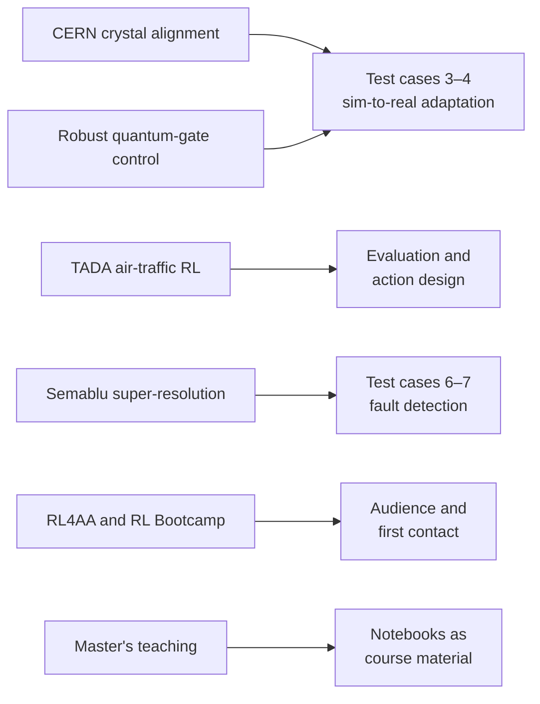

# :re-onramp: For Leander: a personal on-ramp

You already have the RL. What you lack is the plant. This page maps what carries over from your work, names what is genuinely new, and lays out ten working days. By the end you should read a DLR engine paper as easily as an accelerator paper, and be ready to run baselines on day one of challenge access.

## What transfers

| From | To LUMEN | Why it transfers |
|---|---|---|
| **Crystal alignment at CERN (TWOCRYST / AICRYSCON)** | Test cases 3–4: domain adaptation with a fine-tuning dataset | The same shape of problem. A calibrated but imperfect simulator; real interaction that is expensive, scheduled by someone else and ended by safety logic; sparse, noisy readings. Beam-loss signals there, flow-meter-derived mixture ratio here, with $\sigma$ = 3.0 % on the real engine ([thesis p. 116](https://elib.dlr.de/219040/1/DLR-FB-2025-16.pdf#page=133)). |
| **RL4AA community** | The benchmark's home audience | DLR announced the benchmark at RL4AA'25 ([abstract](https://indico.kit.edu/event/4216/contributions/19241/contribution.pdf)), with Simon Hirlaender as co-author. A LUMEN poster followed at RL4AA'26 ([Matanza et al.](https://indico.ph.liv.ac.uk/event/2025/contributions/10623/)). Your work would land with people who already know you. |
| **RL Bootcamp 2026** | First contact | You presented the air-traffic challenge in the session right after the DLR pitch ([livestream, about 7:22:40](https://www.youtube.com/watch?v=CX8I88Pta_I&t=26560s)), and you are now in touch with the organisers. |
| **TADA (air-traffic control)** | Evaluation and action design | Your bootcamp scoring ranks safety first, then timeliness, then efficiency, instead of scoring the reward (livestream, same session). That is the right shape for engine control too: constraint violations first, then tracking, then valve wear and propellant. Your air-traffic action design (discrete, damped, human-plausible commands) has a direct analogue: DLR's valve-rate actions and actuator-usage penalties exist to stop the same kind of chattering. |
| **Robust quantum-gate control** ([Grech et al. 2025](https://arxiv.org/abs/2511.07076)) | Test case 3: parametric uncertainty with a known prior | Training for fidelity under parameter noise is domain randomisation with a physics prior. That is how DLR got from 1.7 % to 0.3 % error under a 5 % turbine-efficiency error ([Table 5.3](https://elib.dlr.de/219040/1/DLR-FB-2025-16.pdf#page=108)). |
| **Satellite super-resolution (Semablu)** | Virtual sensing and fault detection | Reconstructing a signal from redundant, degraded measurements is what DLR's virtual-sensing work does for faulty engine sensors ([Kurudzija et al. 2024](https://elib.dlr.de/214022/), abstract). This is a weaker link, but it is the one to use if test cases 6–7 need a learned fault detector. |
| **Teaching (Master's AI/ML)** | Notebooks | Once access exists, the planned notebooks (explore, baseline, first experiment) could double as course material, subject to the challenge licence. |

## What is new

- **Physics with several clocks.** Chamber pressure answers within fractions of a second. Turbopump speeds take about a second. The fuel side answers through heat soaking into the cooling channels, with settling times of 5–24 s ([Table 4.7](https://elib.dlr.de/219040/1/DLR-FB-2025-16.pdf#page=91)). If your crystal-alignment objective behaved roughly like a static map from crystal angle to loss signal plus noise, this plant is different: it has memory. Read [Fast chamber, slow heat](primer/4-time-scales.md) twice.
- **Coupled outputs by construction.** $p_{cc}$ follows the sum of the propellant flows, and $R_{OF}$ their ratio. Both actions move both outputs ([The engine as a control system](primer/1-engine.md#two-valves-two-outputs-no-clean-pairing)).
- **Constraints with physical teeth.** A mixture-ratio excursion burns the chamber. Too little coolant flow overheats the wall. Coolant pressure below 46 bar boils the methane. And the most efficient operating point sits on the coolant-flow constraint ([Constraints](primer/5-constraints.md#what-the-constraints-protect)).
- **Actuator models are the weak point.** The first two hardware deployments of DLR's RL controller failed on valve dynamics, not on the plant ([§5.1](05-limitations.md#51-sim-to-real-13-on-hardware-against-04-in-simulation)).
- **Access is close, with terms.** DLR's model is EcosimPro with ESA's ESPSS library, and ESPSS "needs prior approval from ESA" ([brochure](https://www.ecosimpro.com/wp-content/uploads/2015/02/ecosimpro_brochure_library_espss.pdf)). The challenge's generalised simulator needs no EcosimPro licence, and a repository is expected around the end of October 2026 ([organisers, Oct 2026](07-references.md#organisers2026)). Plan for a licence that may still restrict redistribution and teaching use.
- **Slow simulation.** DLR trained at about 1 M steps per day on 10 simulator instances ([thesis p. 83](https://elib.dlr.de/219040/1/DLR-FB-2025-16.pdf#page=100)). The challenge simulator runs at about real time ([organisers, Oct 2026](07-references.md#organisers2026)). The bootcamp's air-traffic reference solution trains for 1.5 M steps as a matter of course. Budget accordingly.

## Ten working days

Every reading has a link and page range. The point is to have the wrappers, metrics and baselines ready, so that access day is spent on experiments, not plumbing.

!!! info "Update, October 2026: a surrogate to practise on, and the interface confirmed"
    The coding tasks were written for public environments, because no engine simulator was public. This repo now has a clearly labelled **surrogate** of the 2×2 task: a reduced engine calibrated to DLR's published gains and settling times ([model card](primer/8-lab.md#model-card)). Its PI, PPO and SAC baselines cover much of Day 6 and the baseline half of open question 5 ([Baselines on the surrogate](04a-surrogate-baselines.md)). Use it to debug wrappers and metrics; rerun everything on DLR's simulator when access arrives. The organisers have since confirmed the interface basics: 20 Hz, no preview, simulated fine-tuning data ([below](#what-the-organisers-have-confirmed)).

### Week 1: the plant and the literature

**Day 1: orientation.**

- *Read:* this site's [§1](01-problem.md) and the [domain primer](02-primer.md). Then the Dresia thesis Ch. 1–2, PDF pp. [18–54](https://elib.dlr.de/219040/1/DLR-FB-2025-16.pdf#page=18): why engines are controlled, basic PI loops, the SSME example, throttling needs.
- *Do:* set up the environment with `pip install -e .[dev]`, then run `python scripts/check_challenge.py`, which watches for the challenge repository (expected around the end of October 2026).

**Day 2: LUMEN itself.**

- *Read:* thesis Ch. 4, PDF pp. [70–92](https://elib.dlr.de/219040/1/DLR-FB-2025-16.pdf#page=70): engine, valves, constraints, model validation, step responses. Then [Kurudzija et al. 2025](https://www.eucass.eu/doi/EUCASS2025-105.pdf) (model validation on hot fire; 12 pages).
- *Code:* a `metrics.py` with unit tests on synthetic arrays. It should cover:
    - mean absolute percentage error per output;
    - IAE;
    - settling time into a 2 % band;
    - total valve travel $\Delta u = \sum|u_t - u_{t-1}|$;
    - constraint-violation count and duration.

    These are the thesis's metrics ([Table 5.4](https://elib.dlr.de/219040/1/DLR-FB-2025-16.pdf#page=114), [Table 6.2](https://elib.dlr.de/219040/1/DLR-FB-2025-16.pdf#page=130)), so your numbers will be comparable.

**Day 3: RL against MPC in simulation.**

- *Read:* thesis Ch. 5, PDF pp. [94–115](https://elib.dlr.de/219040/1/DLR-FB-2025-16.pdf#page=94), and [Pérez-Roca et al. 2019](https://arxiv.org/abs/1907.04273) (MPC for gas-generator engine transients, 6 pages).
- *Code:* generic Gymnasium wrappers, tested on `Pendulum-v1`:
    - reference preview of N future steps;
    - observation stacking;
    - action-as-rate with a rate cap;
    - multiplicative Gaussian sensor noise;
    - k-step action delay.

    These are exactly the knobs in open question 5 ([§6](06-open-questions.md#5-anticipation-without-preview-delays-and-action-design-for-the-22-task)).

**Day 4: the hardware result.**

- *Read:* thesis Ch. 6, PDF pp. [116–135](https://elib.dlr.de/219040/1/DLR-FB-2025-16.pdf#page=116), plus Appendix A.3, [p. 165](https://elib.dlr.de/219040/1/DLR-FB-2025-16.pdf#page=165) (the domain-randomisation table). Then [Dauer et al. 2025](https://www.eucass.eu/doi/EUCASS2025-533.pdf) (safety, 15 pages).
- *Code:* the DLR reward as a configurable module. That is the exponential tracking term ([eq. 5.7](https://elib.dlr.de/219040/1/DLR-FB-2025-16.pdf#page=98)), constant constraint penalties and an actuator penalty ([eq. 6.5](https://elib.dlr.de/219040/1/DLR-FB-2025-16.pdf#page=119)). Unit-test the bounds: per-step tracking reward lies in [−1, 0].

**Day 5: the benchmark and how DLR ships benchmarks.**

- *Read:*
    - the benchmark design, [AI4Aerospace 2025 pp. 55–56](https://w3.onera.fr/ailab/sites/default/files/2025-06/abstractsAI4A5thworkshop_external.pdf#page=55);
    - the [RL4AA'25 abstract](https://indico.kit.edu/event/4216/contributions/19241/contribution.pdf);
    - the DX'25 paper [pp. 7–10 and 14–15](https://elib.dlr.de/219953/1/DX2025benchmark.pdf#page=7), for how DLR packaged its LUMEN diagnosis benchmark: Python valve interface, withheld "real" simulator, Docker evaluation.
- *Write:* a checklist for release day. Compare [what the organisers have confirmed](#what-the-organisers-have-confirmed) with the released code, and fill in what is still open: action bounds, the fixed openings of the non-actuated valves, the evaluation metric and the contents of the fine-tuning dataset.

### Week 2: baselines, model-based RL, faults

**Day 6: classical baselines.**

- *Read:*
    - [Lorenzo & Musgrave 1992](https://ntrs.nasa.gov/citations/19920004056), pp. 1–6: loop structure; why mixture ratio is the fast loop; SSME PI without gain scheduling.
    - [Raposo 2016 extended abstract](https://fenix.tecnico.ulisboa.pt/downloadFile/1407770020544802/ExtendedAbstract.pdf): decoupled PID on a Vinci-like expander.
- *Code:* a discrete PI controller class with anti-windup, output clipping and a gain-schedule hook. Add a 2×2 decoupling utility that takes a steady-state gain matrix and returns the relative gain array, to choose pairings. Unit-test on fixed matrices only.

**Day 7: model-based RL.**

- *Read:* [Janner et al. 2019, MBPO](https://arxiv.org/abs/1906.08253). Then the thesis MPC section again ([pp. 92–93](https://elib.dlr.de/219040/1/DLR-FB-2025-16.pdf#page=109)), noting why a Wiener model was chosen.
- *Code:* a small MBPO on `Pendulum-v1`: a 5-member ensemble, k = 1 rollouts, SB3 SAC on mixed real/model buffers. Target: under an hour on your laptop CPU. Record environment steps to reach a fixed return, against plain SAC. That is the plot you will want for LUMEN.

**Day 8: the adjacent field.**

- *Read:*
    - [Hörger et al. 2024](https://elib.dlr.de/207225/1/Final_Acta_Astronautica.pdf): zero-shot sim-to-real on a cold-gas rig; the most complete DLR hardware paper.
    - [Waxenegger-Wilfing et al. 2021](https://arxiv.org/abs/2006.11108): TD3 vs PID on a gas-generator engine.
    - Skim [Jiang et al. 2024](https://arxiv.org/abs/2407.15083) and [Carradori 2024](https://repository.tudelft.nl/record/uuid:bf2a598c-9694-40cd-8dec-03b73d539b54), to see why landing guidance has no shared benchmark either.
- *Code:* none. Write half a page comparing the cold-gas sim-to-real recipe with yours from CERN.

**Day 9: faults and safety.**

- *Read:*
    - [Urgolo et al. 2024](https://drops.dagstuhl.de/entities/document/10.4230/OASIcs.DX.2024.15): learned temporal-logic monitors on a LUMEN-like model.
    - The [DX'25 LUMEN page](https://vehsys.gitlab-pages.liu.se/dx25benchmarks/lumen/lumen_index): fault types and magnitudes.
- *Code:* an ensemble-disagreement out-of-distribution score on the Day 7 dynamics ensemble. Evaluate it on `Pendulum-v1` with a mid-episode change in mass or length.

**Day 10: plan the first experiment.**

- *Read:* this site's [§5](05-limitations.md) and [§6](06-open-questions.md).
- *Write:* fill the TODOs in `notebooks/03-first-experiment.ipynb` once it exists, i.e. once access is granted. Until then, keep a one-page pre-registration for open question 5 in this repo:
    - anticipation without preview (none, set-point rate, a learned reference predictor), with preview 2/4/8 as an upper bound;
    - action absolute vs rate;
    - 5 seeds each;
    - the metrics from Day 2;
    - a fixed one-hour CPU budget per run.
- *Check:* `python scripts/check_challenge.py` again.

## What the organisers have confirmed

From the LUMEN Control Challenge organisers, October 2026 ([personal communication](07-references.md#organisers2026)). Check each point against the released documentation.

| Topic | Answer | What it changes here |
|---|---|---|
| Release | A repository around the end of October 2026. | Port the environment wrapper then and rerun every baseline on DLR's simulator. |
| Control rate, episodes | 20 Hz; 10–100 s per episode, depending on the control problem. | The surrogate now runs at 20 Hz, and PPO and SAC are retrained for it ([baselines](04a-surrogate-baselines.md#results-20-hz)). |
| Preview | No future set points in the observation; targets are generated in real time. | The retrained agents have no preview; the earlier preview runs remain as an ablation; [open question 5](06-open-questions.md#5-anticipation-without-preview-delays-and-action-design-for-the-22-task) is now about anticipation without preview. |
| Data | No real hot-fire data. The sim-to-real test cases change model parameters. | Adaptation is scored against known parameter shifts; real valve behaviour stays out of reach. |
| Compute | No EcosimPro licence needed. About real time, with parallel instances. | Budget for vectorised environments; [model-based RL](06-open-questions.md#2-model-based-rl-for-a-slow-simulator-mbpo-style-test-cases-12) gains weight. |

Still open:

- the admissible valve ranges;
- the fixed openings of the valves the agent does not control;
- the evaluation metric;
- whether the simulator may be used in a university course.
