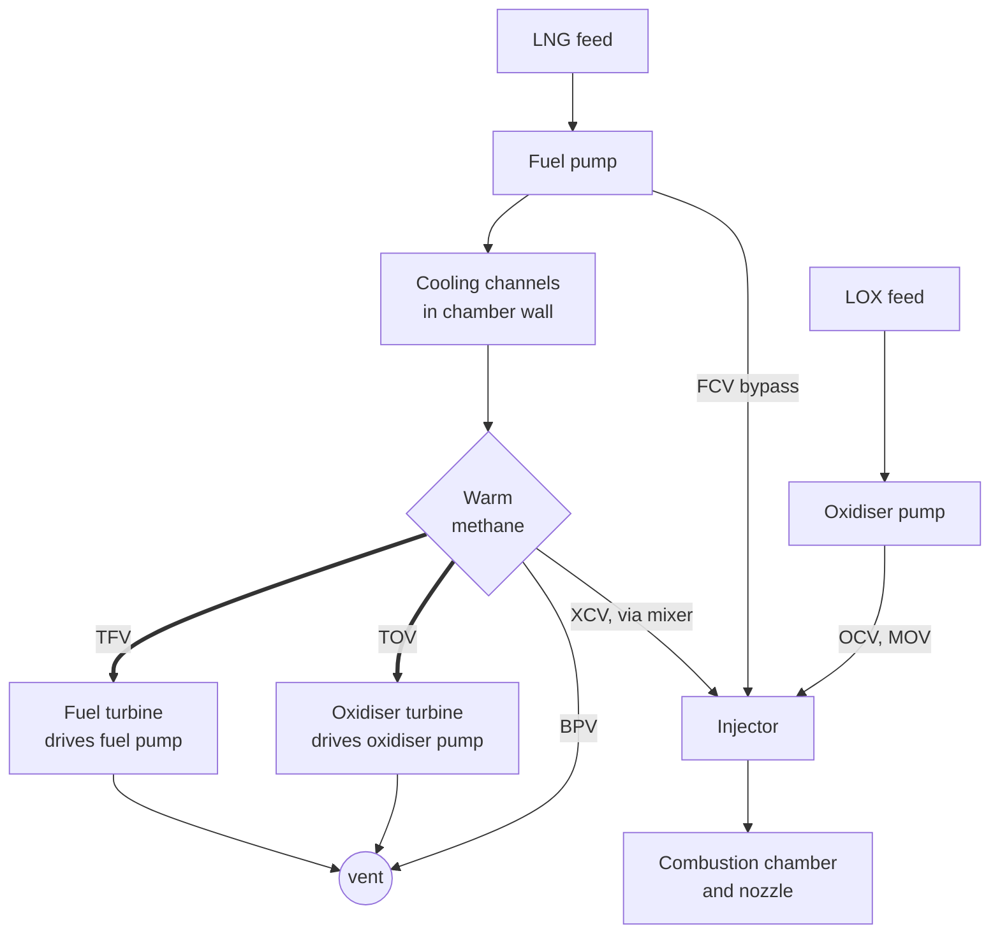
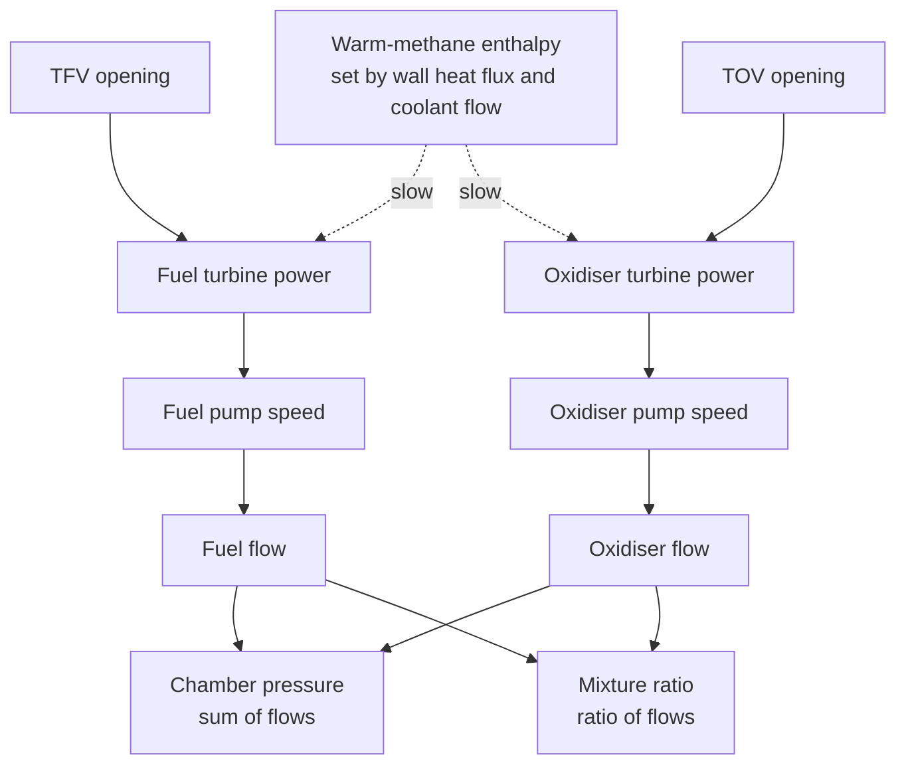

# :re-cycle: The expander-bleed cycle

!!! abstract "The question"

    Where does the power that drives the pumps come from, and why does that make the two valves share one budget?

## Where the turbine power comes from

Pressure-fed engines push propellant out of pressurised tanks, which caps chamber pressure at tank pressure. Pump-fed engines use turbopumps, and the engine *cycle* answers the question "where does the turbine power come from?":

- in a **gas-generator** cycle, a small separate combustor makes hot gas for the turbines;
- in **staged combustion**, that gas then goes into the main chamber;
- in an **expander** cycle, the fuel is heated in the chamber's cooling channels and that heat drives the turbines.

LUMEN is an **expander-bleed** engine ([thesis p. 54](https://elib.dlr.de/219040/1/DLR-FB-2025-16.pdf#page=71)). Liquid methane is pumped through channels in the chamber wall in counter-flow and picks up heat. Part of this warm methane drives both turbines and is then vented unburned (an "open" cycle); the rest is remixed and injected. The two turbopumps run in parallel and independently. Simplified from [thesis Fig. 4.1](https://elib.dlr.de/219040/1/DLR-FB-2025-16.pdf#page=71):

Thick arrows: the two valves the benchmark actuates. Each turbine shares a shaft with its pump. On/off valves other than MOV are omitted.
{: .caption }

The control consequence is the one the benchmark is built on. **The two turbine valves TFV and TOV set how much warm methane reaches each turbine, hence each pump's speed, hence each propellant flow.** Opening both raises $p_{cc}$; opening them asymmetrically shifts $R_{OF}$ ([thesis p. 56](https://elib.dlr.de/219040/1/DLR-FB-2025-16.pdf#page=73)).

The other four continuous valves shape cooling flow, injection temperature and oxidiser flow:

- FCV, the fuel bypass;
- BPV, the vent;
- XCV, the mixer;
- OCV, the oxidiser valve.

DLR actuates them in its own 4- and 5-valve controllers. As far as the published benchmark design says, they are not part of the 2×2 task. The surrogate freezes them at their positions at the 40 bar point of [Table 4.6](https://elib.dlr.de/219040/1/DLR-FB-2025-16.pdf#page=89).

Move the valves and watch the flows. Arrow width is mass flow.

## One heat budget, two turbines

Why the two actions couple, and why one of them is slow: both turbines draw on the same heat budget.

Solid arrows act within about a second. The heat budget closes a slow loop. Chamber pressure and coolant flow set the wall heat flux, which sets the enthalpy both turbines run on, over seconds to tens of seconds. Valve roles from [thesis p. 56](https://elib.dlr.de/219040/1/DLR-FB-2025-16.pdf#page=73), time scales from [Table 4.7](https://elib.dlr.de/219040/1/DLR-FB-2025-16.pdf#page=91).
{: .caption }

The wall heat flux into the coolant grows with chamber pressure. DLR's model "roughly follows the theoretical correlation of $\dot Q \propto p_{cc}^{0.8}$", and the heat flux also rises with the fuel injection temperature ([thesis eq. 4.2 and Fig. 4.6](https://elib.dlr.de/219040/1/DLR-FB-2025-16.pdf#page=80)). The coolant leaves the channels at

$$
T_{RC,out} \approx T_{in} + \frac{\dot Q(p_{cc})}{\dot m_{RC}\,c_p},
$$

so **more coolant flow through the same heat means colder methane**. That is the mechanism behind the slow sag after a TFV step ([Fast chamber, slow heat](4-time-scales.md)):

1. Opening TFV speeds up the fuel pump.
2. More methane flows through the channels and leaves colder.
3. Both turbines weaken.

## Turbopump power balance

Each turbopump is a shaft with a turbine on one end and a pump on the other. Its speed $\omega$ obeys the rotational form of Newton's second law, $I\,\dot\omega = T_{\mathrm{turbine}} - T_{\mathrm{pump}}$; at steady state the two torques balance ([thesis p. 67](https://elib.dlr.de/219040/1/DLR-FB-2025-16.pdf#page=84)). DLR's ESPSS model describes the pump with dimensionless maps ([eq. 4.4](https://elib.dlr.de/219040/1/DLR-FB-2025-16.pdf#page=83)):

$$
\psi^+ = \frac{\Delta p}{\rho_{in}\,\omega^2},\qquad \varphi^+ = \frac{\dot m}{\rho_{in}\,\omega},\qquad C^+ = \frac{T_{\mathrm{pump}}}{\rho_{in}\,\omega^2},
$$

so pump pressure rise grows with $\omega^2$ and flow with $\omega$. The turbine is described by a specific-torque map $T_s = T_{\mathrm{turbine}}/(\dot m\,r\,c) = f(\Pi, N)$ over the pressure ratio $\Pi$ and the blade-speed ratio $N = \omega r / c$ ([eq. 4.5](https://elib.dlr.de/219040/1/DLR-FB-2025-16.pdf#page=83)). Two things follow for an RL person:

- **Turbine power is heat-limited.** The warm methane's enthalpy comes from the chamber wall, which depends on chamber pressure and on how much methane goes through the channels. More thrust needs more turbine power, which needs more heat, which needs more thrust: a positive loop with thermal lag.
- **Efficiencies are uncertain.** Shaft torque is not measured on LUMEN, so efficiencies were inferred from pressures and temperatures. The turbines were characterised with ambient nitrogen but run on hot methane, whose speed of sound is about 500 m/s against nitrogen's 350 m/s ([thesis p. 67](https://elib.dlr.de/219040/1/DLR-FB-2025-16.pdf#page=84)). DLR therefore added turbine-torque scaling factors precisely so they could be randomised during training. Expect the benchmark's parametric-uncertainty test cases to perturb parameters of this kind. The Lab's *fuel turbine ×* and *LOX turbine ×* sliders do the same on the surrogate, and a 5 % weaker LOX turbine is enough to make the surrogate's learned controllers lose to PI on mixture ratio ([Baselines on the surrogate](../04a-surrogate-baselines.md#robustness)).

!!! tip "What it means for the agent"

    - **The actions are power splits, not flows.** A valve sets how much of a shared, slowly varying resource each pump gets. The same TFV opening gives different fuel flow when the methane is hot than when it is cold.
    - **There is a hidden slow state:** the temperature of the chamber wall and the methane. It is not among the benchmark's controlled outputs. It is in the observation only if the environment exposes it, and otherwise has to be inferred from history.
    - **Turbine efficiency is the classic uncertain parameter.** Train against a range of it, not one value.

??? question "Check yourself (click to open)"

    1. Why is LUMEN called an *open* cycle? *The methane that drives the turbines is vented, not burned.*
    2. Opening TFV sends more methane through the cooling channels. What happens to its temperature, and to the LOX turbine? *It falls (same heat, more flow), so the LOX turbine also loses power, even though TOV did not move.*
    3. In the widget, open TOV fully at TFV 0.3. Which limit would you worry about first? *Mixture ratio: LOX flow rises while fuel flow barely changes, so $R_{OF}$ climbs towards stoichiometric.*
