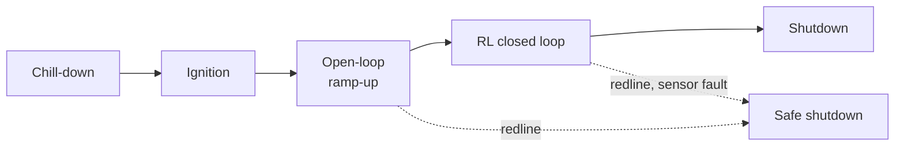

# :re-hotfire: Hot fire, simulators and glossary

!!! abstract "In short"

    - **A hot-fire test is a scripted sequence**: chill-down, ignition, an open-loop ramp-up, a closed-loop phase lasting seconds, and shutdown. Real interaction is measured in minutes per year.
    - **DLR's LUMEN model** is EcosimPro with ESA's ESPSS library, validated against hot fire to a few percent. ESPSS needs ESA's approval to use. The challenge's generalised simulator needs no EcosimPro licence and runs at about real time ([organisers, Oct 2026](../07-references.md#organisers2026)).
    - The glossary at the end links each term to its chapter.

## What a hot-fire test looks like

A test is a scripted sequence ([thesis p. 9–10](https://elib.dlr.de/219040/1/DLR-FB-2025-16.pdf#page=26)):

1. chill-down of lines and pumps;
2. ignition;
3. an open-loop ramp-up to a stable point;
4. an optional closed-loop phase;
5. a scripted shutdown.

Closed loop is only handed over once pressures and flows are established. In DLR's two RL hardware tests the first 15 s and 18 s were open-loop ([Dauer et al. 2025, Fig. 4](https://www.eucass.eu/doi/EUCASS2025-533.pdf#page=8)).

Real data is scarce:

- Across the 2024 and 2025 engine campaigns LUMEN had 17 ignitions and "an accumulated hot-fire test duration of over 20 minutes" ([Kurudzija et al. 2025, p. 4](https://www.eucass.eu/doi/EUCASS2025-105.pdf#page=4)).
- The successful RL hardware run was "over 16 s" of closed loop ([thesis p. 117](https://elib.dlr.de/219040/1/DLR-FB-2025-16.pdf#page=134)).
- The run shown at the RL Bootcamp 2026 tracked for about 15 s before a sensor failure ended it ([livestream, §7.2](../07-references.md#72-lumen-control-challenge-and-benchmark)).

In RL terms, the real environment offers on the order of minutes of interaction per year, with episode termination controlled by safety logic you do not own.



One hot-fire test as an RL episode. In DLR's RL tests the open-loop ramp-up took 15–18 s and the best closed-loop phase lasted over 16 s. Only the closed-loop block is the agent's; everything else is scripted by the test team.
{: .caption }

## How DLR's simulator is built, and how good it is

The LUMEN model is written in EcosimPro, a commercial differential-algebraic modelling tool, with ESA's ESPSS propulsion libraries: versions 6.4.0 and 3.6.0 in the thesis ([p. 60](https://elib.dlr.de/219040/1/DLR-FB-2025-16.pdf#page=77)). The components (pipes, pumps, turbines, valves, cooling channels, chamber) are calibrated individually on sub-system tests, and then the whole engine is validated on hot-fire data. Against a single post-start-up test run the validated model reaches ([Kurudzija et al. 2025, Table 2](https://www.eucass.eu/doi/EUCASS2025-105.pdf#page=10)):

| Quantity | MAPE over test | Max steady-state error |
|---|---|---|
| Chamber pressure | 2.4 % | 3.3 % (2.4 bar) |
| Mixture ratio | 3.5 % | 5.2 % (0.2) |
| Fuel pump outlet pressure | 2.8 % | 4.8 % (5.2 bar) |
| Oxidiser pump outlet pressure | 4.1 % | 7.4 % (3.2 bar) |
| Fuel injection temperature | 1.9 % | 4.8 % (15.1 K) |
| Cooling-channel outlet temperature | 2.1 % | 6.0 % (25.4 K) |
| Turbine inlet temperature | 2.0 % | 4.0 % (23.2 K) |
| Fuel turbopump speed | 1.5 % | 3.1 % (1292 rpm) |
| Oxidiser turbopump speed | 1.8 % | 2.6 % (684 rpm) |

```vegalite
{
  "$schema": "https://vega.github.io/schema/vega-lite/v6.json",
  "title": {"text": "LUMEN model against hot-fire data", "subtitle": "Validated EcosimPro model on one post-start-up test run (Kurudzija et al. 2025, Table 2)"},
  "width": "container", "height": 270,
  "data": {"values": [
    {"q": "Chamber pressure", "mape": 2.4, "worst": 3.3},
    {"q": "Mixture ratio", "mape": 3.5, "worst": 5.2},
    {"q": "Fuel pump outlet pressure", "mape": 2.8, "worst": 4.8},
    {"q": "Oxidiser pump outlet pressure", "mape": 4.1, "worst": 7.4},
    {"q": "Fuel injection temperature", "mape": 1.9, "worst": 4.8},
    {"q": "Cooling-channel outlet temperature", "mape": 2.1, "worst": 6.0},
    {"q": "Turbine inlet temperature", "mape": 2.0, "worst": 4.0},
    {"q": "Fuel turbopump speed", "mape": 1.5, "worst": 3.1},
    {"q": "Oxidiser turbopump speed", "mape": 1.8, "worst": 2.6}
  ]},
  "encoding": {"y": {"field": "q", "type": "nominal", "sort": null, "title": null, "axis": {"labelLimit": 260}}},
  "layer": [
    {"mark": {"type": "rule", "strokeWidth": 2, "color": "var(--viz-axis)"},
     "encoding": {"x": {"field": "mape", "type": "quantitative", "title": "Error (%)", "scale": {"domain": [0, 8]}, "axis": {"tickCount": 8}}, "x2": {"field": "worst"}}},
    {"transform": [{"fold": ["mape", "worst"], "as": ["kind", "err"]},
                   {"calculate": "datum.kind === 'mape' ? 'MAPE over the run' : 'Worst steady-state point'", "as": "measure"}],
     "mark": {"type": "point", "filled": true, "size": 90, "stroke": "var(--md-default-bg-color)", "strokeWidth": 2},
     "encoding": {"x": {"field": "err", "type": "quantitative"},
       "color": {"field": "measure", "type": "nominal", "scale": {"domain": ["MAPE over the run", "Worst steady-state point"]}, "legend": {"title": null, "labelLimit": 300}},
       "tooltip": [{"field": "q", "title": "quantity"}, {"field": "measure"}, {"field": "err", "title": "error (%)"}]}}
  ]
}
```

On the specific run used for the RL hardware demonstration, model–experiment errors were larger: mean 4.1 % on $p_{cc}$, 4.9 % on coolant flow, maximum 10.6 % ([thesis Table 6.3](https://elib.dlr.de/219040/1/DLR-FB-2025-16.pdf#page=131)). A 2026 preprint describes a "representative upper-stage rocket engine based on the LUMEN" model, with errors "below 5 % over the full operational envelope" ([Kurudzija et al. 2026](https://doi.org/10.2139/ssrn.6806858), abstract only). It is plausibly the generalised simulator behind the challenge.

ESPSS itself is ESA property: "Any entity interested in using ESPSS needs prior approval from ESA" ([EcosimPro brochure](https://www.ecosimpro.com/wp-content/uploads/2015/02/ecosimpro_brochure_library_espss.pdf)).

How this compares with the surrogate in the [Engine Lab](8-lab.md):

| | DLR's LUMEN model | This repo's surrogate |
|---|---|---|
| Tool | EcosimPro + ESPSS (commercial, ESA-licensed) | about 250 lines of Python, mirrored in JavaScript |
| Components | 1-D pipes, maps for pumps and turbines, cooling channels with 1-D flow and 3-D walls, all valves | lumped: 10 states, 2 actuated valves, 4 frozen |
| Calibrated on | component tests and hot fire (17 ignitions) | DLR's published gains, settling times and overshoot at one operating point |
| Accuracy | 2–4 % MAPE against hot fire | against DLR's model at 40 bar: static gains within about 13 %, except TOV on coolant temperature (+20 K against +12 K); TFV settling times within 25 % |
| Speed | DLR trained at about 1 M steps per day on 10 instances ([thesis p. 83](https://elib.dlr.de/219040/1/DLR-FB-2025-16.pdf#page=100)) | about 3,000 control steps per second per CPU core |

## Glossary {#glossary}

| Term | Meaning | Chapter |
|---|---|---|
| $p_{cc}$ | combustion chamber pressure (bar); a proxy for thrust | [:re-engine:](1-engine.md "The engine as a control system") |
| $R_{OF}$ | oxidiser-to-fuel mass-flow ratio; sets flame temperature | [:re-engine:](1-engine.md#mixture-ratio-is-temperature "The engine as a control system") |
| $c^*$ | characteristic velocity; links chamber pressure to mass flow | [:re-engine:](1-engine.md "The engine as a control system") |
| LOX / LNG | liquid oxygen / liquefied natural gas (methane) | [:re-cycle:](2-cycle.md "The expander-bleed cycle") |
| expander-bleed | cycle where fuel heated in the cooling channels drives the turbines and is then vented | [:re-cycle:](2-cycle.md "The expander-bleed cycle") |
| OTP / FTP | oxidiser / fuel turbopump | [:re-cycle:](2-cycle.md#turbopump-power-balance "The expander-bleed cycle") |
| TFV / TOV | turbine fuel / oxidiser valve; the benchmark's two actions | [:re-cycle:](2-cycle.md "The expander-bleed cycle") |
| FCV, BPV, XCV, OCV | fuel control (bypass), bypass (vent), mixer, oxidiser control valves | [:re-cycle:](2-cycle.md "The expander-bleed cycle") |
| MOV / MFV | main oxidiser / fuel valves (on/off, for ignition and shutdown) | [:re-cycle:](2-cycle.md "The expander-bleed cycle") |
| $\dot m_{RC}$ | regenerative-cooling (cooling-channel) mass flow | [:re-map:](5-constraints.md "Constraints and the operating map") |
| $k_v$ | valve flow coefficient | [:re-valve:](3-valves.md "Valves are the actuators") |
| dead time | delay between a command and the start of the valve's motion | [:re-valve:](3-valves.md "Valves are the actuators") |
| static gain | change of an output after a step, once everything has settled | [:re-clock:](4-time-scales.md "Fast chamber, slow heat") |
| settling time | time until an output stays within 2 % of its final value | [:re-clock:](4-time-scales.md "Fast chamber, slow heat") |
| non-minimum phase | an output first moves the wrong way after a step | [:re-clock:](4-time-scales.md "Fast chamber, slow heat") |
| $J$ | injector momentum-flux ratio; flame-anchoring criterion | [:re-map:](5-constraints.md "Constraints and the operating map") |
| redline | threshold that triggers automatic shutdown on the test bench | [:re-map:](5-constraints.md "Constraints and the operating map") |
| trim | the valve openings that hold a set point in steady state | [:re-map:](5-constraints.md#the-operating-map-of-two-valves "Constraints and the operating map") |
| RGA | relative gain array; measures how well an input–output pairing decouples | [:re-engine:](1-engine.md "The engine as a control system") |
| preview, stacking | future set points / past observations in the observation vector | [:re-reward:](7-reward.md "From physics to reward") |
| MAPE | mean absolute percentage error | [:re-reward:](7-reward.md "From physics to reward") |
| P8.3 | test cell at DLR Lampoldshausen where LUMEN is fired | this page |
| EcosimPro / ESPSS | commercial simulation tool / ESA propulsion library used for the LUMEN model | this page |
| surrogate | this repo's reduced, calibrated stand-in for DLR's model | [:re-lab:](8-lab.md#model-card "The Engine Lab") |
